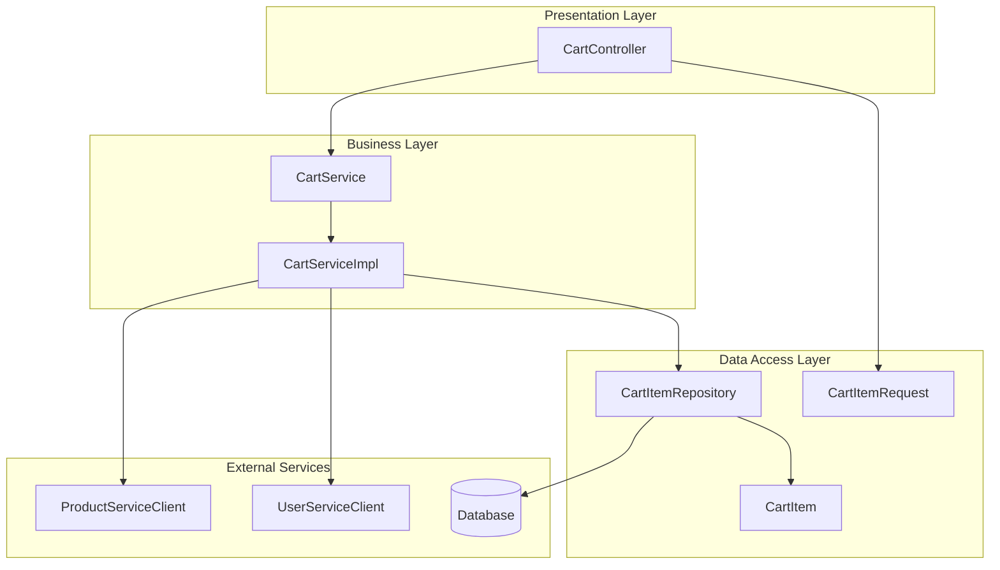
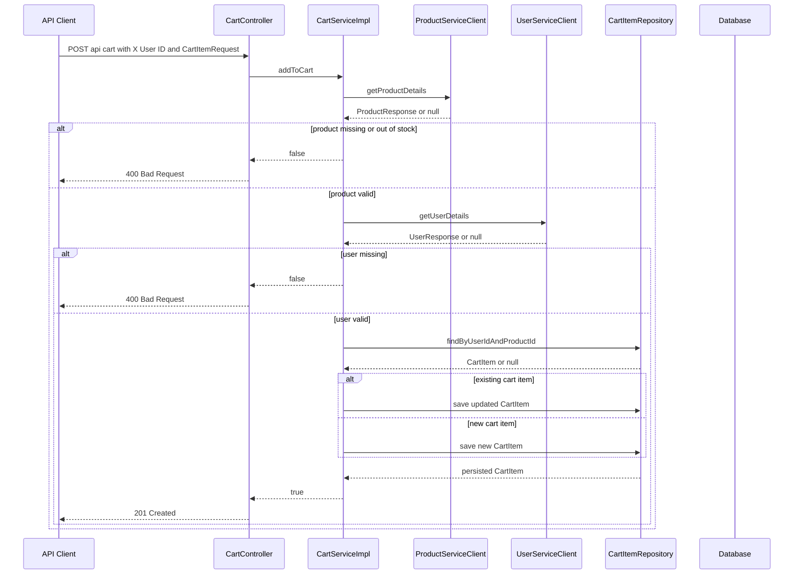
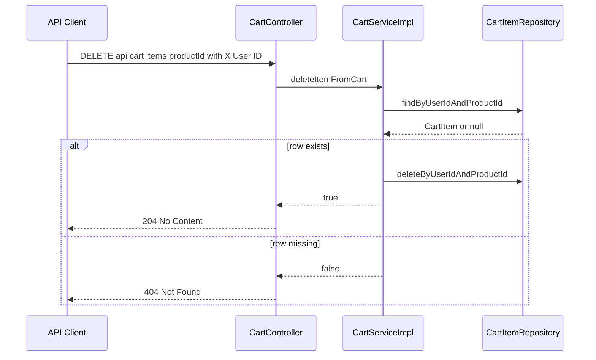
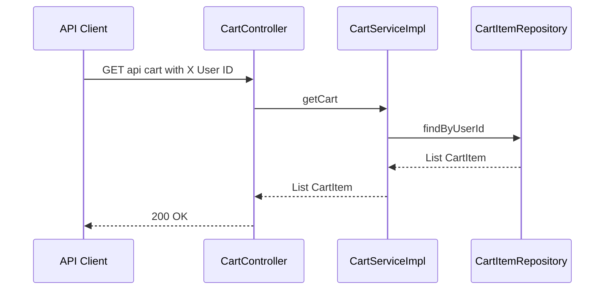

# Order Management Domain Cart API

## Overview

The cart API lets a caller add products to a user-scoped cart, remove individual cart lines, and fetch the current cart contents before checkout. Every cart request is tied to the `X-User-ID` header, so the service treats the header value as the cart owner for all three cart endpoints.

The mutation workflow in `order-service` is intentionally simple: the controller forwards the request to `CartService`, and `CartServiceImpl` validates the product and user through downstream service clients before writing to the cart table. The cart is persisted as `CartItem` rows, and repeated adds for the same `userId` and `productId` update the existing row instead of creating a duplicate.

## Architecture Overview



## Component Structure

### Presentation Layer

#### Cart Controller

The current add-to-cart workflow stores CartItem.price as BigDecimal.ZERO for newly created rows and never populates it from ProductResponse.price. When the same item is added again, the existing price is scaled from the stored value, so repeated additions preserve zero unless a nonzero price was already present. [!NOTE] The stock check compares ProductResponse.stockQuantity only with the incoming request.quantity. The accumulated cart quantity is not compared against the remaining stock when the same product is added repeatedly.

*`order-service/src/main/java/com/example/orders/controller/CartController.java`*

`CartController` is the HTTP entry point for cart operations. It binds the caller identity from `X-User-ID`, reads the request body for add operations, and translates the boolean/list outcomes from `CartService` into HTTP responses.

**Properties**

| Property | Type | Description |
| --- | --- | --- |
| `cartService` | `CartService` | Delegates cart add, delete, fetch, and clear operations to the service layer. |


**Constructor Dependencies**

| Type | Description |
| --- | --- |
| `CartService` | Handles the cart workflow for all controller endpoints. |


**Public Methods**

| Method | Description |
| --- | --- |
| `addToCart` | Accepts a cart item request, logs the request, and returns `201 Created` when the service accepts the mutation or `400 Bad Request` when the service rejects it. |
| `removeFromCart` | Removes a single cart item by `productId` for the caller’s `userId` and returns `204 No Content` or `404 Not Found`. |
| `getCart` | Returns the full cart for the caller’s `userId` as a list of `CartItem` entities. |


**X-User-ID Header Contract**

- Required on every cart endpoint.
- Bound directly to `Long userId`.
- Serves as the only user identity input for cart reads and writes.
- Must resolve to a numeric value before the controller method runs.

#### Add Item to Cart

```api
{
    "title": "Add Item to Cart",
    "description": "Adds a product to the caller's cart or increases the quantity of an existing cart line",
    "method": "POST",
    "baseUrl": "<OrderServiceBaseUrl>",
    "endpoint": "/api/cart",
    "headers": [
        {
            "key": "X-User-ID",
            "value": "42",
            "required": true
        },
        {
            "key": "Content-Type",
            "value": "application/json",
            "required": true
        }
    ],
    "queryParams": [],
    "pathParams": [],
    "bodyType": "json",
    "requestBody": "{\n    \"productId\": 9001,\n    \"quantity\": 2\n}",
    "formData": [],
    "rawBody": "",
    "responses": {
        "201": {
            "description": "Created",
            "body": ""
        },
        "400": {
            "description": "Product Out of Stock or User not found or Product not found",
            "body": "Product Out of Stock or User not found or Product not found"
        }
    }
}
```

#### Remove Item From Cart

```api
{
    "title": "Remove Item From Cart",
    "description": "Deletes a single cart item for the caller's user and product pair",
    "method": "DELETE",
    "baseUrl": "<OrderServiceBaseUrl>",
    "endpoint": "/api/cart/items/{productId}",
    "headers": [
        {
            "key": "X-User-ID",
            "value": "42",
            "required": true
        }
    ],
    "queryParams": [],
    "pathParams": [
        {
            "key": "productId",
            "value": "9001",
            "required": true
        }
    ],
    "bodyType": "none",
    "requestBody": "",
    "formData": [],
    "rawBody": "",
    "responses": {
        "204": {
            "description": "No Content",
            "body": ""
        },
        "404": {
            "description": "Item not found",
            "body": ""
        }
    }
}
```

#### Get Cart

```api
{
    "title": "Get Cart",
    "description": "Returns the current cart contents for the caller's user",
    "method": "GET",
    "baseUrl": "<OrderServiceBaseUrl>",
    "endpoint": "/api/cart",
    "headers": [
        {
            "key": "X-User-ID",
            "value": "42",
            "required": true
        }
    ],
    "queryParams": [],
    "pathParams": [],
    "bodyType": "none",
    "requestBody": "",
    "formData": [],
    "rawBody": "",
    "responses": {
        "200": {
            "description": "Success",
            "body": "[\n    {\n        \"id\": 101,\n        \"userId\": 42,\n        \"productId\": 9001,\n        \"quantity\": 2,\n        \"price\": 0,\n        \"createdDate\": \"2026-03-26T10:15:30\",\n        \"updatedDate\": \"2026-03-26T10:18:45\"\n    }\n]"
        }
    }
}
```

### Business Layer

#### Cart Service

*`order-service/src/main/java/com/example/orders/service/CartService.java`*

`CartService` defines the cart contract used by the controller and by checkout logic. It exposes mutation, lookup, and cart-clearing operations.

**Properties**

| Property | Type | Description |
| --- | --- | --- |
| `—` | `—` | This interface declares no fields. |


**Public Methods**

| Method | Description |
| --- | --- |
| `addToCart` | Validates and adds a product to a user cart, returning `true` when the mutation succeeds. |
| `deleteItemFromCart` | Deletes a single cart item for the given user and product, returning `true` when the row exists and is removed. |
| `getCart` | Returns all `CartItem` rows for the given user. |
| `clearCart` | Deletes all cart rows for the given user. |


#### Cart Service Implementation

*`order-service/src/main/java/com/example/orders/service/impl/CartServiceImpl.java`*

`CartServiceImpl` contains the full cart mutation workflow. It validates product and user existence through downstream service clients, reads and updates cart rows through `CartItemRepository`, and runs under a class-level transaction boundary.

**Properties**

| Property | Type | Description |
| --- | --- | --- |
| `cartItemRepository` | `CartItemRepository` | Loads, saves, and deletes cart rows. |
| `productServiceClient` | `ProductServiceClient` | Fetches product details before the cart is mutated. |
| `userServiceClient` | `UserServiceClient` | Fetches user details before the cart is mutated. |


**Constructor Dependencies**

| Type | Description |
| --- | --- |
| `CartItemRepository` | Repository used for cart persistence and lookup. |
| `ProductServiceClient` | Downstream product lookup used to validate product existence and stock. |
| `UserServiceClient` | Downstream user lookup used to validate the user before writing cart data. |


**Public Methods**

| Method | Description |
| --- | --- |
| `addToCart` | Validates product and user, merges quantity into an existing cart line or inserts a new one, and saves the result. |
| `deleteItemFromCart` | Locates the cart row for a user-product pair and removes it when present. |
| `getCart` | Loads all cart rows for the given user. |
| `clearCart` | Removes every cart row for the given user. |


**Transactional Behavior**

- The class is annotated with `jakarta.transaction.Transactional`.
- `addToCart`, `deleteItemFromCart`, `getCart`, and `clearCart` all execute within the service transaction boundary.
- Database writes are coordinated inside the transaction; downstream service lookups happen inside the method before repository writes.

**Repeated Add Mutation Logic**

When `addToCart` finds an existing row for the same `userId` and `productId`, it performs the following steps:

1. Reads the current quantity.
2. Computes `newQuantity = oldQty + request.getQuantity()`.
3. Updates the quantity to `newQuantity`.
4. If the stored price is non-null and the old quantity is greater than zero, it derives a unit price by dividing the stored price by the old quantity.
5. Multiplies that unit price by the new quantity and stores the result as the updated price.
6. If the stored price is null or the old quantity is zero, it resets the price to `BigDecimal.ZERO`.
7. Saves the updated entity.

This logic preserves the previous line total shape when a nonzero price already exists, but it does not source a product price from downstream product data.

**Cart Mutation Rules Implemented in Code**

- Product lookup happens first.
- Product stock must be at least the incoming request quantity.
- User lookup happens after the product check.
- Existing cart rows are updated in place.
- Missing cart rows are created with `quantity` from the request and `price` set to zero.
- Cart rows are keyed by the `userId` and `productId` pair.

#### Cart Mutation Workflow



#### Cart Removal Workflow



#### Cart Read Workflow



### Data Access Layer

#### Cart Item Repository

*`order-service/src/main/java/com/example/orders/repository/CartItemRepository.java`*

`CartItemRepository` provides the JPA queries used by cart reads, cart updates, and cart cleanup.

**Properties**

| Property | Type | Description |
| --- | --- | --- |
| `—` | `—` | This interface declares no fields. |


**Public Methods**

| Method | Description |
| --- | --- |
| `findByUserIdAndProductId` | Locates the cart row for a specific user and product pair. |
| `deleteByUserIdAndProductId` | Deletes the cart row for a specific user and product pair. |
| `findByUserId` | Returns all cart rows for the given user. |
| `deleteByUserId` | Deletes all cart rows for the given user. |


#### Cart Item

*`order-service/src/main/java/com/example/orders/model/CartItem.java`*

`CartItem` is the persisted cart row. It stores the owning user, the product, the quantity, the current price value, and audit timestamps.

**Properties**

| Property | Type | Description |
| --- | --- | --- |
| `id` | `Long` | Primary key generated with `GenerationType.IDENTITY`. |
| `userId` | `Long` | Owning user identifier stored in the `user_id` column. |
| `productId` | `Long` | Product identifier stored in the `product_id` column. |
| `quantity` | `Integer` | Number of units currently held in the cart line. |
| `price` | `BigDecimal` | Stored line price value used by cart mutation logic. |
| `createdDate` | `LocalDateTime` | Automatically populated creation timestamp. |
| `updatedDate` | `LocalDateTime` | Automatically populated update timestamp. |


#### Cart Item Request

*`order-service/src/main/java/com/example/orders/dto/CartItemRequest.java`*

`CartItemRequest` is the JSON payload accepted by the add-to-cart endpoint.

**Properties**

| Property | Type | Description |
| --- | --- | --- |
| `productId` | `Long` | Product identifier to add to the cart. |
| `quantity` | `Integer` | Quantity to add for that product. |


## Feature Flows

### Add Item to Cart

The controller receives the `X-User-ID` header and deserializes `CartItemRequest`. `CartServiceImpl` then checks the downstream product service and user service before reading the cart row from the repository. If a row exists, it updates the quantity and recalculates the stored price value; otherwise, it inserts a new row.

### Remove Item From Cart

The controller receives the same user header plus the `productId` path variable. `CartServiceImpl` looks up the row by user and product, deletes it when present, and returns a boolean that the controller maps to `204` or `404`.

### List Cart

The controller binds the `X-User-ID` header, delegates to `CartServiceImpl`, and returns the current `List<CartItem>` directly from the repository result.

## State Management

### Cart Item Mutation State

| State Aspect | Implementation |
| --- | --- |
| Ownership | `userId` associates each cart row with one caller identity. |
| Line identity | The repository treats `userId` plus `productId` as the lookup pair for updates and deletions. |
| Quantity growth | Repeated adds increase `quantity` in place rather than creating duplicate rows. |
| Price mutation | Existing rows are rescaled from their stored `price`; new rows start at `BigDecimal.ZERO`. |
| Audit timestamps | `createdDate` and `updatedDate` are maintained automatically by Hibernate annotations. |


## Error Handling

`CartController` maps service outcomes to HTTP responses instead of throwing business exceptions.

| Condition | Where It Is Handled | Result |
| --- | --- | --- |
| Product lookup fails | `CartServiceImpl.addToCart` | Returns `false`; controller responds with `400 Bad Request`. |
| Product stock is lower than the requested quantity | `CartServiceImpl.addToCart` | Returns `false`; controller responds with `400 Bad Request`. |
| User lookup fails | `CartServiceImpl.addToCart` | Returns `false`; controller responds with `400 Bad Request`. |
| Cart row missing for delete | `CartServiceImpl.deleteItemFromCart` | Returns `false`; controller responds with `404 Not Found`. |
| Cart row present for delete | `CartServiceImpl.deleteItemFromCart` | Returns `true`; controller responds with `204 No Content`. |


Request binding failures happen before controller logic when `X-User-ID`, `productId`, `quantity`, or the JSON body cannot bind to the declared Java types.

## Dependencies and Integration Points

- `CartController` depends on `CartService`.
- `CartServiceImpl` depends on `CartItemRepository`, `ProductServiceClient`, and `UserServiceClient`.
- `addToCart` validates product existence and stock through `ProductServiceClient`.
- `addToCart` validates user existence through `UserServiceClient`.
- `clearCart` is consumed by the checkout flow in `OrderServiceImpl` after order creation.
- `CartItemRepository` is the sole persistence gateway for cart rows.

## Key Classes Reference

| Class | Responsibility |
| --- | --- |
| `CartController.java` | HTTP surface for add, remove, and list cart operations. |
| `CartService.java` | Cart operation contract used by the controller and checkout flow. |
| `CartServiceImpl.java` | Transactional cart validation, mutation, and cleanup workflow. |
| `CartItemRepository.java` | JPA query interface for finding, deleting, and clearing cart rows. |
| `CartItem.java` | Persisted cart row with ownership, quantity, price, and audit timestamps. |
| `CartItemRequest.java` | Request payload for adding items to the cart. |
