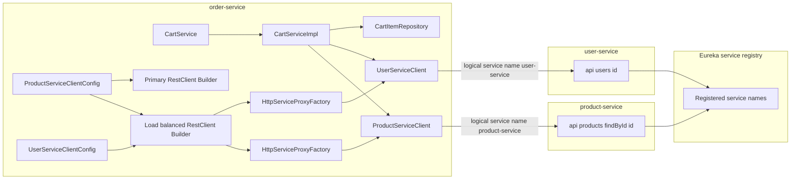
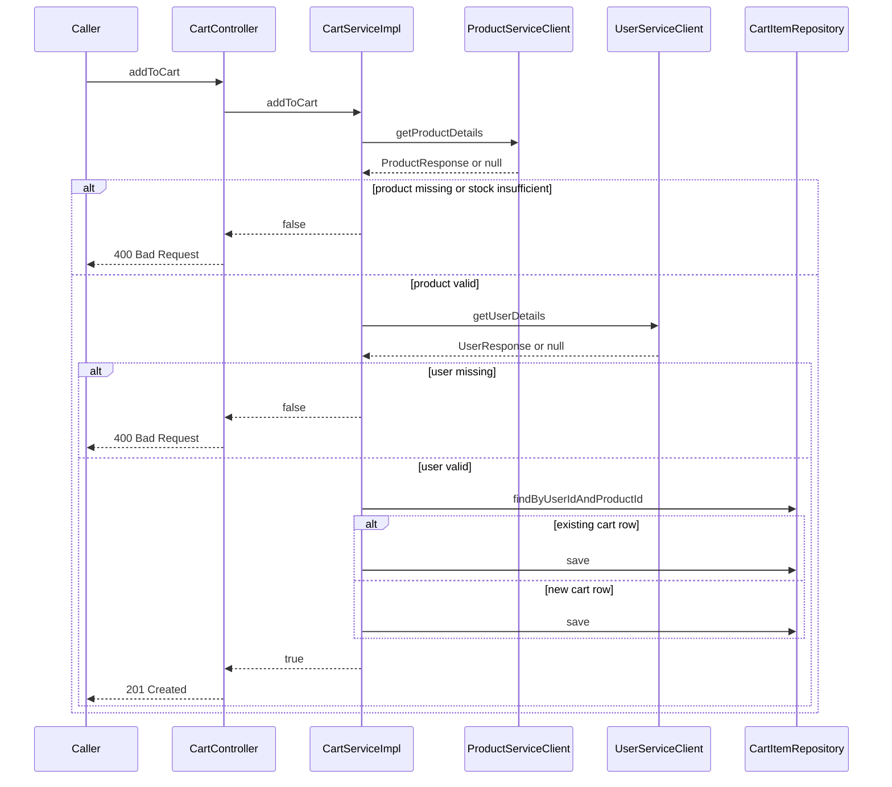

# Order Management Domain Downstream Product and User Integrations

## Overview

This part of `order-service` connects cart mutation logic to the live state owned by `product-service` and `user-service`. The order module does not depend on upstream entity classes; instead, it validates incoming cart requests by calling typed HTTP client proxies and by reading local DTOs that mirror the downstream response shapes.

The practical effect is that a cart item is only accepted when the product exists, the product has enough stock, and the user exists. Those checks happen before any `CartItem` row is inserted or updated, so the cart state in `order-service` is gated by downstream product and user availability rather than by stale local copies.

## Architecture Overview



## Downstream Service Clients

### Product Service Client

order-service keeps its own ProductResponse, UserResponse, AddressDTO, and UserRole classes. That duplication isolates the cart workflow from upstream module classes and keeps the order-side contract stable even when the upstream services evolve independently.

*`order-service/src/main/java/com/example/orders/clients/ProductServiceClient.java`*

`ProductServiceClient` is a typed HTTP interface for product lookup. The interface is annotated with `@HttpExchange`, and its single method maps to a `GET` call that resolves product details by id.

#### Properties

| Property | Type | Description |
| --- | --- | --- |
| None declared | — | This interface is stateless and declares only HTTP operations. |


#### Methods

| Method | Description |
| --- | --- |
| `getProductDetails` | Retrieves a `ProductResponse` for the supplied product id from `product-service`. |


#### Get Product Details

```api
{
    "title": "Get Product Details",
    "description": "Retrieves product details through the load-balanced product-service proxy",
    "method": "GET",
    "baseUrl": "<product-service>",
    "endpoint": "/api/products/findById/{id}",
    "headers": [],
    "queryParams": [],
    "pathParams": [
        {
            "key": "id",
            "value": "101",
            "required": true
        }
    ],
    "bodyType": "none",
    "requestBody": "",
    "formData": [],
    "rawBody": "",
    "responses": {
        "200": {
            "description": "Product found",
            "body": "{\n    \"id\": 101,\n    \"name\": \"Wireless Mouse\",\n    \"description\": \"Ergonomic 2.4 GHz wireless mouse\",\n    \"price\": 24.99,\n    \"stockQuantity\": 18,\n    \"category\": \"Accessories\",\n    \"imageUrl\": \"https://cdn.example.com/products/wireless-mouse.png\",\n    \"active\": true\n}"
        },
        "4xx": {
            "description": "Handled by the RestClient status handler and treated as a failed product lookup"
        }
    }
}
```

### User Service Client

*`order-service/src/main/java/com/example/orders/clients/UserServiceClient.java`*

`UserServiceClient` is the typed HTTP interface for user lookup. It follows the same proxy pattern as the product client, but resolves user data by numeric id.

#### Properties

| Property | Type | Description |
| --- | --- | --- |
| None declared | — | This interface is stateless and declares only HTTP operations. |


#### Methods

| Method | Description |
| --- | --- |
| `getUserDetails` | Retrieves a `UserResponse` for the supplied user id from `user-service`. |


#### Get User Details

```api
{
    "title": "Get User Details",
    "description": "Retrieves user details through the load-balanced user-service proxy",
    "method": "GET",
    "baseUrl": "<user-service>",
    "endpoint": "/api/users/{id}",
    "headers": [],
    "queryParams": [],
    "pathParams": [
        {
            "key": "id",
            "value": "42",
            "required": true
        }
    ],
    "bodyType": "none",
    "requestBody": "",
    "formData": [],
    "rawBody": "",
    "responses": {
        "200": {
            "description": "User found",
            "body": "{\n    \"id\": \"42\",\n    \"firstName\": \"Ava\",\n    \"lastName\": \"Patel\",\n    \"email\": \"ava.patel@example.com\",\n    \"phNo\": \"+1-555-0102\",\n    \"userRole\": \"CUSTOMER\",\n    \"address\": {\n        \"street\": \"12 Market Street\",\n        \"city\": \"Austin\",\n        \"state\": \"TX\",\n        \"country\": \"USA\",\n        \"zipCode\": \"78701\"\n    }\n}"
        },
        "4xx": {
            "description": "Handled by the RestClient status handler and treated as a failed user lookup"
        }
    }
}
```

## Downstream Client Configuration

### Product Service Client Configuration

*`order-service/src/main/java/com/example/orders/clients/ProductServiceClientConfig.java`*

This configuration class creates the RestClient infrastructure used by `ProductServiceClient`. It publishes both a load-balanced builder and a primary builder, then uses `RestClientAdapter` and `HttpServiceProxyFactory` to turn the annotated interface into a runnable client proxy.

#### Properties

| Property | Type | Description |
| --- | --- | --- |
| None declared | — | The class is configuration-only and stores no instance state. |


#### Methods

| Method | Description |
| --- | --- |
| `restClientBuilderLb` | Creates the `@LoadBalanced` `RestClient.Builder` bean used for logical service-name resolution. |
| `restClientBuilder` | Creates the `@Primary` `RestClient.Builder` bean used to avoid circular dependency issues. |
| `productServiceInterface` | Builds a `RestClient` for `http://product-service`, configures 4xx handling, adapts it, and creates the `ProductServiceClient` proxy. |


#### Runtime wiring

- `restClientBuilderLb` is annotated with `@LoadBalanced`, so calls made through the resulting builder can resolve service names through Spring Cloud load balancing.
- `restClientBuilder` is marked `@Primary`, giving the application a default builder bean that is separate from the load-balanced one.
- `productServiceInterface` uses `baseUrl("http://product-service")`, which targets the logical service name rather than a fixed host.
- `defaultStatusHandler(HttpStatusCode::is4xxClientError, ...)` suppresses client-error failures from becoming hard exceptions in the cart validation flow.
- `RestClientAdapter.create(restClient)` bridges the configured RestClient into `HttpServiceProxyFactory`.
- `factory.createClient(ProductServiceClient.class)` generates the runtime proxy for the interface.

### User Service Client Configuration

*`order-service/src/main/java/com/example/orders/clients/UserServiceClientConfig.java`*

This configuration class builds the proxy for `UserServiceClient` using the same RestClient-to-proxy pattern as the product configuration. It relies on the load-balanced builder bean to resolve the downstream service name at runtime.

#### Properties

| Property | Type | Description |
| --- | --- | --- |
| None declared | — | The class is configuration-only and stores no instance state. |


#### Methods

| Method | Description |
| --- | --- |
| `userServiceInterface` | Builds a `RestClient` for `http://user-service`, configures 4xx handling, adapts it, and creates the `UserServiceClient` proxy. |


#### Runtime wiring

- The injected `@LoadBalanced RestClient.Builder` resolves the logical host `user-service` through the service registry.
- `baseUrl("http://user-service")` keeps the client aligned with the service name used by discovery rather than a hard-coded physical endpoint.
- The same 4xx suppression pattern is applied here as in the product client.
- `HttpServiceProxyFactory` converts the annotated interface into the runtime client implementation.

## Cart Mutation Validation Flow

### Cart Service Contract

*`order-service/src/main/java/com/example/orders/service/CartService.java`*

`CartService` defines the cart mutation contract consumed by the controller layer and implemented by `CartServiceImpl`.

#### Properties

| Property | Type | Description |
| --- | --- | --- |
| None declared | — | This service contract declares behavior only. |


#### Methods

| Method | Description |
| --- | --- |
| `addToCart` | Adds a requested product to a user cart after downstream validation succeeds. |
| `deleteItemFromCart` | Removes a specific cart item for a user and product pair. |
| `getCart` | Returns all cart items for a given user. |
| `clearCart` | Removes all cart items for a given user. |


### Cart Service Implementation

*`order-service/src/main/java/com/example/orders/service/impl/CartServiceImpl.java`*

`CartServiceImpl` is where the downstream product and user checks are enforced before a cart row is written. It is annotated with `@Transactional`, so the local repository operations run in a transaction, while the remote product and user lookups happen as part of the same service method flow.

#### Properties

| Property | Type | Description |
| --- | --- | --- |
| `cartItemRepository` | `CartItemRepository` | Persists and queries cart rows for the current user. |
| `productServiceClient` | `ProductServiceClient` | Fetches product details for existence and stock validation. |
| `userServiceClient` | `UserServiceClient` | Fetches user details for existence validation. |


#### Methods

| Method | Description |
| --- | --- |
| `addToCart` | Validates product existence, stock quantity, and user existence before creating or updating a `CartItem`. |
| `deleteItemFromCart` | Deletes the cart row only when the matching user and product entry exists. |
| `getCart` | Reads all cart rows for the supplied user id. |
| `clearCart` | Deletes all cart rows for the supplied user id. |


#### Validation and mutation flow

1. `addToCart` logs the incoming `userId`, `productId`, and quantity.
2. `productServiceClient.getProductDetails(request.getProductId().toString())` is called first.
3. A `null` product response causes the method to return `false`.
4. The returned `ProductResponse.stockQuantity` is compared with `request.getQuantity()`.
5. If the requested quantity exceeds available stock, the method returns `false`.
6. `userServiceClient.getUserDetails(userId)` runs only after the product passes validation.
7. A `null` user response causes the method to return `false`.
8. The repository is queried with `findByUserIdAndProductId`.
9. If a row exists, quantity and price are updated and saved.
10. If no row exists, a new `CartItem` is created and saved.
11. The method returns `true` only after the local mutation succeeds.

#### Sequence: cart mutation with downstream validation



## Downstream Facing Data Models

### ProductResponse

*`order-service/src/main/java/com/example/orders/dto/ProductResponse.java`*

This DTO mirrors the product lookup payload used by the cart workflow. `CartServiceImpl` reads `id`, `price`, and `stockQuantity` from this shape during validation.

#### Properties

| Property | Type | Description |
| --- | --- | --- |
| `id` | `Long` | Product identifier returned by `product-service`. |
| `name` | `String` | Product name. |
| `description` | `String` | Product description. |
| `price` | `BigDecimal` | Product price used by downstream cart logic. |
| `stockQuantity` | `Integer` | Available inventory count used to reject over-limit quantities. |
| `category` | `String` | Product category. |
| `imageUrl` | `String` | Product image reference. |
| `active` | `Boolean` | Product status flag. |


### UserResponse

*`order-service/src/main/java/com/example/orders/dto/UserResponse.java`*

This DTO mirrors the user lookup payload used by the cart workflow. `CartServiceImpl` only needs the response to confirm that the user exists, but the contract also carries the user profile and address shape.

#### Properties

| Property | Type | Description |
| --- | --- | --- |
| `id` | `String` | User identifier returned by `user-service`. |
| `firstName` | `String` | User first name. |
| `lastName` | `String` | User last name. |
| `email` | `String` | User email address. |
| `phNo` | `String` | User phone number. |
| `userRole` | `UserRole` | User role copied into the order-service contract. |
| `address` | `AddressDTO` | Nested address payload returned by the user lookup. |


### AddressDTO

*`order-service/src/main/java/com/example/orders/dto/AddressDTO.java`*

This DTO is nested inside `UserResponse` and isolates the address structure from upstream module classes.

#### Properties

| Property | Type | Description |
| --- | --- | --- |
| `street` | `String` | Street line. |
| `city` | `String` | City name. |
| `state` | `String` | State or region. |
| `country` | `String` | Country name. |
| `zipCode` | `String` | Postal code. |


### UserRole

*`order-service/src/main/java/com/example/orders/dto/UserRole.java`*

The user role contract is duplicated locally so `UserResponse` can deserialize the downstream role value without importing upstream enums.

#### Values

`ADMIN`, `SELLER`, `CUSTOMER`

## Error Handling

`CartServiceImpl.addToCart` converts invalid downstream or inventory state into a `false` result rather than mutating the cart.

- Product lookup returns `null` → the cart mutation is rejected.
- `stockQuantity` is lower than the requested quantity → the cart mutation is rejected.
- User lookup returns `null` → the cart mutation is rejected.
- Existing cart item not found in `deleteItemFromCart` → the method returns `false`.
- Both client config classes apply a `defaultStatusHandler` for 4xx responses, so downstream client errors are handled inside the client layer instead of being left for the cart repository flow.

## Dependencies

- `org.springframework.web.client.RestClient`
- `org.springframework.web.client.support.RestClientAdapter`
- `org.springframework.web.service.invoker.HttpServiceProxyFactory`
- `org.springframework.cloud.client.loadbalancer.LoadBalanced`
- `org.springframework.web.service.annotation.HttpExchange`
- `org.springframework.web.service.annotation.GetExchange`
- `org.springframework.web.bind.annotation.PathVariable`
- `org.springframework.transaction` support through `@Transactional`
- `CartItemRepository` and JPA-backed cart persistence
- Eureka service discovery through the logical service names `product-service` and `user-service`
- Lombok annotations used across the DTOs, configs, and service implementation
- SLF4J logging through `@Slf4j`

## Testing Considerations

- `addToCart` with a missing product should return `false`.
- `addToCart` with insufficient stock should return `false`.
- `addToCart` with a missing user should return `false`.
- `addToCart` with an existing cart row should update the row instead of creating a duplicate.
- `deleteItemFromCart` should return `true` for an existing row and `false` for a missing one.
- `getCart` should return all rows for the supplied user id.
- `clearCart` should remove all cart rows for the supplied user id.
- The client configuration should be verified against the logical service names `product-service` and `user-service`.

## Key Classes Reference

| Class | Responsibility |
| --- | --- |
| `ProductServiceClient.java` | Declares the downstream product lookup contract. |
| `ProductServiceClientConfig.java` | Builds the load-balanced RestClient proxy for product-service. |
| `UserServiceClient.java` | Declares the downstream user lookup contract. |
| `UserServiceClientConfig.java` | Builds the load-balanced RestClient proxy for user-service. |
| `CartService.java` | Defines the cart mutation contract used by the service layer. |
| `CartServiceImpl.java` | Validates downstream product and user data before mutating cart rows. |
| `ProductResponse.java` | Local product lookup DTO used by order-service. |
| `UserResponse.java` | Local user lookup DTO used by order-service. |
| `AddressDTO.java` | Local nested address DTO used by `UserResponse`. |
| `UserRole.java` | Local enum for downstream user roles. |
