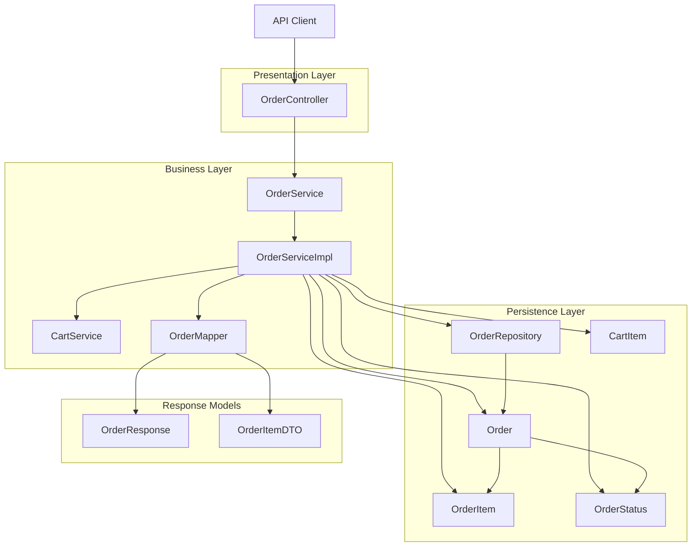
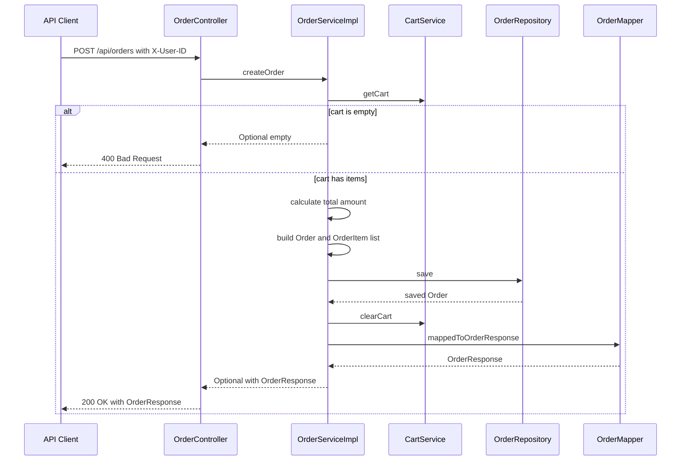
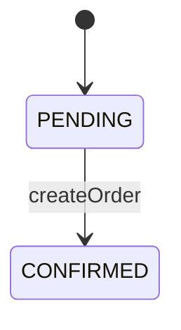
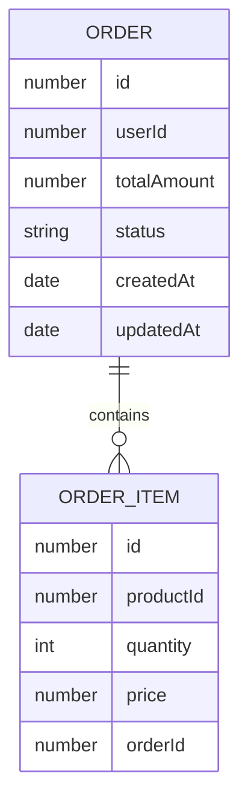

# Order Management Domain - Order Creation, Persistence Model, and Checkout Response Mapping

## Overview

This domain turns the current cart for a user into a persisted `Order` aggregate and returns a checkout response that mirrors the saved order. The flow starts at `OrderController.createOrder`, moves through `OrderServiceImpl.createOrder`, reads cart contents through `CartService`, persists the new order with `OrderRepository`, clears the cart, and then maps the saved entity into `OrderResponse`.

The business outcome is a single checkout action that captures order header data, order items, total amount, and lifecycle status in one transaction-like sequence of calls. The response shape is intentionally separate from the persistence model: `OrderMapper` converts the entity graph into DTOs so the API returns only the fields needed by the client.

## Architecture Overview



## Component Structure

### Order Controller

OrderServiceImpl.createOrder calculates totals from CartItem.price and quantity, and OrderMapper.mappedToOrderResponse calculates each subTotal the same way. In the cart flow, newly created CartItem rows are stored with price = BigDecimal.ZERO, so checkout totals can be 0 for fresh cart items and can also diverge if price is being treated as a line amount rather than a unit amount.

*`order-service/src/main/java/com/example/orders/controller/OrderController.java`*

`OrderController` exposes the checkout entry point. It accepts the user identity through the `X-User-ID` header, delegates order creation to `OrderService`, and translates the service result into either `200 OK` with an `OrderResponse` or `400 Bad Request` when checkout cannot proceed.

#### Properties

| Property | Type | Description |
| --- | --- | --- |
| `orderService` | `OrderService` | Service used to create an order for the requested user. |


#### Constructor Dependencies

| Type | Description |
| --- | --- |
| `OrderService` | Performs the cart-to-order conversion and returns the mapped checkout response. |


#### Public Methods

| Method | Description |
| --- | --- |
| `createOrder` | Reads `X-User-ID`, calls `OrderService.createOrder`, returns the mapped response on success, or `400 Bad Request` when the service returns empty. |


### Order Service

*`order-service/src/main/java/com/example/orders/service/OrderService.java`*

`OrderService` defines the checkout contract for the order domain. The interface has a single operation that converts a user cart into an `OrderResponse` wrapped in `Optional`.

#### Public Methods

| Method | Description |
| --- | --- |
| `createOrder` | Creates an order for the given user and returns the checkout response when cart data is available. |


### Order Service Implementation

*`order-service/src/main/java/com/example/orders/service/impl/OrderServiceImpl.java`*

`OrderServiceImpl` contains the checkout workflow. It reads cart items, rejects empty carts, calculates the total amount, builds the `Order` aggregate and its `OrderItem` children, saves the order, clears the cart, and maps the saved entity to `OrderResponse`.

#### Properties

| Property | Type | Description |
| --- | --- | --- |
| `cartService` | `CartService` | Reads cart contents and clears the cart after a successful checkout. |
| `orderRepository` | `OrderRepository` | Persists the `Order` aggregate. |


#### Constructor Dependencies

| Type | Description |
| --- | --- |
| `CartService` | Provides cart retrieval and cart clearing for checkout. |
| `OrderRepository` | Saves the constructed order aggregate. |


#### Public Methods

| Method | Description |
| --- | --- |
| `createOrder` | Loads cart items, computes total amount, creates `OrderItem` records, saves the order, clears the cart, and returns the mapped `OrderResponse`. |


### Order Repository

*`order-service/src/main/java/com/example/orders/repository/OrderRepository.java`*

`OrderRepository` is the Spring Data JPA repository for `Order`. It does not declare custom methods; the service uses the inherited `JpaRepository` operations for persistence.

#### Properties

| Property | Type | Description |
| --- | --- | --- |
| — | — | No fields are declared in this repository interface. |


#### Public Methods

| Method | Description |
| --- | --- |
| `JpaRepository` inherited operations | Provides CRUD and paging support for `Order` persistence. |


### Order Entity

*`order-service/src/main/java/com/example/orders/model/Order.java`*

`Order` is the aggregate root for checkout persistence. It stores the user reference, total amount, current status, timestamps, and the `OrderItem` collection with cascade and orphan removal enabled.

#### Properties

| Property | Type | Description |
| --- | --- | --- |
| `id` | `Long` | Database-generated primary key. |
| `userId` | `Long` | User identifier stored with the order. |
| `totalAmount` | `BigDecimal` | Calculated checkout total. |
| `status` | `OrderStatus` | Current order lifecycle state; defaults to `PENDING`. |
| `orderItems` | `List<OrderItem>` | Order line items persisted with cascade and orphan removal. |
| `createdAt` | `LocalDateTime` | Creation timestamp managed by Hibernate. |
| `updatedAt` | `LocalDateTime` | Update timestamp managed by Hibernate. |


### Order Item Entity

*`order-service/src/main/java/com/example/orders/model/OrderItem.java`*

`OrderItem` stores a single purchased product line for an order. Each row links back to its parent `Order` through a non-null foreign key.

#### Properties

| Property | Type | Description |
| --- | --- | --- |
| `id` | `Long` | Database-generated primary key. |
| `productId` | `Long` | Purchased product identifier. |
| `quantity` | `Integer` | Quantity captured at checkout. |
| `price` | `BigDecimal` | Price value copied from the cart item during checkout. |
| `order` | `Order` | Owning order reference mapped with `@ManyToOne`. |


### Order Status

*`order-service/src/main/java/com/example/orders/model/OrderStatus.java`*

`OrderStatus` defines the lifecycle values available to an order.

`PENDING, CONFIRMED, SHIPPED, DELIVERED, CANCELLED`

### Order Mapper

*`order-service/src/main/java/com/example/orders/utility/OrderMapper.java`*

`OrderMapper` converts the persisted `Order` aggregate into the checkout response DTO. It flattens the entity graph into `OrderResponse` and derives each `OrderItemDTO.subTotal` from the stored item values.

#### Properties

| Property | Type | Description |
| --- | --- | --- |
| — | — | No instance fields are declared; the mapper exposes a static conversion method. |


#### Constructor Dependencies

| Type | Description |
| --- | --- |
| — | No constructor dependencies are declared. |


#### Public Methods

| Method | Description |
| --- | --- |
| `mappedToOrderResponse` | Converts an `Order` entity into `OrderResponse` with mapped item DTOs and the creation timestamp. |


### Order Item DTO

*`order-service/src/main/java/com/example/orders/dto/OrderItemDTO.java`*

`OrderItemDTO` is the response projection for a single order line. It carries the persisted item identity, product reference, quantity, price, and derived subtotal.

#### Properties

| Property | Type | Description |
| --- | --- | --- |
| `id` | `Long` | Persisted order item identifier. |
| `productId` | `Long` | Product identifier for the line item. |
| `quantity` | `Integer` | Quantity included in the order. |
| `price` | `BigDecimal` | Price value copied from the entity. |
| `subTotal` | `BigDecimal` | Derived line subtotal used in the response. |


### Order Response

*`order-service/src/main/java/com/example/orders/dto/OrderResponse.java`*

`OrderResponse` is the checkout response returned by `OrderController`. It exposes the order identity, total amount, status, item list, and creation timestamp.

#### Properties

| Property | Type | Description |
| --- | --- | --- |
| `id` | `Long` | Persisted order identifier. |
| `totalAmount` | `BigDecimal` | Final order total returned to the client. |
| `orderStatus` | `OrderStatus` | Current order status in the response payload. |
| `items` | `List<OrderItemDTO>` | Response projection of the order lines. |
| `createdAt` | `LocalDateTime` | Order creation timestamp. |


## API Integration

#### Create Order

```api
{
    "title": "Create Order",
    "description": "Converts the current cart for the user into a persisted order, clears the cart, and returns the checkout response",
    "method": "POST",
    "baseUrl": "<OrderServiceBaseUrl>",
    "endpoint": "/api/orders",
    "headers": [
        {
            "key": "X-User-ID",
            "value": "<userId>",
            "required": true
        }
    ],
    "queryParams": [],
    "pathParams": [],
    "bodyType": "none",
    "requestBody": "",
    "formData": [],
    "rawBody": "",
    "responses": {
        "200": {
            "description": "Order created successfully",
            "body": "{\n    \"id\": 101,\n    \"totalAmount\": 99.98,\n    \"orderStatus\": \"CONFIRMED\",\n    \"items\": [\n        {\n            \"id\": 1001,\n            \"productId\": 501,\n            \"quantity\": 2,\n            \"price\": 49.99,\n            \"subTotal\": 99.98\n        }\n    ],\n    \"createdAt\": \"2026-03-26T10:15:30\"\n}"
        },
        "400": {
            "description": "Checkout rejected because the cart is empty",
            "body": ""
        }
    }
}
```

## Feature Flows

### Checkout Order From Cart



#### Flow Details

1. `OrderController.createOrder` reads `X-User-ID` and forwards the request to `OrderService`.
2. `OrderServiceImpl.createOrder` fetches all cart items for that user.
3. If the cart is empty, the service returns `Optional.empty()` and the controller sends `400 Bad Request`.
4. If the cart has items, the service calculates `totalAmount`, creates the `Order` root and the `OrderItem` children, and sets `OrderStatus.CONFIRMED`.
5. The order is saved through `OrderRepository`, the cart is cleared with `CartService.clearCart`, and `OrderMapper.mappedToOrderResponse` builds the final response payload.

### Order Status Lifecycle



#### Lifecycle Notes

- `Order.status` defaults to `PENDING` in the entity.
- `OrderServiceImpl.createOrder` sets the persisted order to `CONFIRMED` before saving.
- `SHIPPED`, `DELIVERED`, and `CANCELLED` are available enum values in `OrderStatus`, but this section only shows the explicit checkout transition implemented in code.

## Persistence Model

### Order and Order Item Mapping

- `Order` is declared with `@Entity(name = "orders")`.
- `Order.orderItems` is mapped with `@OneToMany(mappedBy = "order", cascade = CascadeType.ALL, orphanRemoval = true)`.
- `OrderItem.order` is mapped with `@ManyToOne` and `@JoinColumn(name = "order_id", nullable = false)`.
- This makes the order the aggregate root for checkout persistence and allows the item collection to be stored and removed with the parent order.

### Entity Relationship



### Persistence Fields Managed by Hibernate

- `Order.createdAt` and `Order.updatedAt` use `@CreationTimestamp` and `@UpdateTimestamp`.
- `OrderItem` does not define timestamp fields.
- `Order.status` is persisted with `@Enumerated(EnumType.STRING)`, so the enum name is stored rather than an ordinal value.

## Response Shaping

### Mapping Rules Used by `OrderMapper`

- `Order.id` maps to `OrderResponse.id`.
- `Order.totalAmount` maps to `OrderResponse.totalAmount`.
- `Order.status` maps to `OrderResponse.orderStatus`.
- `Order.orderItems` maps to `OrderResponse.items`.
- `Order.createdAt` maps to `OrderResponse.createdAt`.
- Each `OrderItem` becomes an `OrderItemDTO` with `id`, `productId`, `quantity`, `price`, and derived `subTotal`.

### Response Shape Characteristics

- The response is a flat checkout DTO, not a persistence entity.
- Item-level data is embedded directly in `items`.
- The line subtotal is derived in the mapper instead of being returned from the entity.

## Integration Points

- `CartService` provides the cart data used to create the order and is also invoked to clear the cart after a successful save.
- `OrderRepository` persists the `Order` aggregate.
- `OrderMapper` shapes the final checkout payload.
- `X-User-ID` is the only input used by `OrderController` to identify the checkout context.
- `OrderStatus` defines the state values used for the persisted order and API response.

## Error Handling

### Observed Error Paths

- `OrderServiceImpl.createOrder` returns `Optional.empty()` when the cart list is empty.
- `OrderController.createOrder` converts that empty result into `400 Bad Request`.
- The success path returns `200 OK` with the mapped `OrderResponse`.
- The code logs checkout attempts, empty-cart warnings, successful persistence, and cart clearing events with `Slf4j`.

### Failure Behavior

- The controller does not return a custom error body for failed checkout.
- The service does not attempt to recover from missing cart data; it uses the empty `Optional` to signal failure to the controller.
- `OrderMapper.mappedToOrderResponse` directly dereferences entity values during mapping, so the response assumes the saved order and item graph is fully populated.

## Dependencies

### Framework and Runtime Dependencies

- Spring Web MVC for `@RestController`, `@RequestMapping`, `@PostMapping`, `@RequestHeader`, and `ResponseEntity`.
- Spring Data JPA for `JpaRepository` and entity persistence.
- Jakarta Persistence for `@Entity`, `@Id`, `@GeneratedValue`, `@OneToMany`, `@ManyToOne`, `@Enumerated`, and `@JoinColumn`.
- Hibernate timestamps for `@CreationTimestamp` and `@UpdateTimestamp`.
- Lombok for `@RequiredArgsConstructor`, `@Slf4j`, `@Data`, `@NoArgsConstructor`, and `@AllArgsConstructor`.
- Java `Optional` and `BigDecimal` for checkout control flow and money calculations.

### Domain Dependencies

- `CartService` is the checkout source of truth for cart contents and cart clearing.
- `OrderRepository` is the persistence boundary for the order aggregate.
- `OrderMapper` isolates response shaping from the entity model.
- `OrderStatus` is the only lifecycle enum used by the persistence model and response DTO.

## Testing Considerations

- Verify `OrderController.createOrder` returns `200 OK` when `OrderService.createOrder` returns a value.
- Verify `OrderController.createOrder` returns `400 Bad Request` when `OrderService.createOrder` returns `Optional.empty()`.
- Verify `OrderServiceImpl.createOrder` returns empty when the cart has no items.
- Verify `OrderServiceImpl.createOrder` sets `OrderStatus.CONFIRMED` before saving.
- Verify the service calls `OrderRepository.save` and then `CartService.clearCart`.
- Verify `OrderMapper.mappedToOrderResponse` preserves `id`, `totalAmount`, `orderStatus`, and `createdAt`.
- Verify `OrderMapper.mappedToOrderResponse` derives `subTotal` from each order item.

## Key Classes Reference

| Class | Location | Responsibility |
| --- | --- | --- |
| `OrderController.java` | `OrderController.java` | Exposes the checkout endpoint and translates service results into HTTP responses. |
| `OrderService.java` | `OrderService.java` | Declares the checkout contract for order creation. |
| `OrderServiceImpl.java` | `OrderServiceImpl.java` | Builds the order aggregate from cart items, persists it, clears the cart, and returns the mapped response. |
| `OrderRepository.java` | `OrderRepository.java` | Provides JPA persistence for `Order`. |
| `Order.java` | `Order.java` | Represents the persisted order aggregate root. |
| `OrderItem.java` | `OrderItem.java` | Represents a persisted order line item. |
| `OrderStatus.java` | `OrderStatus.java` | Defines the order lifecycle values. |
| `OrderMapper.java` | `OrderMapper.java` | Maps the persisted order into `OrderResponse`. |
| `OrderItemDTO.java` | `OrderItemDTO.java` | Carries item data in the checkout response. |
| `OrderResponse.java` | `OrderResponse.java` | Carries the checkout response returned by the API. |
