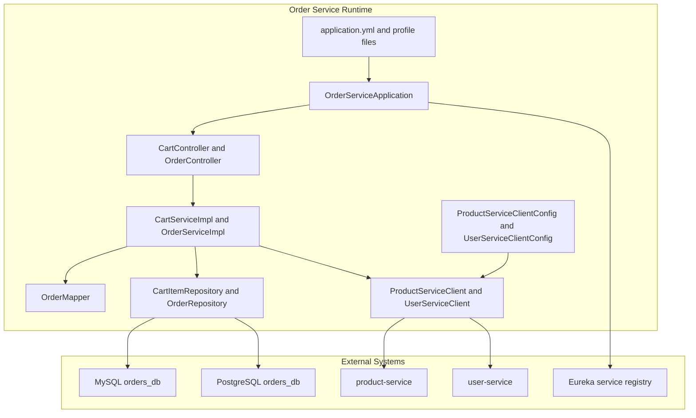
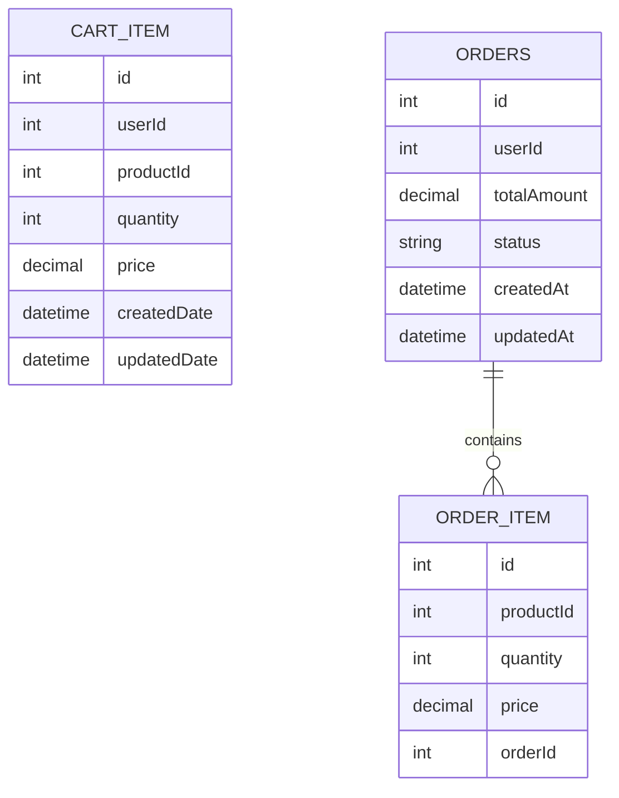
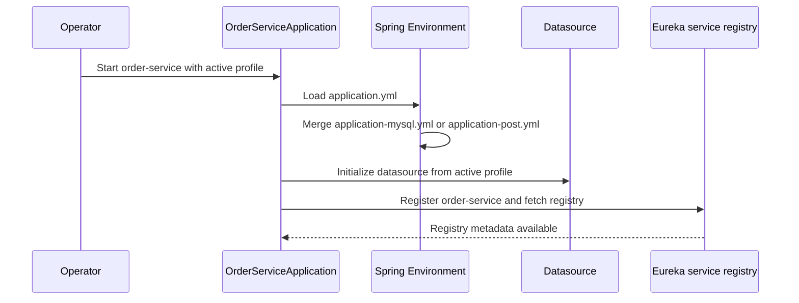

# Order Management DOMAIN - Order-service runtime configuration, persistence profiles, and operational considerations

## Overview

`order-service` is the Order Management runtime for the e-commerce backend. It exposes cart and order HTTP endpoints, registers itself with Eureka as `order-service`, and persists domain data through Spring Data JPA with profile-driven datasource settings. The module also wires outbound `RestClient` proxies to `product-service` and `user-service` so cart validation can fetch product and user details before mutating cart state.

From an operations perspective, this module is configured for local development and profile-based database switching. The base configuration exposes all actuator web endpoints, enables SQL output, and fixes the server port and Eureka registry URL. The main maintainability concern visible in the code is the pricing-field mismatch between `CartServiceImpl` and `OrderServiceImpl`, which affects how cart item prices and order totals are calculated and mapped.

## Architecture Overview



### Persistence Model



## Runtime Configuration

### Maven Build and Dependency Set

*order-service/pom.xml*

`order-service` is packaged as a JAR and inherits the Boot-managed dependency set from the parent `com.example:ecom:0.0.1-SNAPSHOT` aggregator. The module includes both MySQL and PostgreSQL JDBC drivers as runtime dependencies, so the active profile determines the live datasource.

| Dependency | Scope | Role in `order-service` |
| --- | --- | --- |
| `spring-boot-starter-web` | compile | Web MVC controllers and HTTP endpoints |
| `spring-cloud-starter-netflix-eureka-client` | compile | Service registration and discovery |
| `spring-boot-starter-data-jpa` | compile | JPA repositories and entity mapping |
| `spring-boot-starter-actuator` | compile | Operational endpoints enabled in base config |
| `mysql-connector-j` | runtime | MySQL driver for the MySQL profile |
| `postgresql` | runtime | PostgreSQL driver for the PostgreSQL profile |
| `spring-boot-devtools` | runtime optional | Development-time restart and reload support |
| `lombok` | optional | Generates data, constructor, and logging boilerplate |
| `spring-boot-configuration-processor` | optional | Configuration metadata generation |
| `spring-boot-starter-test` | test | JUnit and Mockito test support |


Build plugin configuration is minimal:

- `spring-boot-maven-plugin` packages the service JAR.
- The compiler plugin is inherited from the parent build.

### Bootstrap and Service Discovery

*order-service/src/main/java/com/example/orders/OrderServiceApplication.java*

`OrderServiceApplication` is the Spring Boot entry point. It starts the application context through `SpringApplication.run(OrderServiceApplication.class, args)`.

| Method | Description |
| --- | --- |
| `main` | Starts the `order-service` application |


The base runtime configuration gives this application its service identity and registry wiring:

*order-service/src/main/resources/application.yml*

| Setting | Value | Runtime effect |
| --- | --- | --- |
| `spring.application.name` | `order-service` | Service name used for registration and discovery |
| `server.port` | `8081` | Fixed HTTP port |
| `management.endpoints.web.exposure.include` | `*` | Exposes all actuator web endpoints |
| `logging.level.root` | `INFO` | Default application log level |
| `eureka.client.serviceUrl.defaultZone` | `http://localhost:8761/eureka/` | Eureka registry endpoint |
| `eureka.client.register-with-eureka` | `true` | Registers this service with Eureka |
| `eureka.client.fetch-registry` | `true` | Fetches registry metadata for discovery |


### Outbound REST Client Wiring

management.endpoints.web.exposure.include: "*" exposes all actuator web endpoints through the web layer configured in this service.

`order-service` uses Spring 6+ HTTP interfaces backed by `RestClient` and `HttpServiceProxyFactory` to call `product-service` and `user-service`.

#### Product Service Client Config

*order-service/src/main/java/com/example/orders/clients/ProductServiceClientConfig.java*

This configuration defines two `RestClient.Builder` beans:

| Method | Description |
| --- | --- |
| `restClientBuilderLb` | Creates the load-balanced `RestClient.Builder` used for discovery-aware calls |
| `restClientBuilder` | Creates the primary `RestClient.Builder` to avoid circular dependency |
| `productServiceInterface` | Builds the `ProductServiceClient` proxy against `http://product-service` |


Constructor dependencies: none.

#### User Service Client Config

*order-service/src/main/java/com/example/orders/clients/UserServiceClientConfig.java*

| Method | Description |
| --- | --- |
| `userServiceInterface` | Builds the `UserServiceClient` proxy against `http://user-service` |


Constructor dependencies: none.

### Actuator and Eureka Client Setup

The runtime configuration combines observability and discovery in the base YAML:

- Actuator web exposure is widened to all endpoints.
- The application registers with Eureka and also fetches the registry.
- The registry URL is hard-coded to `http://localhost:8761/eureka/`.

That makes the service self-registering in local and developer environments, while also making the registry endpoint an operational dependency of startup and discovery.

## Persistence Profiles

### Profile Matrix

| File | Purpose | Key behavior |
| --- | --- | --- |
| `application.yml` | Base runtime settings | Service name, port, logging, actuator exposure, Eureka client |
| `application-mysql.yml` | MySQL persistence profile | MySQL datasource, `ddl-auto: update`, MySQL dialect |
| `application-post.yml` | PostgreSQL persistence profile | PostgreSQL datasource, `ddl-auto: create-drop`, PostgreSQL dialect |


### MySQL Profile

*order-service/src/main/resources/application-mysql.yml*

| Setting | Value | Runtime effect |
| --- | --- | --- |
| `spring.datasource.url` | `jdbc:mysql://localhost:3306/orders_db?createDatabaseIfNotExist=true` | Connects to local MySQL and creates the database if missing |
| `spring.datasource.username` | `root` | Database login |
| `spring.datasource.password` | `Vishwas@123` | Database login |
| `spring.datasource.driver-class-name` | `com.mysql.cj.jdbc.Driver` | MySQL JDBC driver |
| `spring.jpa.hibernate.ddl-auto` | `update` | Updates schema in place |
| `spring.jpa.properties.hibernate.dialect` | `org.hibernate.dialect.MySQLDialect` | MySQL dialect |
| `spring.jpa.properties.hibernate.format_sql` | `true` | Pretty-prints SQL |
| `spring.jpa.properties.hibernate.highlight_sql` | `true` | ANSI-highlighted SQL |
| `spring.jpa.properties.hibernate.use_sql_comments` | `true` | Adds SQL comments |
| `logging.level.org.hibernate.SQL` | `DEBUG` | Logs generated SQL |
| `logging.level.org.hibernate.orm.jdbc.bind` | `TRACE` | Logs bind parameter values |


### PostgreSQL Profile

*order-service/src/main/resources/application-post.yml*

| Setting | Value | Runtime effect |
| --- | --- | --- |
| `spring.datasource.url` | `jdbc:postgresql://localhost:5432/orders_db` | Connects to local PostgreSQL |
| `spring.datasource.username` | `postgres` | Database login |
| `spring.datasource.password` | `vish@post` | Database login |
| `spring.datasource.driver-class-name` | `org.postgresql.Driver` | PostgreSQL JDBC driver |
| `spring.jpa.hibernate.ddl-auto` | `create-drop` | Recreates schema on startup and drops it on shutdown |
| `spring.jpa.properties.hibernate.dialect` | `org.hibernate.dialect.PostgreSQLDialect` | PostgreSQL dialect |
| `spring.jpa.properties.hibernate.format_sql` | `true` | Pretty-prints SQL |
| `spring.jpa.properties.hibernate.highlight_sql` | `true` | ANSI-highlighted SQL |
| `spring.jpa.properties.hibernate.use_sql_comments` | `true` | Adds SQL comments |
| `spring.jpa.show-sql` | `true` | Prints SQL through JPA logging |
| `logging.level.org.hibernate.SQL` | `DEBUG` | Logs generated SQL |
| `logging.level.org.hibernate.orm.jdbc.bind` | `TRACE` | Logs bind parameter values |


### Schema Generation and SQL Logging

The two profiles diverge in lifecycle behavior:

- `application-mysql.yml` uses `ddl-auto: update`, so Hibernate adjusts the schema incrementally.
- `application-post.yml` uses `ddl-auto: create-drop`, so schema creation is ephemeral and tied to the application lifecycle.
- Both profiles enable formatted SQL, highlighted SQL, SQL comments, and detailed Hibernate logging.
- Base `application.yml` also enables `spring.jpa.show-sql: true`, so SQL visibility is active even before a profile override is applied.

This means runtime SQL is visible through both JPA-level SQL printing and Hibernate logger output.

### Persistence Entities

#### Cart Item

The credentials in application-mysql.yml and application-post.yml are committed directly into the profile files, and the Eureka registry URL is pinned to http://localhost:8761/eureka/ in base config.

*order-service/src/main/java/com/example/orders/model/CartItem.java*

| Property | Type | Description |
| --- | --- | --- |
| `id` | `Long` | Primary key |
| `userId` | `Long` | Owning user, mapped to `user_id` |
| `productId` | `Long` | Product reference, mapped to `product_id` |
| `quantity` | `Integer` | Cart quantity |
| `price` | `BigDecimal` | Stored price value |
| `createdDate` | `LocalDateTime` | Creation timestamp via `@CreationTimestamp` |
| `updatedDate` | `LocalDateTime` | Update timestamp via `@UpdateTimestamp` |


#### Order

*order-service/src/main/java/com/example/orders/model/Order.java*

| Property | Type | Description |
| --- | --- | --- |
| `id` | `Long` | Primary key |
| `userId` | `Long` | Owning user, mapped to `user_id` |
| `totalAmount` | `BigDecimal` | Order total |
| `status` | `OrderStatus` | Order lifecycle status, defaults to `PENDING` |
| `orderItems` | `List<OrderItem>` | Child items mapped by `order`, cascade all, orphan removal enabled |
| `createdAt` | `LocalDateTime` | Creation timestamp via `@CreationTimestamp` |
| `updatedAt` | `LocalDateTime` | Update timestamp via `@UpdateTimestamp` |


#### Order Item

*order-service/src/main/java/com/example/orders/model/OrderItem.java*

| Property | Type | Description |
| --- | --- | --- |
| `id` | `Long` | Primary key |
| `productId` | `Long` | Product reference, mapped to `product_id` |
| `quantity` | `Integer` | Ordered quantity |
| `price` | `BigDecimal` | Stored price value |
| `order` | `Order` | Owning order, mapped through `order_id` |


#### Order Status

*order-service/src/main/java/com/example/orders/model/OrderStatus.java*

`PENDING`, `CONFIRMED`, `SHIPPED`, `DELIVERED`, `CANCELLED`

## Component Structure

### Configuration Classes

#### Product Service Client Config

*order-service/src/main/java/com/example/orders/clients/ProductServiceClientConfig.java*

| Property | Type | Description |
| --- | --- | --- |
| none | — | No instance fields are declared |


| Method | Description |
| --- | --- |
| `restClientBuilderLb` | Produces a load-balanced `RestClient.Builder` bean |
| `restClientBuilder` | Produces the primary `RestClient.Builder` bean |
| `productServiceInterface` | Builds the `ProductServiceClient` proxy |


#### User Service Client Config

*order-service/src/main/java/com/example/orders/clients/UserServiceClientConfig.java*

| Property | Type | Description |
| --- | --- | --- |
| none | — | No instance fields are declared |


| Method | Description |
| --- | --- |
| `userServiceInterface` | Builds the `UserServiceClient` proxy |


### Controllers

#### Cart Controller

*order-service/src/main/java/com/example/orders/controller/CartController.java*

| Property | Type | Description |
| --- | --- | --- |
| `cartService` | `CartService` | Cart mutation and read operations |


| Method | Description |
| --- | --- |
| `addToCart` | Adds a product to the current user's cart |
| `removeFromCart` | Removes one product from the current user's cart |
| `getCart` | Returns the current user's cart items |


#### Order Controller

*order-service/src/main/java/com/example/orders/controller/OrderController.java*

| Property | Type | Description |
| --- | --- | --- |
| `orderService` | `OrderService` | Order creation workflow |


| Method | Description |
| --- | --- |
| `createOrder` | Creates an order for the current user |


### Service Layer

#### Cart Service

*order-service/src/main/java/com/example/orders/service/CartService.java*

| Method | Description |
| --- | --- |
| `addToCart` | Adds or updates a cart item |
| `deleteItemFromCart` | Deletes a specific cart item |
| `getCart` | Returns all cart items for a user |
| `clearCart` | Removes all cart items for a user |


#### Cart Service Implementation

*order-service/src/main/java/com/example/orders/service/impl/CartServiceImpl.java*

| Property | Type | Description |
| --- | --- | --- |
| `cartItemRepository` | `CartItemRepository` | Persists cart rows |
| `productServiceClient` | `ProductServiceClient` | Fetches product details and stock |
| `userServiceClient` | `UserServiceClient` | Verifies user details |


| Method | Description |
| --- | --- |
| `addToCart` | Fetches product and user details, checks stock, then creates or updates a `CartItem` |
| `deleteItemFromCart` | Deletes the matching cart row when present |
| `getCart` | Loads all cart rows for a user |
| `clearCart` | Deletes all cart rows for a user |


`CartServiceImpl` is annotated with `@Transactional`, so repository mutations run within a transaction boundary.

#### Order Service

*order-service/src/main/java/com/example/orders/service/OrderService.java*

| Method | Description |
| --- | --- |
| `createOrder` | Creates an order from the current user's cart |


#### Order Service Implementation

*order-service/src/main/java/com/example/orders/service/impl/OrderServiceImpl.java*

| Property | Type | Description |
| --- | --- | --- |
| `cartService` | `CartService` | Reads and clears cart data |
| `orderRepository` | `OrderRepository` | Persists order aggregates |


| Method | Description |
| --- | --- |
| `createOrder` | Converts cart items into an `Order`, saves it, clears the cart, and maps the saved order to `OrderResponse` |


#### Order Mapper

*order-service/src/main/java/com/example/orders/utility/OrderMapper.java*

| Property | Type | Description |
| --- | --- | --- |
| none | — | No instance fields are declared |


| Method | Description |
| --- | --- |
| `mappedToOrderResponse` | Maps an `Order` entity to `OrderResponse` and computes item subtotals |


### Repository Layer

#### Cart Item Repository

*order-service/src/main/java/com/example/orders/repository/CartItemRepository.java*

| Method | Description |
| --- | --- |
| `findByUserIdAndProductId` | Finds a cart row for a user and product |
| `deleteByUserIdAndProductId` | Deletes a cart row for a user and product |
| `findByUserId` | Returns all cart rows for a user |
| `deleteByUserId` | Deletes all cart rows for a user |


#### Order Repository

*order-service/src/main/java/com/example/orders/repository/OrderRepository.java*

Repository interface extending `JpaRepository<Order, Long>`.

### Data Transfer Objects

#### Address DTO

*order-service/src/main/java/com/example/orders/dto/AddressDTO.java*

| Property | Type |
| --- | --- |
| `street` | `String` |
| `city` | `String` |
| `state` | `String` |
| `country` | `String` |
| `zipCode` | `String` |


#### Cart Item Request

*order-service/src/main/java/com/example/orders/dto/CartItemRequest.java*

| Property | Type |
| --- | --- |
| `productId` | `Long` |
| `quantity` | `Integer` |


#### Order Item DTO

*order-service/src/main/java/com/example/orders/dto/OrderItemDTO.java*

| Property | Type |
| --- | --- |
| `id` | `Long` |
| `productId` | `Long` |
| `quantity` | `Integer` |
| `price` | `BigDecimal` |
| `subTotal` | `BigDecimal` |


#### Order Response

*order-service/src/main/java/com/example/orders/dto/OrderResponse.java*

| Property | Type |
| --- | --- |
| `id` | `Long` |
| `totalAmount` | `BigDecimal` |
| `orderStatus` | `OrderStatus` |
| `items` | `List<OrderItemDTO>` |
| `createdAt` | `LocalDateTime` |


#### Product Response

*order-service/src/main/java/com/example/orders/dto/ProductResponse.java*

| Property | Type |
| --- | --- |
| `id` | `Long` |
| `name` | `String` |
| `description` | `String` |
| `price` | `BigDecimal` |
| `stockQuantity` | `Integer` |
| `category` | `String` |
| `imageUrl` | `String` |
| `active` | `Boolean` |


#### User Response

*order-service/src/main/java/com/example/orders/dto/UserResponse.java*

| Property | Type |
| --- | --- |
| `id` | `String` |
| `firstName` | `String` |
| `lastName` | `String` |
| `email` | `String` |
| `phNo` | `String` |
| `userRole` | `UserRole` |
| `address` | `AddressDTO` |


#### User Role

*order-service/src/main/java/com/example/orders/dto/UserRole.java*

`ADMIN`, `SELLER`, `CUSTOMER`

## API Integration

### Inbound Order Service Endpoints

#### Add To Cart

*`CartController.addToCart`*

*order-service/src/main/java/com/example/orders/controller/CartController.java*

```api
{
    "title": "Add To Cart",
    "description": "Adds a product to the current user's cart after product and user lookups succeed and the requested quantity fits the available stock.",
    "method": "POST",
    "baseUrl": "<OrderServiceBaseUrl>",
    "endpoint": "/api/cart",
    "headers": [
        {
            "key": "X-User-ID",
            "value": "<userId>",
            "required": true
        },
        {
            "key": "Content-Type",
            "value": "application/json",
            "required": true
        }
    ],
    "queryParams": [],
    "pathParams": [],
    "bodyType": "json",
    "requestBody": "{\n    \"productId\": 101,\n    \"quantity\": 2\n}",
    "formData": [],
    "rawBody": "",
    "responses": {
        "201": {
            "description": "Created",
            "body": "[]"
        },
        "400": {
            "description": "Bad Request",
            "body": "Product Out of Stock or User not found or Product not found"
        }
    }
}
```

#### Remove From Cart Item

*`CartController.removeFromCart`*

*order-service/src/main/java/com/example/orders/controller/CartController.java*

```api
{
    "title": "Remove From Cart Item",
    "description": "Removes the cart row for the current user and the given product identifier.",
    "method": "DELETE",
    "baseUrl": "<OrderServiceBaseUrl>",
    "endpoint": "/api/cart/items/{productId}",
    "headers": [
        {
            "key": "X-User-ID",
            "value": "<userId>",
            "required": true
        }
    ],
    "queryParams": [],
    "pathParams": [
        {
            "name": "productId",
            "type": "Long",
            "required": true
        }
    ],
    "bodyType": "none",
    "requestBody": "",
    "formData": [],
    "rawBody": "",
    "responses": {
        "204": {
            "description": "No Content",
            "body": "[]"
        },
        "404": {
            "description": "Not Found",
            "body": "[]"
        }
    }
}
```

#### Get Cart

*`CartController.getCart`*

*order-service/src/main/java/com/example/orders/controller/CartController.java*

```api
{
    "title": "Get Cart",
    "description": "Returns all cart items for the current user.",
    "method": "GET",
    "baseUrl": "<OrderServiceBaseUrl>",
    "endpoint": "/api/cart",
    "headers": [
        {
            "key": "X-User-ID",
            "value": "<userId>",
            "required": true
        }
    ],
    "queryParams": [],
    "pathParams": [],
    "bodyType": "none",
    "requestBody": "",
    "formData": [],
    "rawBody": "",
    "responses": {
        "200": {
            "description": "Success",
            "body": "[\n    {\n        \"id\": 1,\n        \"userId\": 42,\n        \"productId\": 101,\n        \"quantity\": 2,\n        \"price\": 0,\n        \"createdDate\": \"2026-03-26T10:15:30\",\n        \"updatedDate\": \"2026-03-26T10:20:45\"\n    }\n]"
        }
    }
}
```

#### Create Order

*`OrderController.createOrder`*

*order-service/src/main/java/com/example/orders/controller/OrderController.java*

```api
{
    "title": "Create Order",
    "description": "Creates an order for the current user from the items currently stored in the cart and returns the mapped order payload when successful.",
    "method": "POST",
    "baseUrl": "<OrderServiceBaseUrl>",
    "endpoint": "/api/orders",
    "headers": [
        {
            "key": "X-User-ID",
            "value": "<userId>",
            "required": true
        }
    ],
    "queryParams": [],
    "pathParams": [],
    "bodyType": "none",
    "requestBody": "",
    "formData": [],
    "rawBody": "",
    "responses": {
        "200": {
            "description": "Success",
            "body": "{\n    \"id\": 5001,\n    \"totalAmount\": 0,\n    \"orderStatus\": \"CONFIRMED\",\n    \"items\": [\n        {\n            \"id\": 9001,\n            \"productId\": 101,\n            \"quantity\": 2,\n            \"price\": 0,\n            \"subTotal\": 0\n        }\n    ],\n    \"createdAt\": \"2026-03-26T10:30:00\"\n}"
        },
        "400": {
            "description": "Bad Request",
            "body": "[]"
        }
    }
}
```

### Outbound Service Client Endpoints

#### Get Product Details By Id

*`ProductServiceClient.getProductDetails`*

*order-service/src/main/java/com/example/orders/clients/ProductServiceClient.java*

```api
{
    "title": "Get Product Details By Id",
    "description": "Fetches a product from `product-service` by product identifier for cart validation.",
    "method": "GET",
    "baseUrl": "<ProductServiceClientBaseUrl>",
    "endpoint": "/api/products/findById/{id}",
    "headers": [],
    "queryParams": [],
    "pathParams": [
        {
            "name": "id",
            "type": "String",
            "required": true
        }
    ],
    "bodyType": "none",
    "requestBody": "",
    "formData": [],
    "rawBody": "",
    "responses": {
        "200": {
            "description": "Success",
            "body": "{\n    \"id\": 101,\n    \"name\": \"Running Shoes\",\n    \"description\": \"Lightweight daily trainer\",\n    \"price\": 120,\n    \"stockQuantity\": 18,\n    \"category\": \"Footwear\",\n    \"imageUrl\": \"https://cdn.example.com/products/101.png\",\n    \"active\": true\n}"
        }
    }
}
```

#### Get User Details By Id

*`UserServiceClient.getUserDetails`*

*order-service/src/main/java/com/example/orders/clients/UserServiceClient.java*

```api
{
    "title": "Get User Details By Id",
    "description": "Fetches a user from `user-service` by user identifier for cart validation.",
    "method": "GET",
    "baseUrl": "<UserServiceClientBaseUrl>",
    "endpoint": "/api/users/{id}",
    "headers": [],
    "queryParams": [],
    "pathParams": [
        {
            "name": "id",
            "type": "Long",
            "required": true
        }
    ],
    "bodyType": "none",
    "requestBody": "",
    "formData": [],
    "rawBody": "",
    "responses": {
        "200": {
            "description": "Success",
            "body": "{\n    \"id\": \"42\",\n    \"firstName\": \"Maya\",\n    \"lastName\": \"Shah\",\n    \"email\": \"maya.shah@example.com\",\n    \"phNo\": \"5551234567\",\n    \"userRole\": \"CUSTOMER\",\n    \"address\": {\n        \"street\": \"12 Market Street\",\n        \"city\": \"Austin\",\n        \"state\": \"TX\",\n        \"country\": \"USA\",\n        \"zipCode\": \"78701\"\n    }\n}"
        }
    }
}
```

## Feature Flows

### Profile-Driven Startup and Discovery Registration



This startup path is driven by the base configuration and the selected profile file. The same application binary can boot against MySQL or PostgreSQL depending on the active profile and the matching runtime driver on the classpath.

## Operational Considerations

### Hard-Coded Credentials and Local Endpoints

### SQL Visibility

application-mysql.yml and application-post.yml contain database usernames and passwords in plain text, and application.yml hard-codes the Eureka registry URL to http://localhost:8761/eureka/.

- Base configuration enables `spring.jpa.show-sql: true`.
- Both profile files add Hibernate SQL logger settings.
- MySQL and PostgreSQL profiles both enable formatting, comments, and highlighted SQL.
- PostgreSQL profile repeats `show-sql: true` locally, so SQL visibility is explicit in that profile file as well.

### Schema Lifecycle Behavior

- MySQL profile keeps the schema and applies incremental updates with `ddl-auto: update`.
- PostgreSQL profile recreates the schema at startup and drops it on shutdown with `ddl-auto: create-drop`.
- Both profiles use explicit dialects, so schema generation is tied to the selected database engine.

### Service-to-Service Runtime Dependencies

- `CartServiceImpl` depends on `ProductServiceClient` and `UserServiceClient` for cart validation.
- Those clients are backed by `RestClient` proxies and resolved through the load-balanced service name `http://product-service` and `http://user-service`.
- Eureka registration and registry fetch are required for that discovery-based resolution path to function.

## Key Classes Reference

CartServiceImpl and OrderServiceImpl use the price field with incompatible semantics. CartServiceImpl.addToCart writes new CartItem rows with price = BigDecimal.ZERO, and when updating an existing row it treats the stored price as a total amount to derive a unit price. OrderServiceImpl.createOrder and OrderMapper.mappedToOrderResponse both multiply item.getPrice() by item.getQuantity(), so the same field is consumed as if it were a unit price. This makes order totals and item subtotals depend on how the cart row was created and updated.

| Class | Location | Responsibility |
| --- | --- | --- |
| `OrderServiceApplication.java` |  | Bootstraps the service |
| `ProductServiceClientConfig.java` |  | Builds the product service HTTP proxy and RestClient beans |
| `UserServiceClientConfig.java` |  | Builds the user service HTTP proxy |
| `CartController.java` |  | Exposes cart endpoints |
| `OrderController.java` |  | Exposes order creation endpoint |
| `CartServiceImpl.java` |  | Implements cart mutation and lookup logic |
| `OrderServiceImpl.java` |  | Builds and persists orders from cart data |
| `OrderMapper.java` |  | Maps saved orders to response DTOs |
| `CartItem.java` |  | Cart persistence entity |
| `Order.java` |  | Order aggregate root |
| `OrderItem.java` |  | Order line-item entity |
| `CartItemRepository.java` |  | Cart row queries and deletes |
| `OrderRepository.java` |  | Persists `Order` entities |
| `application.yml` |  | Base runtime, Eureka, actuator, and logging config |
| `application-mysql.yml` |  | MySQL persistence profile |
| `application-post.yml` |  | PostgreSQL persistence profile |
