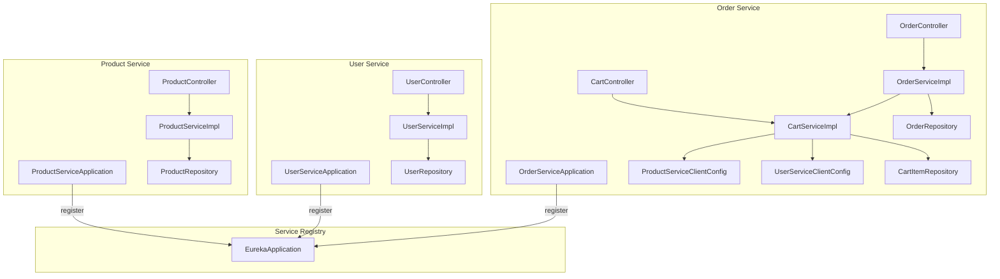
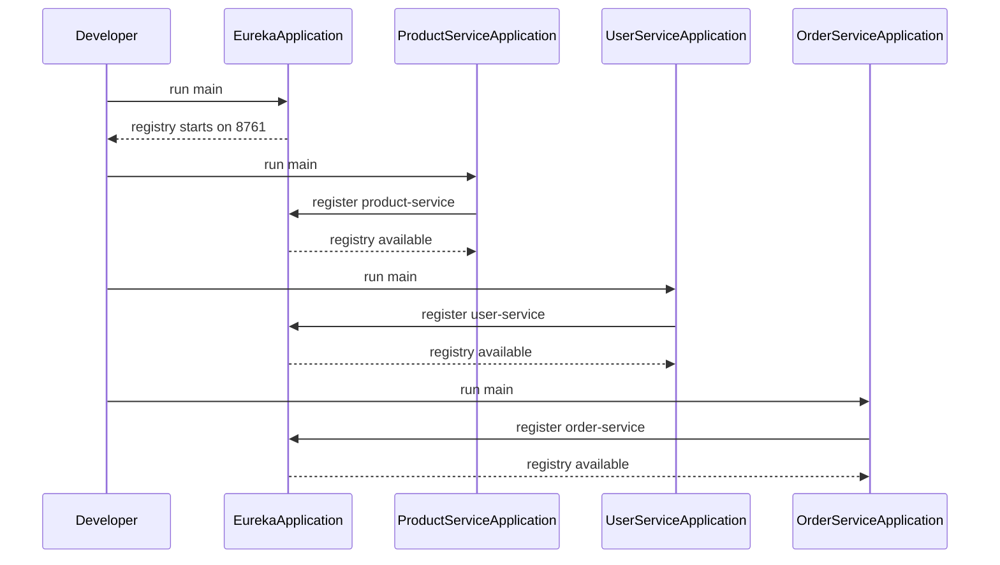
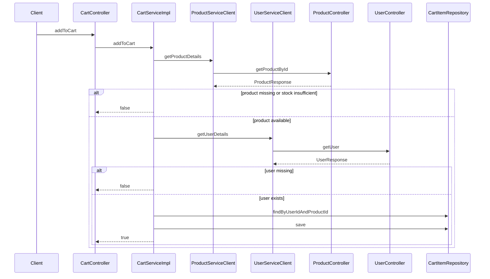
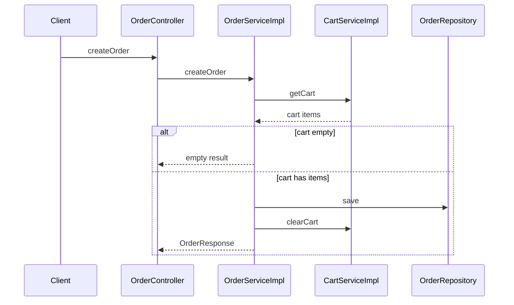

# Application Entry Points and Repository Workflow

## Overview

This repository is organized as four Spring Boot processes: `eureka`, `product-service`, `user-service`, and `order-service`. Each service has its own bootstrap class, its own `server.port`, and its own `spring.application.name`, while the three domain services register with Eureka and discover each other through service IDs instead of hard-coded hostnames.

The repository-level workflow is centered on starting the registry first, then launching the three domain services, then exercising the product, user, cart, and order flows through their REST controllers. The order service depends on load-balanced `RestClient` proxies to call the product and user services through Eureka, so the local startup order directly affects whether cart and order operations can resolve remote data.

## Architecture Overview



## Runtime Configuration

| Module | Bootstrap Class | Service Name | Port | Eureka Client Behavior | Runtime Profile Files |
| --- | --- | --- | --- | --- | --- |
| `eureka` | `EurekaApplication` | `eureka` | `8761` | Does not register or fetch the registry |  |
| `product-service` | `ProductServiceApplication` | `product-service` | `8082` | Registers with Eureka and fetches the registry | , `application-post.yml`, `application-mysql.yml` |
| `user-service` | `UserServiceApplication` | `user-service` | `8083` | Registers with Eureka and fetches the registry | , `application-post.yml`, `application-mysql.yml` |
| `order-service` | `OrderServiceApplication` | `order-service` | `8081` | Registers with Eureka and fetches the registry | , `application-post.yml`, `application-mysql.yml` |


## Application Entry Points

### Eureka Registry

 places name: eureka at the same indentation level as application:. As written, the file does not nest spring.application.name under application.

*`eureka/src/main/java/com/ecommerce/eureka/EurekaApplication.java`*

`EurekaApplication` is the registry bootstrap. It is annotated with `@SpringBootApplication` and `@EnableEurekaServer`, and its `main` method starts the registry on port `8761` using `SpringApplication.run`.

#### Properties

| Property | Type | Description |
| --- | --- | --- |
| None | - | No instance fields are declared in the bootstrap class |


#### Constructor Dependencies

| Type | Description |
| --- | --- |
| None | The bootstrap class is started directly through `main` |


#### Public Methods

| Method | Description |
| --- | --- |
| `main` | Starts the Eureka server application |


### Product Service Application

*`product-service/src/main/java/com/example/ecom/ProductServiceApplication.java`*

`ProductServiceApplication` is the entry point for the catalog service. It starts the Spring Boot context for `product-service`, which is configured to run on port `8082`, register with Eureka, and expose Actuator endpoints.

#### Properties

| Property | Type | Description |
| --- | --- | --- |
| None | - | No instance fields are declared in the bootstrap class |


#### Constructor Dependencies

| Type | Description |
| --- | --- |
| None | The bootstrap class is started directly through `main` |


#### Public Methods

| Method | Description |
| --- | --- |
| `main` | Starts the product service application |


### User Service Application

*`user-service/src/main/java/com/example/ecom/UserServiceApplication.java`*

`UserServiceApplication` is the entry point for the user service. It starts the Spring Boot context for `user-service`, which runs on port `8083` and registers itself in Eureka.

#### Properties

| Property | Type | Description |
| --- | --- | --- |
| None | - | No instance fields are declared in the bootstrap class |


#### Constructor Dependencies

| Type | Description |
| --- | --- |
| None | The bootstrap class is started directly through `main` |


#### Public Methods

| Method | Description |
| --- | --- |
| `main` | Starts the user service application |


### Order Service Application

*`order-service/src/main/java/com/example/orders/OrderServiceApplication.java`*

`OrderServiceApplication` is the entry point for the order and cart runtime. It starts the Spring Boot context for `order-service`, which runs on port `8081` and registers itself in Eureka.

#### Properties

| Property | Type | Description |
| --- | --- | --- |
| None | - | No instance fields are declared in the bootstrap class |


#### Constructor Dependencies

| Type | Description |
| --- | --- |
| None | The bootstrap class is started directly through `main` |


#### Public Methods

| Method | Description |
| --- | --- |
| `main` | Starts the order service application |


## Local Startup Order

1. Start `EurekaApplication` first on port `8761`.
2. Start `ProductServiceApplication` on port `8082`.
3. Start `UserServiceApplication` on port `8083`.
4. Start `OrderServiceApplication` on port `8081`.
5. Seed product and user records through their REST controllers.
6. Add items to the cart with the `X-User-ID` header.
7. Create the order after the cart contains items.



## Service to Service HTTP Clients

### Product Service Client

*`order-service/src/main/java/com/example/orders/clients/ProductServiceClient.java`*

`ProductServiceClient` is the type-safe HTTP client used by the order service to fetch product data from `product-service`. The only visible method resolves to the product service detail route and is wrapped by a `RestClient` proxy created in `ProductServiceClientConfig`.

#### Properties

| Property | Type | Description |
| --- | --- | --- |
| None | - | Interface only |


#### Constructor Dependencies

| Type | Description |
| --- | --- |
| None | The client is created by `HttpServiceProxyFactory` |


#### Public Methods

| Method | Description |
| --- | --- |
| `getProductDetails` | Fetches product details for a cart validation request |


#### Get Product Details

```api
{
    "title": "Get Product Details",
    "description": "Fetches product details through the load balanced product service client",
    "method": "GET",
    "baseUrl": "http://product-service",
    "endpoint": "/api/products/findById/{id}",
    "headers": [],
    "queryParams": [],
    "pathParams": [
        {
            "key": "id",
            "value": "1"
        }
    ],
    "bodyType": "none",
    "requestBody": "",
    "formData": [],
    "rawBody": "",
    "responses": {
        "200": {
            "description": "Success",
            "body": "{\n    \"id\": 1,\n    \"name\": \"Wireless Mouse\",\n    \"description\": \"Ergonomic wireless mouse\",\n    \"price\": 29.99,\n    \"stockQuantity\": 120,\n    \"category\": \"Accessories\",\n    \"imageUrl\": \"/images/wireless-mouse.png\",\n    \"active\": true\n}"
        }
    }
}
```

### Product Service Client Configuration

*`order-service/src/main/java/com/example/orders/clients/ProductServiceClientConfig.java`*

`ProductServiceClientConfig` wires the `ProductServiceClient` proxy. It exposes a load-balanced `RestClient.Builder`, a primary plain builder, and a `productServiceInterface` bean that targets the Eureka service ID `http://product-service`. The configured `defaultStatusHandler` absorbs 4xx responses so the cart flow can interpret missing products as `null`.

#### Properties

| Property | Type | Description |
| --- | --- | --- |
| None | - | No instance fields are declared in the configuration class |


#### Constructor Dependencies

| Type | Description |
| --- | --- |
| None | Beans are created directly in configuration methods |


#### Public Methods

| Method | Description |
| --- | --- |
| `restClientBuilderLb` | Creates a load-balanced `RestClient.Builder` |
| `restClientBuilder` | Creates the primary plain `RestClient.Builder` |
| `productServiceInterface` | Builds the `ProductServiceClient` proxy |


### User Service Client Configuration

*`order-service/src/main/java/com/example/orders/clients/UserServiceClientConfig.java`*

`UserServiceClientConfig` wires the user lookup client used by `CartServiceImpl`. It targets the Eureka service ID `http://user-service` and uses the same 4xx handling pattern as the product client.

#### Properties

| Property | Type | Description |
| --- | --- | --- |
| None | - | No instance fields are declared in the configuration class |


#### Constructor Dependencies

| Type | Description |
| --- | --- |
| None | Beans are created directly in configuration methods |


#### Public Methods

| Method | Description |
| --- | --- |
| `userServiceInterface` | Builds the `UserServiceClient` proxy |


#### Get User Details

```api
{
    "title": "Get User Details",
    "description": "Fetches user details through the load balanced user service client",
    "method": "GET",
    "baseUrl": "http://user-service",
    "endpoint": "/api/users/{id}",
    "headers": [],
    "queryParams": [],
    "pathParams": [
        {
            "key": "id",
            "value": "1"
        }
    ],
    "bodyType": "none",
    "requestBody": "",
    "formData": [],
    "rawBody": "",
    "responses": {
        "200": {
            "description": "Success",
            "body": "{\n    \"id\": \"1\",\n    \"firstName\": \"Jane\",\n    \"lastName\": \"Doe\",\n    \"email\": \"jane@example.com\",\n    \"phNo\": \"9876543210\",\n    \"userRole\": \"CUSTOMER\",\n    \"address\": {\n        \"street\": \"12 Market Street\",\n        \"city\": \"Austin\",\n        \"state\": \"TX\",\n        \"country\": \"USA\",\n        \"zipCode\": \"73301\"\n    }\n}"
        }
    }
}
```

## Product Service

### Product Controller

*`product-service/src/main/java/com/example/ecom/controller/ProductController.java`*

`ProductController` exposes catalog CRUD and lookup endpoints under `/api/products`. It delegates to `ProductService` and uses `ResponseEntity` status codes to encode success, not found, and delete outcomes.

#### Properties

| Property | Type | Description |
| --- | --- | --- |
| `productService` | `ProductService` | Handles product creation, update, lookup, search, and soft delete |


#### Constructor Dependencies

| Type | Description |
| --- | --- |
| `ProductService` | Business facade for product operations |


#### Public Methods

| Method | Description |
| --- | --- |
| `getAllProducts` | Returns all active products |
| `createProduct` | Creates a new product |
| `updateProduct` | Updates a product by id |
| `deleteProduct` | Soft deletes a product by id |
| `searchProducts` | Searches active in-stock products by keyword |
| `getProductById` | Returns a single active product by id |


#### Get All Products

```api
{
    "title": "Get All Products",
    "description": "Returns all active products",
    "method": "GET",
    "baseUrl": "http://localhost:8082",
    "endpoint": "/api/products",
    "headers": [],
    "queryParams": [],
    "pathParams": [],
    "bodyType": "none",
    "requestBody": "",
    "formData": [],
    "rawBody": "",
    "responses": {
        "200": {
            "description": "Success",
            "body": "[\n    {\n        \"id\": 1,\n        \"name\": \"Wireless Mouse\",\n        \"description\": \"Ergonomic wireless mouse\",\n        \"price\": 29.99,\n        \"stockQuantity\": 120,\n        \"category\": \"Accessories\",\n        \"imageUrl\": \"/images/wireless-mouse.png\",\n        \"active\": true\n    }\n]"
        }
    }
}
```

#### Create Product

```api
{
    "title": "Create Product",
    "description": "Creates a new product record",
    "method": "POST",
    "baseUrl": "http://localhost:8082",
    "endpoint": "/api/products",
    "headers": [
        {
            "key": "Content-Type",
            "value": "application/json",
            "required": true
        }
    ],
    "queryParams": [],
    "pathParams": [],
    "bodyType": "application/json",
    "requestBody": "{\n    \"name\": \"Wireless Mouse\",\n    \"description\": \"Ergonomic wireless mouse\",\n    \"price\": 29.99,\n    \"stockQuantity\": 120,\n    \"category\": \"Accessories\",\n    \"imageUrl\": \"/images/wireless-mouse.png\"\n}",
    "formData": [],
    "rawBody": "",
    "responses": {
        "201": {
            "description": "Created",
            "body": "{\n    \"id\": 1,\n    \"name\": \"Wireless Mouse\",\n    \"description\": \"Ergonomic wireless mouse\",\n    \"price\": 29.99,\n    \"stockQuantity\": 120,\n    \"category\": \"Accessories\",\n    \"imageUrl\": \"/images/wireless-mouse.png\",\n    \"active\": true\n}"
        }
    }
}
```

#### Update Product

```api
{
    "title": "Update Product",
    "description": "Updates an existing product by id",
    "method": "PUT",
    "baseUrl": "http://localhost:8082",
    "endpoint": "/api/products/{id}",
    "headers": [
        {
            "key": "Content-Type",
            "value": "application/json",
            "required": true
        }
    ],
    "queryParams": [],
    "pathParams": [
        {
            "key": "id",
            "value": "1"
        }
    ],
    "bodyType": "application/json",
    "requestBody": "{\n    \"name\": \"Wireless Mouse Pro\",\n    \"description\": \"Ergonomic mouse with higher precision\",\n    \"price\": 39.99,\n    \"stockQuantity\": 85,\n    \"category\": \"Accessories\",\n    \"imageUrl\": \"/images/wireless-mouse-pro.png\"\n}",
    "formData": [],
    "rawBody": "",
    "responses": {
        "200": {
            "description": "Success",
            "body": "{\n    \"id\": 1,\n    \"name\": \"Wireless Mouse Pro\",\n    \"description\": \"Ergonomic mouse with higher precision\",\n    \"price\": 39.99,\n    \"stockQuantity\": 85,\n    \"category\": \"Accessories\",\n    \"imageUrl\": \"/images/wireless-mouse-pro.png\",\n    \"active\": true\n}"
        },
        "404": {
            "description": "Not found",
            "body": ""
        }
    }
}
```

#### Delete Product

```api
{
    "title": "Delete Product",
    "description": "Soft deletes a product by setting its active flag to false",
    "method": "DELETE",
    "baseUrl": "http://localhost:8082",
    "endpoint": "/api/products/{id}",
    "headers": [],
    "queryParams": [],
    "pathParams": [
        {
            "key": "id",
            "value": "1"
        }
    ],
    "bodyType": "none",
    "requestBody": "",
    "formData": [],
    "rawBody": "",
    "responses": {
        "204": {
            "description": "No content",
            "body": ""
        },
        "404": {
            "description": "Not found",
            "body": ""
        }
    }
}
```

#### Search Products

```api
{
    "title": "Search Products",
    "description": "Searches active in-stock products by keyword",
    "method": "GET",
    "baseUrl": "http://localhost:8082",
    "endpoint": "/api/products/search",
    "headers": [],
    "queryParams": [
        {
            "key": "keyword",
            "value": "mouse",
            "required": true
        }
    ],
    "pathParams": [],
    "bodyType": "none",
    "requestBody": "",
    "formData": [],
    "rawBody": "",
    "responses": {
        "200": {
            "description": "Success",
            "body": "[\n    {\n        \"id\": 1,\n        \"name\": \"Wireless Mouse\",\n        \"description\": \"Ergonomic wireless mouse\",\n        \"price\": 29.99,\n        \"stockQuantity\": 120,\n        \"category\": \"Accessories\",\n        \"imageUrl\": \"/images/wireless-mouse.png\",\n        \"active\": true\n    }\n]"
        }
    }
}
```

#### Get Product By Id

```api
{
    "title": "Get Product By Id",
    "description": "Returns a single active product by id",
    "method": "GET",
    "baseUrl": "http://localhost:8082",
    "endpoint": "/api/products/findById/{id}",
    "headers": [],
    "queryParams": [],
    "pathParams": [
        {
            "key": "id",
            "value": "1"
        }
    ],
    "bodyType": "none",
    "requestBody": "",
    "formData": [],
    "rawBody": "",
    "responses": {
        "200": {
            "description": "Success",
            "body": "{\n    \"id\": 1,\n    \"name\": \"Wireless Mouse\",\n    \"description\": \"Ergonomic wireless mouse\",\n    \"price\": 29.99,\n    \"stockQuantity\": 120,\n    \"category\": \"Accessories\",\n    \"imageUrl\": \"/images/wireless-mouse.png\",\n    \"active\": true\n}"
        },
        "404": {
            "description": "Not found",
            "body": ""
        }
    }
}
```

### Product Service Facade

#### Product Service Interface

*`product-service/src/main/java/com/example/ecom/service/ProductService.java`*

`ProductService` defines the business contract for catalog operations.

#### Properties

| Property | Type | Description |
| --- | --- | --- |
| None | - | Interface only |


#### Constructor Dependencies

| Type | Description |
| --- | --- |
| None | Contract only |


#### Public Methods

| Method | Description |
| --- | --- |
| `createProduct` | Creates a product from a request payload |
| `updateProduct` | Updates an existing product and returns an optional response |
| `getAllProducts` | Returns active products |
| `deleteProduct` | Soft deletes a product by id |
| `searchProducts` | Searches catalog content by keyword |
| `getProductById` | Returns an active product by id |


#### Product Service Implementation

*`product-service/src/main/java/com/example/ecom/service/impl/ProductServiceImpl.java`*

`ProductServiceImpl` is annotated with `@Service`, `@RequiredArgsConstructor`, `@Transactional`, and `@Slf4j`. It maps `ProductRequest` to `Product`, persists via `ProductRepository`, and converts saved entities back to `ProductResponse`.

#### Properties

| Property | Type | Description |
| --- | --- | --- |
| `productRepository` | `ProductRepository` | Persists and queries `Product` entities |


#### Constructor Dependencies

| Type | Description |
| --- | --- |
| `ProductRepository` | Data access for product persistence and queries |


#### Public Methods

| Method | Description |
| --- | --- |
| `createProduct` | Saves a new product and returns a response model |
| `updateProduct` | Updates an existing product when it exists |
| `getAllProducts` | Returns active products only |
| `deleteProduct` | Soft deletes a product by setting `active` to `false` |
| `searchProducts` | Searches active products with stock greater than zero |
| `getProductById` | Returns a product when `active` is `true` |


### Product Mapping and Data Models

#### Product Mapper

*`product-service/src/main/java/com/example/ecom/utility/ProductMapper.java`*

`ProductMapper` is a static mapping helper used by `ProductServiceImpl` to move values between request, entity, and response models.

#### Properties

| Property | Type | Description |
| --- | --- | --- |
| None | - | Static utility class |


#### Public Methods

| Method | Description |
| --- | --- |
| `mapProductRequestToProduct` | Copies request fields into a `Product` entity |
| `mapProductToProductResponse` | Copies entity fields into a `ProductResponse` |


#### Product Request

*`product-service/src/main/java/com/example/ecom/dto/ProductRequest.java`*

| Property | Type | Description |
| --- | --- | --- |
| `name` | `String` | Product name |
| `description` | `String` | Product description |
| `price` | `BigDecimal` | Product price |
| `stockQuantity` | `Integer` | Available stock count |
| `category` | `String` | Product category |
| `imageUrl` | `String` | Image path or URL |


#### Product Response

*`product-service/src/main/java/com/example/ecom/dto/ProductResponse.java`*

| Property | Type | Description |
| --- | --- | --- |
| `id` | `Long` | Product identifier |
| `name` | `String` | Product name |
| `description` | `String` | Product description |
| `price` | `BigDecimal` | Product price |
| `stockQuantity` | `Integer` | Available stock count |
| `category` | `String` | Product category |
| `imageUrl` | `String` | Image path or URL |
| `active` | `Boolean` | Soft delete flag |


#### Product Entity

*`product-service/src/main/java/com/example/ecom/model/Product.java`*

| Property | Type | Description |
| --- | --- | --- |
| `id` | `Long` | Primary key |
| `name` | `String` | Product name |
| `description` | `String` | Product description |
| `price` | `BigDecimal` | Product price |
| `stockQuantity` | `Integer` | Available stock count |
| `category` | `String` | Product category |
| `imageUrl` | `String` | Image path or URL |
| `active` | `Boolean` | Soft delete flag |
| `createdAt` | `LocalDateTime` | Creation timestamp |
| `updatedAt` | `LocalDateTime` | Last update timestamp |


#### Product Repository

*`product-service/src/main/java/com/example/ecom/repository/ProductRepository.java`*

`ProductRepository` is the JPA store used by the product service.

#### Properties

| Property | Type | Description |
| --- | --- | --- |
| None | - | Repository interface only |


#### Public Methods

| Method | Description |
| --- | --- |
| `findByActiveTrue` | Returns active products |
| `searchProducts` | Searches active in-stock products by keyword in name or description |
| `findByIdAndActiveTrue` | Returns a product only when it is active |


## User Service

### User Controller

*`user-service/src/main/java/com/example/ecom/controller/UserController.java`*

`UserController` exposes user registration and lookup endpoints under `/api/users`. It delegates all persistence work to `UserService` and returns plain success strings for create and update operations.

#### Properties

| Property | Type | Description |
| --- | --- | --- |
| `userService` | `UserService` | Handles user retrieval and persistence |


#### Constructor Dependencies

| Type | Description |
| --- | --- |
| `UserService` | Business facade for user operations |


#### Public Methods

| Method | Description |
| --- | --- |
| `getAllUsers` | Returns all users |
| `addUser` | Creates a new user |
| `getUser` | Returns a user by id |
| `updateUser` | Updates a user by id |


#### Get All Users

```api
{
    "title": "Get All Users",
    "description": "Returns all users",
    "method": "GET",
    "baseUrl": "http://localhost:8083",
    "endpoint": "/api/users",
    "headers": [],
    "queryParams": [],
    "pathParams": [],
    "bodyType": "none",
    "requestBody": "",
    "formData": [],
    "rawBody": "",
    "responses": {
        "200": {
            "description": "Success",
            "body": "[\n    {\n        \"id\": \"1\",\n        \"firstName\": \"Jane\",\n        \"lastName\": \"Doe\",\n        \"email\": \"jane@example.com\",\n        \"phNo\": \"9876543210\",\n        \"userRole\": \"CUSTOMER\",\n        \"address\": {\n            \"street\": \"12 Market Street\",\n            \"city\": \"Austin\",\n            \"state\": \"TX\",\n            \"country\": \"USA\",\n            \"zipCode\": \"73301\"\n        }\n    }\n]"
        }
    }
}
```

#### Add User

```api
{
    "title": "Add User",
    "description": "Creates a new user record",
    "method": "POST",
    "baseUrl": "http://localhost:8083",
    "endpoint": "/api/users",
    "headers": [
        {
            "key": "Content-Type",
            "value": "application/json",
            "required": true
        }
    ],
    "queryParams": [],
    "pathParams": [],
    "bodyType": "application/json",
    "requestBody": "{\n    \"firstName\": \"Jane\",\n    \"lastName\": \"Doe\",\n    \"email\": \"jane@example.com\",\n    \"phNo\": \"9876543210\",\n    \"address\": {\n        \"street\": \"12 Market Street\",\n        \"city\": \"Austin\",\n        \"state\": \"TX\",\n        \"country\": \"USA\",\n        \"zipCode\": \"73301\"\n    }\n}",
    "formData": [],
    "rawBody": "",
    "responses": {
        "200": {
            "description": "Success",
            "body": "User Added Successfully"
        }
    }
}
```

#### Get User By Id

```api
{
    "title": "Get User By Id",
    "description": "Returns a user by id",
    "method": "GET",
    "baseUrl": "http://localhost:8083",
    "endpoint": "/api/users/{id}",
    "headers": [],
    "queryParams": [],
    "pathParams": [
        {
            "key": "id",
            "value": "1"
        }
    ],
    "bodyType": "none",
    "requestBody": "",
    "formData": [],
    "rawBody": "",
    "responses": {
        "200": {
            "description": "Success",
            "body": "{\n    \"id\": \"1\",\n    \"firstName\": \"Jane\",\n    \"lastName\": \"Doe\",\n    \"email\": \"jane@example.com\",\n    \"phNo\": \"9876543210\",\n    \"userRole\": \"CUSTOMER\",\n    \"address\": {\n        \"street\": \"12 Market Street\",\n        \"city\": \"Austin\",\n        \"state\": \"TX\",\n        \"country\": \"USA\",\n        \"zipCode\": \"73301\"\n    }\n}"
        },
        "404": {
            "description": "Not found",
            "body": ""
        }
    }
}
```

#### Update User

```api
{
    "title": "Update User",
    "description": "Updates an existing user by id",
    "method": "PUT",
    "baseUrl": "http://localhost:8083",
    "endpoint": "/api/users/{id}",
    "headers": [
        {
            "key": "Content-Type",
            "value": "application/json",
            "required": true
        }
    ],
    "queryParams": [],
    "pathParams": [
        {
            "key": "id",
            "value": "1"
        }
    ],
    "bodyType": "application/json",
    "requestBody": "{\n    \"firstName\": \"Jane\",\n    \"lastName\": \"Smith\",\n    \"email\": \"jane.smith@example.com\",\n    \"phNo\": \"9876543211\",\n    \"address\": {\n        \"street\": \"45 Commerce Ave\",\n        \"city\": \"Austin\",\n        \"state\": \"TX\",\n        \"country\": \"USA\",\n        \"zipCode\": \"73301\"\n    }\n}",
    "formData": [],
    "rawBody": "",
    "responses": {
        "200": {
            "description": "Success",
            "body": "User Updated successfully"
        },
        "404": {
            "description": "Not found",
            "body": ""
        }
    }
}
```

### User Service Facade

#### User Service Interface

*`user-service/src/main/java/com/example/ecom/service/UserService.java`*

`UserService` defines the user business contract used by the controller and implementation.

#### Properties

| Property | Type | Description |
| --- | --- | --- |
| None | - | Interface only |


#### Public Methods

| Method | Description |
| --- | --- |
| `getAllUsers` | Returns all users |
| `addUser` | Persists a new user |
| `getUser` | Returns a single user by id |
| `updateUser` | Updates a user by id |


#### User Service Implementation

*`user-service/src/main/java/com/example/ecom/service/impl/UserServiceImpl.java`*

`UserServiceImpl` is the transactional business layer for user persistence. It uses `UserRepository` and static mapper helpers to move between request, entity, and response shapes.

#### Properties

| Property | Type | Description |
| --- | --- | --- |
| `userRepository` | `UserRepository` | Persists and queries `User` entities |


#### Constructor Dependencies

| Type | Description |
| --- | --- |
| `UserRepository` | Data access for user persistence and queries |


#### Public Methods

| Method | Description |
| --- | --- |
| `getAllUsers` | Returns mapped user responses for all records |
| `addUser` | Saves a new user |
| `getUser` | Returns an optional user response |
| `updateUser` | Updates an existing user when found |


### User Data Models and Mapping

#### Address DTO

*`user-service/src/main/java/com/example/ecom/dto/AddressDTO.java`*

| Property | Type | Description |
| --- | --- | --- |
| `street` | `String` | Street line |
| `city` | `String` | City |
| `state` | `String` | State |
| `country` | `String` | Country |
| `zipCode` | `String` | Postal code |


#### User Request

*`user-service/src/main/java/com/example/ecom/dto/UserRequest.java`*

| Property | Type | Description |
| --- | --- | --- |
| `firstName` | `String` | User first name |
| `lastName` | `String` | User last name |
| `email` | `String` | User email |
| `phNo` | `String` | User phone number |
| `address` | `AddressDTO` | Nested address payload |


#### User Response

*`user-service/src/main/java/com/example/ecom/dto/UserResponse.java`*

| Property | Type | Description |
| --- | --- | --- |
| `id` | `String` | User identifier |
| `firstName` | `String` | User first name |
| `lastName` | `String` | User last name |
| `email` | `String` | User email |
| `phNo` | `String` | User phone number |
| `userRole` | `UserRole` | Stored role |
| `address` | `AddressDTO` | Nested address payload |


#### Address Entity

*`user-service/src/main/java/com/example/ecom/model/Address.java`*

| Property | Type | Description |
| --- | --- | --- |
| `id` | `Long` | Primary key |
| `street` | `String` | Street line |
| `city` | `String` | City |
| `state` | `String` | State |
| `country` | `String` | Country |
| `zipCode` | `String` | Postal code |


#### User Entity

*`user-service/src/main/java/com/example/ecom/model/User.java`*

| Property | Type | Description |
| --- | --- | --- |
| `id` | `Long` | Primary key |
| `firstName` | `String` | User first name |
| `lastName` | `String` | User last name |
| `email` | `String` | User email |
| `phNo` | `String` | User phone number |
| `userRole` | `UserRole` | Role stored as string |
| `address` | `Address` | One-to-one address entity |
| `createdAt` | `LocalDateTime` | Creation timestamp |
| `updatedAt` | `LocalDateTime` | Last update timestamp |


#### Address Mapper

*`user-service/src/main/java/com/example/ecom/utility/AddressMapper.java`*

`AddressMapper` copies address data between `Address` and `AddressDTO`.

#### Public Methods

| Method | Description |
| --- | --- |
| `mapAddressToAddressDTO` | Converts an `Address` entity to `AddressDTO` |
| `mapAddressDTOToAddress` | Converts an `AddressDTO` to `Address` |


#### User Repository

*`user-service/src/main/java/com/example/ecom/repository/UserRepository.java`*

`UserRepository` is the JPA store used by the user service.

#### Properties

| Property | Type | Description |
| --- | --- | --- |
| None | - | Repository interface only |


## Cart and Order Runtime

### Cart Controller

*`order-service/src/main/java/com/example/orders/controller/CartController.java`*

`CartController` exposes cart operations under `/api/cart`. Every cart request requires the `X-User-ID` header, and the controller delegates validation and persistence to `CartService`.

#### Properties

| Property | Type | Description |
| --- | --- | --- |
| `cartService` | `CartService` | Handles cart item add, delete, read, and clear operations |


#### Constructor Dependencies

| Type | Description |
| --- | --- |
| `CartService` | Business facade for cart operations |


#### Public Methods

| Method | Description |
| --- | --- |
| `addToCart` | Adds a product to the current user's cart |
| `removeFromCart` | Removes a product from the cart |
| `getCart` | Returns the current user's cart contents |


#### Add To Cart

```api
{
    "title": "Add To Cart",
    "description": "Adds a product to the current user's cart after product, stock, and user validation",
    "method": "POST",
    "baseUrl": "http://localhost:8081",
    "endpoint": "/api/cart",
    "headers": [
        {
            "key": "X-User-ID",
            "value": "1",
            "required": true
        },
        {
            "key": "Content-Type",
            "value": "application/json",
            "required": true
        }
    ],
    "queryParams": [],
    "pathParams": [],
    "bodyType": "application/json",
    "requestBody": "{\n    \"productId\": 1,\n    \"quantity\": 2\n}",
    "formData": [],
    "rawBody": "",
    "responses": {
        "201": {
            "description": "Created",
            "body": ""
        },
        "400": {
            "description": "Bad request",
            "body": "Product Out of Stock or User not found or Product not found"
        }
    }
}
```

#### Remove From Cart

```api
{
    "title": "Remove From Cart",
    "description": "Removes a product from the current user's cart",
    "method": "DELETE",
    "baseUrl": "http://localhost:8081",
    "endpoint": "/api/cart/items/{productId}",
    "headers": [
        {
            "key": "X-User-ID",
            "value": "1",
            "required": true
        }
    ],
    "queryParams": [],
    "pathParams": [
        {
            "key": "productId",
            "value": "1"
        }
    ],
    "bodyType": "none",
    "requestBody": "",
    "formData": [],
    "rawBody": "",
    "responses": {
        "204": {
            "description": "No content",
            "body": ""
        },
        "404": {
            "description": "Not found",
            "body": ""
        }
    }
}
```

#### Get Cart

```api
{
    "title": "Get Cart",
    "description": "Returns the current user's cart contents",
    "method": "GET",
    "baseUrl": "http://localhost:8081",
    "endpoint": "/api/cart",
    "headers": [
        {
            "key": "X-User-ID",
            "value": "1",
            "required": true
        }
    ],
    "queryParams": [],
    "pathParams": [],
    "bodyType": "none",
    "requestBody": "",
    "formData": [],
    "rawBody": "",
    "responses": {
        "200": {
            "description": "Success",
            "body": "[\n    {\n        \"id\": 1,\n        \"userId\": 1,\n        \"productId\": 1,\n        \"quantity\": 2,\n        \"price\": 0,\n        \"createdDate\": \"2026-03-26T10:15:30\",\n        \"updatedDate\": \"2026-03-26T10:15:30\"\n    }\n]"
        }
    }
}
```

### Cart Service Facade

#### Cart Service Interface

*`order-service/src/main/java/com/example/orders/service/CartService.java`*

`CartService` defines the cart business contract used by the cart controller and order service.

#### Properties

| Property | Type | Description |
| --- | --- | --- |
| None | - | Interface only |


#### Public Methods

| Method | Description |
| --- | --- |
| `addToCart` | Adds a product for a user |
| `deleteItemFromCart` | Deletes a product from a user cart |
| `getCart` | Returns all cart items for a user |
| `clearCart` | Removes all cart items for a user |


#### Cart Service Implementation

*`order-service/src/main/java/com/example/orders/service/impl/CartServiceImpl.java`*

`CartServiceImpl` is the transactional cart layer. It validates product availability through `ProductServiceClient`, validates the user through `UserServiceClient`, and persists cart items via `CartItemRepository`.

#### Properties

| Property | Type | Description |
| --- | --- | --- |
| `cartItemRepository` | `CartItemRepository` | Persists cart items |
| `productServiceClient` | `ProductServiceClient` | Reads product details from `product-service` |
| `userServiceClient` | `UserServiceClient` | Reads user details from `user-service` |


#### Constructor Dependencies

| Type | Description |
| --- | --- |
| `CartItemRepository` | Data access for cart items |
| `ProductServiceClient` | Remote product validation and lookup |
| `UserServiceClient` | Remote user validation and lookup |


#### Public Methods

| Method | Description |
| --- | --- |
| `addToCart` | Validates product and user, then inserts or updates a cart item |
| `deleteItemFromCart` | Removes a single cart item for a user |
| `getCart` | Returns all cart items for a user |
| `clearCart` | Deletes all cart items for a user |




#### Cart Item Request

CartServiceImpl.addToCart creates new CartItem rows with price set to BigDecimal.ZERO, and OrderServiceImpl.createOrder computes totalAmount from item.getPrice().multiply(quantity). With the visible write path, newly created cart items flow into order totals as zero.

*`order-service/src/main/java/com/example/orders/dto/CartItemRequest.java`*

| Property | Type | Description |
| --- | --- | --- |
| `productId` | `Long` | Product identifier |
| `quantity` | `Integer` | Number of units to add |


#### Cart Item Entity

*`order-service/src/main/java/com/example/orders/model/CartItem.java`*

| Property | Type | Description |
| --- | --- | --- |
| `id` | `Long` | Primary key |
| `userId` | `Long` | Owning user identifier |
| `productId` | `Long` | Product identifier |
| `quantity` | `Integer` | Units in cart |
| `price` | `BigDecimal` | Stored cart value |
| `createdDate` | `LocalDateTime` | Creation timestamp |
| `updatedDate` | `LocalDateTime` | Last update timestamp |


### Order Controller

*`order-service/src/main/java/com/example/orders/controller/OrderController.java`*

`OrderController` delegates order creation to `OrderService` and returns `OrderResponse` when the service successfully creates an order for the requested user.

#### Properties

| Property | Type | Description |
| --- | --- | --- |
| `orderService` | `OrderService` | Handles order creation |


#### Constructor Dependencies

| Type | Description |
| --- | --- |
| `OrderService` | Business facade for order creation |


#### Public Methods

| Method | Description |
| --- | --- |
| `createOrder` | Creates an order for the current user |


### Order Service Facade

#### Order Service Interface

*`order-service/src/main/java/com/example/orders/service/OrderService.java`*

`OrderService` defines the order creation contract used by the controller.

#### Properties

| Property | Type | Description |
| --- | --- | --- |
| None | - | Interface only |


#### Public Methods

| Method | Description |
| --- | --- |
| `createOrder` | Creates an order from the current user's cart |


#### Order Service Implementation

*`order-service/src/main/java/com/example/orders/service/impl/OrderServiceImpl.java`*

`OrderServiceImpl` reads cart items from `CartService`, creates an `Order`, persists it through `OrderRepository`, and clears the cart after save.

#### Properties

| Property | Type | Description |
| --- | --- | --- |
| `cartService` | `CartService` | Reads and clears the current user's cart |
| `orderRepository` | `OrderRepository` | Persists `Order` entities |


#### Constructor Dependencies

| Type | Description |
| --- | --- |
| `CartService` | Reads and clears cart items |
| `OrderRepository` | Data access for order persistence |


#### Public Methods

| Method | Description |
| --- | --- |
| `createOrder` | Builds and saves an order from cart items, then clears the cart |




### Order Data Models and Enumerations

#### Order Status

*`order-service/src/main/java/com/example/orders/model/OrderStatus.java`*

`PENDING, CONFIRMED, SHIPPED, DELIVERED, CANCELLED`

#### Order Entity

*`order-service/src/main/java/com/example/orders/model/Order.java`*

| Property | Type | Description |
| --- | --- | --- |
| `id` | `Long` | Primary key |
| `userId` | `Long` | Owning user identifier |
| `totalAmount` | `BigDecimal` | Order amount |
| `status` | `OrderStatus` | Order state |
| `orderItems` | `List<OrderItem>` | Child order items |
| `createdAt` | `LocalDateTime` | Creation timestamp |
| `updatedAt` | `LocalDateTime` | Last update timestamp |


#### Order Item Entity

*`order-service/src/main/java/com/example/orders/model/OrderItem.java`*

| Property | Type | Description |
| --- | --- | --- |
| `id` | `Long` | Primary key |
| `productId` | `Long` | Product identifier |
| `quantity` | `Integer` | Units ordered |
| `price` | `BigDecimal` | Stored line price |
| `order` | `Order` | Owning order |


#### Order Item DTO

*`order-service/src/main/java/com/example/orders/dto/OrderItemDTO.java`*

| Property | Type | Description |
| --- | --- | --- |
| `id` | `Long` | Order item identifier |
| `productId` | `Long` | Product identifier |
| `quantity` | `Integer` | Units ordered |
| `price` | `BigDecimal` | Stored line price |
| `subTotal` | `BigDecimal` | Derived line total |


#### Order Response

*`order-service/src/main/java/com/example/orders/dto/OrderResponse.java`*

| Property | Type | Description |
| --- | --- | --- |
| `id` | `Long` | Order identifier |
| `totalAmount` | `BigDecimal` | Final amount |
| `orderStatus` | `OrderStatus` | Order state |
| `items` | `List<OrderItemDTO>` | Order items |
| `createdAt` | `LocalDateTime` | Creation timestamp |


#### Order Service User DTO

*`order-service/src/main/java/com/example/orders/dto/UserResponse.java`*

| Property | Type | Description |
| --- | --- | --- |
| `id` | `String` | User identifier |
| `firstName` | `String` | User first name |
| `lastName` | `String` | User last name |
| `email` | `String` | User email |
| `phNo` | `String` | User phone number |
| `userRole` | `UserRole` | User role |
| `address` | `AddressDTO` | Nested address payload |


#### Order Service Address DTO

*`order-service/src/main/java/com/example/orders/dto/AddressDTO.java`*

| Property | Type | Description |
| --- | --- | --- |
| `street` | `String` | Street line |
| `city` | `String` | City |
| `state` | `String` | State |
| `country` | `String` | Country |
| `zipCode` | `String` | Postal code |


### Repository Workflow and Curl Sequence

The visible controller routes support a simple setup and checkout flow:

1. Create catalog entries through `ProductController`.
2. Create a user through `UserController`.
3. Add cart items with the `X-User-ID` header through `CartController`.
4. Read or remove cart items as needed.
5. Trigger order creation through `OrderController.createOrder` after the cart contains items.

```bash
curl -X POST http://localhost:8082/api/products \
  -H "Content-Type: application/json" \
  -d '{"name":"Wireless Mouse","description":"Ergonomic wireless mouse","price":29.99,"stockQuantity":120,"category":"Accessories","imageUrl":"/images/wireless-mouse.png"}'

curl -X POST http://localhost:8083/api/users \
  -H "Content-Type: application/json" \
  -d '{"firstName":"Jane","lastName":"Doe","email":"jane@example.com","phNo":"9876543210","address":{"street":"12 Market Street","city":"Austin","state":"TX","country":"USA","zipCode":"73301"}}'

curl -X POST http://localhost:8081/api/cart \
  -H "Content-Type: application/json" \
  -H "X-User-ID: 1" \
  -d '{"productId":1,"quantity":2}'

curl -X GET http://localhost:8081/api/cart \
  -H "X-User-ID: 1"

curl -X DELETE http://localhost:8081/api/cart/items/1 \
  -H "X-User-ID: 1"
```

## Runtime Configuration and Profiles

### Product Service Profiles

*`product-service/src/main/resources/application.yml`*

- `spring.application.name`: `product-service`
- `server.port`: `8082`
- `management.endpoints.web.exposure.include`: `*`
- `eureka.client.defaultZone`: `http://localhost:8761/eureka/`
- `eureka.client.register-with-eureka`: `true`
- `eureka.client.fetch-registry`: `true`

*`product-service/src/main/resources/application-post.yml`*

- PostgreSQL URL: `jdbc:postgresql://localhost:5432/product_db`
- Username: `postgres`
- Password: `vish@post`
- `ddl-auto`: `create-drop`

*`product-service/src/main/resources/application-mysql.yml`*

- MySQL URL: `jdbc:mysql://localhost:3306/product_db?createDatabaseIfNotExist=true`
- Username: `root`
- Password: `Vishwas@123`
- `ddl-auto`: `update`

### User Service Profiles

*`user-service/src/main/resources/application.yml`*

- `spring.application.name`: `user-service`
- `server.port`: `8083`
- `management.endpoints.web.exposure.include`: `*`
- `eureka.client.defaultZone`: `http://localhost:8761/eureka/`
- `eureka.client.register-with-eureka`: `true`
- `eureka.client.fetch-registry`: `true`

*`user-service/src/main/resources/application-post.yml`*

- PostgreSQL URL: `jdbc:postgresql://localhost:5432/user_db`
- Username: `postgres`
- Password: `vish@post`
- `ddl-auto`: `create-drop`

*`user-service/src/main/resources/application-mysql.yml`*

- MySQL URL: `jdbc:mysql://localhost:3306/user_db?createDatabaseIfNotExist=true`
- Username: `root`
- Password: `Vishwas@123`
- `ddl-auto`: `update`

### Order Service Profiles

*`order-service/src/main/resources/application.yml`*

- `spring.application.name`: `order-service`
- `server.port`: `8081`
- `management.endpoints.web.exposure.include`: `*`
- `eureka.client.defaultZone`: `http://localhost:8761/eureka/`
- `eureka.client.register-with-eureka`: `true`
- `eureka.client.fetch-registry`: `true`

*`order-service/src/main/resources/application-post.yml`*

- PostgreSQL URL: `jdbc:postgresql://localhost:5432/orders_db`
- Username: `postgres`
- Password: `vish@post`
- `ddl-auto`: `create-drop`

*`order-service/src/main/resources/application-mysql.yml`*

- MySQL URL: `jdbc:mysql://localhost:3306/orders_db?createDatabaseIfNotExist=true`
- Username: `root`
- Password: `Vishwas@123`
- `ddl-auto`: `update`

## Key Classes Reference

| Class | Responsibility |
| --- | --- |
| `EurekaApplication.java` | Starts the Eureka registry |
| `ProductServiceApplication.java` | Starts the product service |
| `UserServiceApplication.java` | Starts the user service |
| `OrderServiceApplication.java` | Starts the order and cart service runtime |
| `ProductController.java` | Exposes product REST endpoints |
| `UserController.java` | Exposes user REST endpoints |
| `CartController.java` | Exposes cart REST endpoints |
| `OrderController.java` | Exposes order creation flow |
| `ProductServiceImpl.java` | Implements product business logic |
| `UserServiceImpl.java` | Implements user business logic |
| `CartServiceImpl.java` | Implements cart validation and persistence |
| `OrderServiceImpl.java` | Implements order creation and cart clearing |
| `ProductServiceClientConfig.java` | Builds the product service HTTP client proxy |
| `UserServiceClientConfig.java` | Builds the user service HTTP client proxy |
