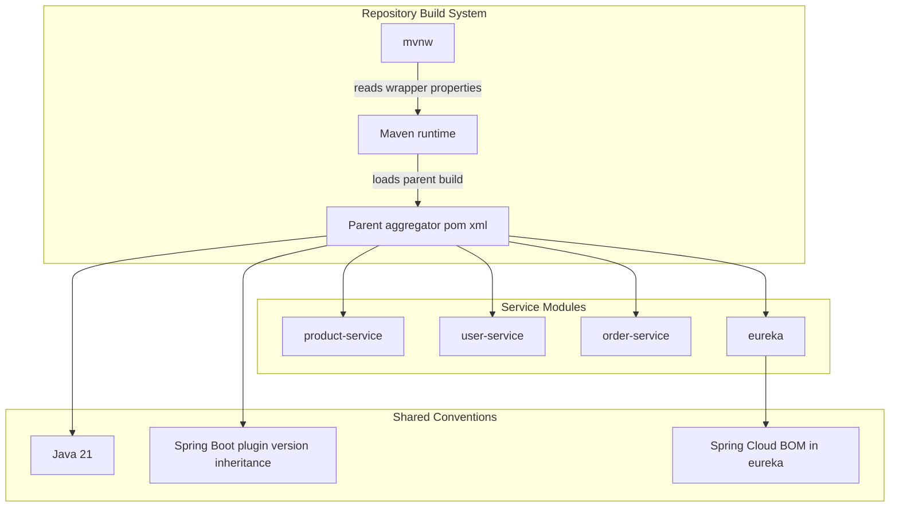
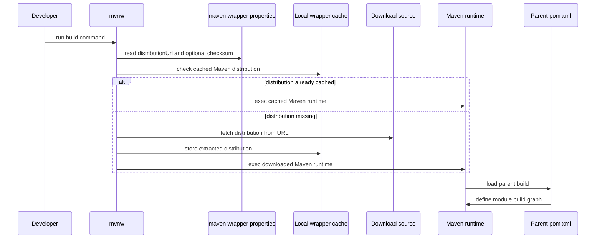

# Platform Architecture and Build System

## Overview

This repository is organized as a Maven multi-module build for four Spring Boot services: `product-service`, `user-service`, `order-service`, and `eureka`. The modules inherit a shared parent build through , and the repository uses the Maven Wrapper `mvnw` as the command-line entry point so builds can run with the same Maven distribution everywhere.

The build layout keeps shared conventions at the parent level and pushes service-specific differences into each child `pom.xml`. The service modules share Java 21, Spring Boot starters, and test dependencies, while `eureka` is the registry server module and imports the Spring Cloud BOM directly in its own build descriptor.

## Architecture Overview

## Repository Build Topology

The repository builds from a shared parent POM and four child modules. Each service module declares the parent coordinates as `com.example:ecom:0.0.1-SNAPSHOT` with `relativePath` set to , which makes the parent build the authoritative source for shared conventions.

| Module | Build Role | Parent Inheritance | Notable Build Identity |
| --- | --- | --- | --- |
| `product-service` | Product REST service | Inherits from  | `artifactId` and `name` are both `product-service`; `packaging` is `jar` |
| `user-service` | User REST service | Inherits from  | `artifactId` and `name` are both `user-service`; `packaging` is `jar` |
| `order-service` | Order and cart service | Inherits from  | `artifactId` and `name` are both `order-service`; `packaging` is `jar` |
| `eureka` | Service registry | Inherits from  | Overrides `groupId` to `com.ecommerce`; `artifactId` is `eureka` |

## Parent Aggregator and Shared Dependency Management

The child module POMs all point to the same parent aggregator. That parent is responsible for the shared Java and Spring Boot build conventions that the children rely on, including inherited plugin versions referenced in the module comments.

| Shared Build Concern | Evidence in Child POMs | Effect |
| --- | --- | --- |
| Parent inheritance | `<parent> ... <relativePath>../pom.xml</relativePath>` in all module POMs | Child modules share the same build baseline |
| Java level | `java.version` is set to `21` in ; `user-service` uses `${java.version}` in `maven-compiler-plugin` | Build targets Java 21 |
| Spring Boot plugin versioning | Child comments say the `spring-boot-maven-plugin` version is inherited | Child modules only declare the plugin, not its version |
| Compiler plugin control | `user-service` declares `maven-compiler-plugin` with `source` and `target` set to `${java.version}` | `user-service` explicitly pins compilation to Java 21 |
| Spring Cloud BOM |  imports `spring-cloud-dependencies` with `${spring-cloud.version}` | Spring Cloud dependency versions are aligned through BOM import |

## Module Build Descriptors

### Product Service POM

The build conventions are split between inheritance and local overrides: product-service and order-service rely on parent-managed plugin versioning, user-service adds a local compiler plugin override, and eureka adds its own Spring Cloud BOM import and groupId override.

*`product-service/pom.xml`*

`product-service` is a jar module that inherits from the shared parent and adds the dependencies needed for a REST API backed by JPA and exposed to Eureka.

**Coordinates and packaging**

| Property | Value |
| --- | --- |
| `artifactId` | `product-service` |
| `name` | `product-service` |
| `packaging` | `jar` |

**Direct dependencies**

| Dependency | Scope | Purpose |
| --- | --- | --- |
| `spring-boot-starter-web` | compile | REST endpoints |
| `spring-cloud-starter-netflix-eureka-client` | compile | Service registration with Eureka |
| `spring-boot-starter-data-jpa` | compile | JPA persistence |
| `spring-boot-starter-actuator` | compile | Actuator endpoints |
| `mysql-connector-j` | runtime | MySQL driver selected by profile |
| `postgresql` | runtime | PostgreSQL driver selected by profile |
| `spring-boot-devtools` | runtime, optional | Development-time reload support |
| `lombok` | optional | Boilerplate reduction |
| `spring-boot-configuration-processor` | optional | Configuration metadata generation |
| `spring-boot-starter-test` | test | JUnit and Mockito support |

**Build plugin**

| Plugin | Role |
| --- | --- |
| `spring-boot-maven-plugin` | Declared only; version is inherited from the parent build |

### User Service POM

*`user-service/pom.xml`*

`user-service` follows the same parent inheritance pattern as `product-service` but diverges in its local compiler configuration. It uses the same service stack and database driver strategy, then explicitly pins the Java source and target level through `maven-compiler-plugin`.

**Coordinates and packaging**

| Property | Value |
| --- | --- |
| `artifactId` | `user-service` |
| `name` | `user-service` |
| `packaging` | `jar` |

**Direct dependencies**

| Dependency | Scope | Purpose |
| --- | --- | --- |
| `spring-boot-starter-web` | compile | REST endpoints |
| `spring-cloud-starter-netflix-eureka-client` | compile | Service registration with Eureka |
| `spring-boot-starter-data-jpa` | compile | JPA persistence |
| `spring-boot-starter-actuator` | compile | Actuator endpoints |
| `postgresql` | runtime | PostgreSQL driver selected by profile |
| `mysql-connector-j` | runtime | MySQL driver selected by profile |
| `spring-boot-devtools` | runtime, optional | Development-time reload support |
| `lombok` | optional | Boilerplate reduction |
| `spring-boot-starter-test` | test | JUnit and Mockito support |

**Build plugins**

| Plugin | Role |
| --- | --- |
| `spring-boot-maven-plugin` | Declared only; version is inherited from the parent build |
| `maven-compiler-plugin` | Explicitly configured with `source` and `target` set to `${java.version}` |

### Order Service POM

*`order-service/pom.xml`*

`order-service` mirrors the product module’s dependency style and keeps the same runtime profile split for MySQL and PostgreSQL. Like `product-service`, it relies on the parent for plugin versioning and only declares the Boot plugin locally.

**Coordinates and packaging**

| Property | Value |
| --- | --- |
| `artifactId` | `order-service` |
| `name` | `order-service` |
| `packaging` | `jar` |

**Direct dependencies**

| Dependency | Scope | Purpose |
| --- | --- | --- |
| `spring-boot-starter-web` | compile | REST endpoints |
| `spring-cloud-starter-netflix-eureka-client` | compile | Service registration with Eureka |
| `spring-boot-starter-data-jpa` | compile | JPA persistence |
| `spring-boot-starter-actuator` | compile | Actuator endpoints |
| `mysql-connector-j` | runtime | MySQL driver selected by profile |
| `postgresql` | runtime | PostgreSQL driver selected by profile |
| `spring-boot-devtools` | runtime, optional | Development-time reload support |
| `lombok` | optional | Boilerplate reduction |
| `spring-boot-configuration-processor` | optional | Configuration metadata generation |
| `spring-boot-starter-test` | test | JUnit and Mockito support |

**Build plugin**

| Plugin | Role |
| --- | --- |
| `spring-boot-maven-plugin` | Declared only; version is inherited from the parent build |

### Eureka POM

*`eureka/pom.xml`*

`eureka` is the registry server module. It differs from the service modules in two important ways: it uses the Eureka server starter instead of the client starter, and it imports the Spring Cloud BOM directly in its own `dependencyManagement` section.

**Coordinates and metadata**

| Property | Value |
| --- | --- |
| `groupId` | `com.ecommerce` |
| `artifactId` | `eureka` |
| `version` | `0.0.1-SNAPSHOT` |
| `name` | `eureka` |
| `description` | `eureka` |

**Build properties**

| Property | Value |
| --- | --- |
| `java.version` | `21` |

**Direct dependencies**

| Dependency | Scope | Purpose |
| --- | --- | --- |
| `spring-boot-starter-web` | compile | Web endpoint hosting |
| `spring-cloud-starter-netflix-eureka-server` | compile | Eureka registry server |
| `spring-boot-starter-test` | test | Test support |

**Dependency management**

| Managed Import | Role |
| --- | --- |
| `spring-cloud-dependencies` | Imported as a BOM using `${spring-cloud.version}` |

**Build plugin**

| Plugin | Role |
| --- | --- |
| `spring-boot-maven-plugin` | Declared in the module build |

## Shared Dependency and Profile Conventions

The three service modules use both MySQL and PostgreSQL JDBC drivers at runtime scope, with the active Spring profile deciding which driver is actually selected at startup. Their corresponding `application-mysql.yml` and `application-post.yml` files hold the database URL, credentials, and Hibernate settings for each profile.

| Convention | Modules |
| --- | --- |
| MySQL driver as runtime dependency | `product-service`, `user-service`, `order-service` |
| PostgreSQL driver as runtime dependency | `product-service`, `user-service`, `order-service` |
| Devtools as optional runtime dependency | `product-service`, `user-service`, `order-service` |
| JPA and Actuator starters | `product-service`, `user-service`, `order-service` |
| Eureka client starter | `product-service`, `user-service`, `order-service` |
| Eureka server starter | `eureka` |

## Maven Wrapper

The repository’s Maven Wrapper script is the portable build entry point. It reads wrapper configuration from , resolves or downloads the Maven distribution, stores it under the user’s Maven wrapper cache, and then executes the Maven binary from that local installation.

### Wrapper Execution Lifecycle

### Wrapper Responsibilities

| Responsibility | Behavior |
| --- | --- |
| Distribution resolution | Uses `distributionUrl` from  |
| Cache location | Stores Maven under `~/.m2/wrapper/dists/...` using a hash of the distribution URL |
| Download fallback | Uses `wget`, `curl`, or a Java-based downloader depending on availability |
| Checksum validation | Verifies `distributionSha256Sum` when present |
| Platform handling | Normalizes paths for Cygwin and MinGW environments |
| Runtime selection | Executes the resolved Maven binary from the local wrapper install |

### Wrapper Environment Variables

| Variable | Purpose |
| --- | --- |
| `JAVA_HOME` | Used when the wrapper needs Java to download the distribution |
| `MVNW_REPOURL` | Overrides the repository base URL for the Maven distribution |
| `MVNW_USERNAME` | Supplies download credentials when authentication is required |
| `MVNW_PASSWORD` | Supplies download credentials when authentication is required |
| `MVNW_VERBOSE` | Enables verbose wrapper logging |
| `MAVEN_USER_HOME` | Overrides the wrapper cache root used for distribution storage |

## Build Conventions and Divergence

The repository’s build setup follows a small set of repeatable conventions:

- All service modules inherit from the same parent build through .
- Service modules declare the same core Spring Boot stack and use the same runtime database driver split.
- `spring-boot-devtools` is marked optional in the service modules, keeping it out of the production dependency set.
- `spring-boot-maven-plugin` is declared in each module but its version is inherited from the parent.
- `user-service` is the only service module that explicitly configures `maven-compiler-plugin` at the module level.
- `eureka` is the only module that declares `spring-cloud-starter-netflix-eureka-server` and imports `spring-cloud-dependencies` in module-local `dependencyManagement`.

## Key Classes Reference

| Class | Responsibility |
| --- | --- |
| `pom.xml` | Parent aggregator build that child modules inherit through  |
| `product-service pom.xml` | Product service module build descriptor with web, JPA, Eureka client, Actuator, and profile-based JDBC drivers |
| `user-service pom.xml` | User service module build descriptor with Java 21 compiler configuration |
| `order-service pom.xml` | Order service module build descriptor with web, JPA, Eureka client, Actuator, and profile-based JDBC drivers |
| `eureka pom.xml` | Eureka server module build descriptor with Spring Cloud BOM import |
| `mvnw` | Maven Wrapper entry point that resolves, caches, and executes the build runtime |
