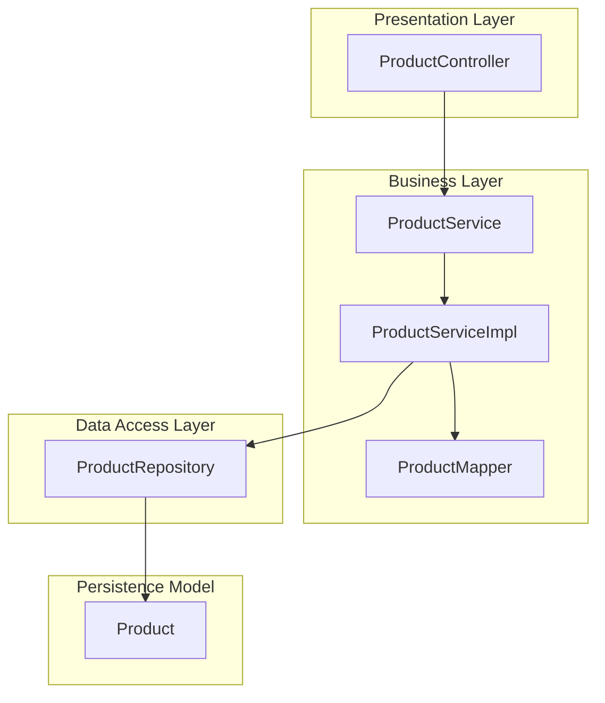
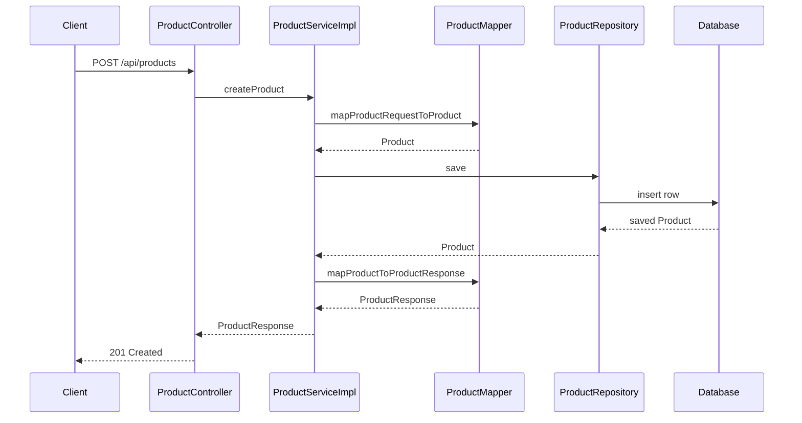
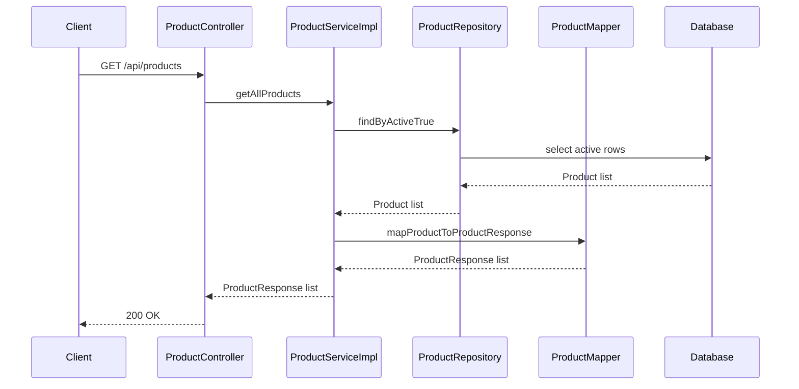
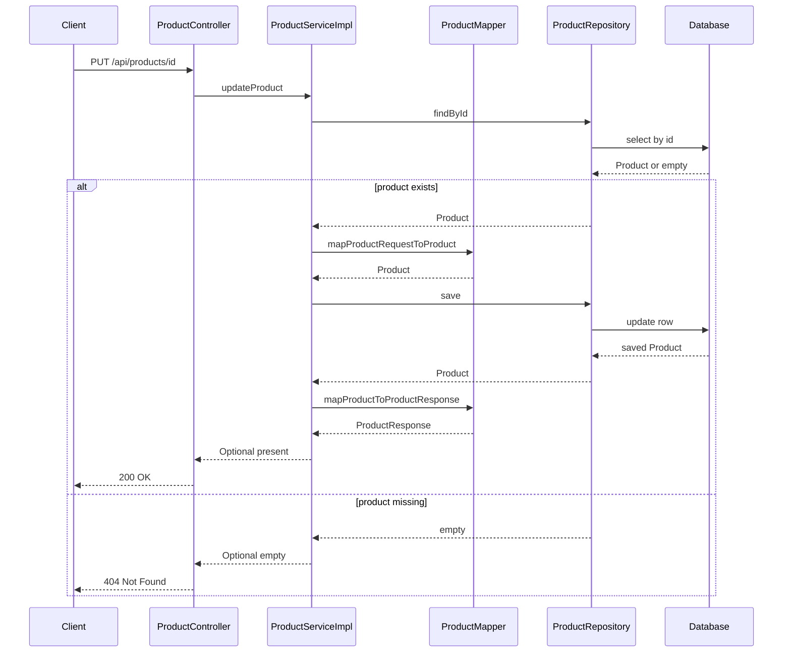
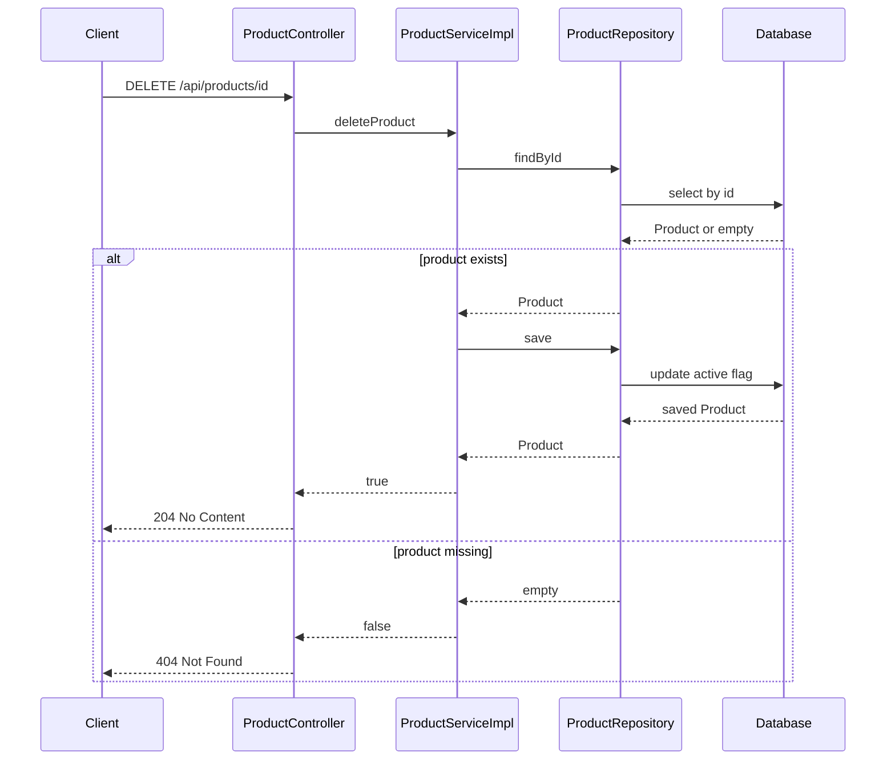
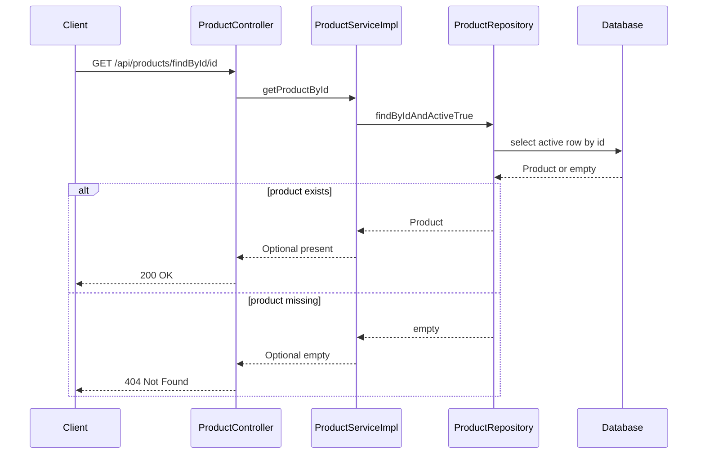

# Product Catalog DOMAIN - Catalog API, CRUD flow, and service-repository responsibilities

## Overview

This section covers the catalog HTTP API exposed by `product-service` through `ProductController`, and the service and repository chain that powers create, list, update, delete, get-by-id, and search operations. The controller owns request binding and HTTP status mapping, `ProductServiceImpl` owns transactional business orchestration and soft-delete behavior, and `ProductRepository` owns JPA persistence and query filtering.

The catalog API returns `ProductResponse` objects for reads and writes, uses `ProductRequest` for create and update payloads, and persists changes against the `Product` entity. Active-product visibility is enforced in the read paths through repository methods that filter on `active = true`, while delete flips the entity state to inactive instead of removing the row.

## Architecture Overview



## HTTP API

### Create Product

#### Create Product

*`product-service/src/main/java/com/example/ecom/controller/ProductController.java`*

```api
{
    "title": "Create Product",
    "description": "Creates a new catalog product and returns the created ProductResponse",
    "method": "POST",
    "baseUrl": "<ProductServiceBaseUrl>",
    "endpoint": "/api/products",
    "headers": [
        {
            "key": "Content-Type",
            "value": "application/json",
            "required": true
        }
    ],
    "queryParams": [],
    "pathParams": [],
    "bodyType": "json",
    "requestBody": "{\n    \"name\": \"Wireless Mouse\",\n    \"description\": \"2.4 GHz ergonomic wireless mouse\",\n    \"price\": 24.99,\n    \"stockQuantity\": 120,\n    \"category\": \"Accessories\",\n    \"imageUrl\": \"https://cdn.example.com/products/wireless-mouse.png\"\n}",
    "formData": [],
    "rawBody": "",
    "responses": {
        "201": {
            "description": "Created",
            "body": "{\n    \"id\": 101,\n    \"name\": \"Wireless Mouse\",\n    \"description\": \"2.4 GHz ergonomic wireless mouse\",\n    \"price\": 24.99,\n    \"stockQuantity\": 120,\n    \"category\": \"Accessories\",\n    \"imageUrl\": \"https://cdn.example.com/products/wireless-mouse.png\",\n    \"active\": true\n}"
        }
    }
}
```

### List Active Products

#### List Active Products

*`product-service/src/main/java/com/example/ecom/controller/ProductController.java`*

```api
{
    "title": "List Active Products",
    "description": "Returns all active catalog products as a ProductResponse array",
    "method": "GET",
    "baseUrl": "<ProductServiceBaseUrl>",
    "endpoint": "/api/products",
    "headers": [],
    "queryParams": [],
    "pathParams": [],
    "bodyType": "none",
    "requestBody": "",
    "formData": [],
    "rawBody": "",
    "responses": {
        "200": {
            "description": "Success",
            "body": "[\n    {\n        \"id\": 101,\n        \"name\": \"Wireless Mouse\",\n        \"description\": \"2.4 GHz ergonomic wireless mouse\",\n        \"price\": 24.99,\n        \"stockQuantity\": 120,\n        \"category\": \"Accessories\",\n        \"imageUrl\": \"https://cdn.example.com/products/wireless-mouse.png\",\n        \"active\": true\n    }\n]"
        }
    }
}
```

### Update Product

#### Update Product

*`product-service/src/main/java/com/example/ecom/controller/ProductController.java`*

```api
{
    "title": "Update Product",
    "description": "Updates an existing product when the id exists and returns the updated ProductResponse",
    "method": "PUT",
    "baseUrl": "<ProductServiceBaseUrl>",
    "endpoint": "/api/products/id",
    "headers": [
        {
            "key": "Content-Type",
            "value": "application/json",
            "required": true
        }
    ],
    "queryParams": [],
    "pathParams": [
        {
            "key": "id",
            "value": "101",
            "required": true
        }
    ],
    "bodyType": "json",
    "requestBody": "{\n    \"name\": \"Wireless Mouse Pro\",\n    \"description\": \"Updated ergonomic mouse with higher DPI\",\n    \"price\": 29.99,\n    \"stockQuantity\": 95,\n    \"category\": \"Accessories\",\n    \"imageUrl\": \"https://cdn.example.com/products/wireless-mouse-pro.png\"\n}",
    "formData": [],
    "rawBody": "",
    "responses": {
        "200": {
            "description": "Success",
            "body": "{\n    \"id\": 101,\n    \"name\": \"Wireless Mouse Pro\",\n    \"description\": \"Updated ergonomic mouse with higher DPI\",\n    \"price\": 29.99,\n    \"stockQuantity\": 95,\n    \"category\": \"Accessories\",\n    \"imageUrl\": \"https://cdn.example.com/products/wireless-mouse-pro.png\",\n    \"active\": true\n}"
        },
        "404": {
            "description": "Not Found",
            "body": ""
        }
    }
}
```

### Delete Product

#### Delete Product

*`product-service/src/main/java/com/example/ecom/controller/ProductController.java`*

```api
{
    "title": "Delete Product",
    "description": "Soft deletes a product and returns no content when the id exists",
    "method": "DELETE",
    "baseUrl": "<ProductServiceBaseUrl>",
    "endpoint": "/api/products/id",
    "headers": [],
    "queryParams": [],
    "pathParams": [
        {
            "key": "id",
            "value": "101",
            "required": true
        }
    ],
    "bodyType": "none",
    "requestBody": "",
    "formData": [],
    "rawBody": "",
    "responses": {
        "204": {
            "description": "No Content",
            "body": ""
        },
        "404": {
            "description": "Not Found",
            "body": ""
        }
    }
}
```

### Search Products

#### Search Products

*`product-service/src/main/java/com/example/ecom/controller/ProductController.java`*

```api
{
    "title": "Search Products",
    "description": "Searches active in-stock products by keyword in name or description",
    "method": "GET",
    "baseUrl": "<ProductServiceBaseUrl>",
    "endpoint": "/api/products/search",
    "headers": [],
    "queryParams": [
        {
            "key": "keyword",
            "value": "mouse",
            "required": true
        }
    ],
    "pathParams": [],
    "bodyType": "none",
    "requestBody": "",
    "formData": [],
    "rawBody": "",
    "responses": {
        "200": {
            "description": "Success",
            "body": "[\n    {\n        \"id\": 101,\n        \"name\": \"Wireless Mouse\",\n        \"description\": \"2.4 GHz ergonomic wireless mouse\",\n        \"price\": 24.99,\n        \"stockQuantity\": 120,\n        \"category\": \"Accessories\",\n        \"imageUrl\": \"https://cdn.example.com/products/wireless-mouse.png\",\n        \"active\": true\n    }\n]"
        }
    }
}
```

### Get Product By Id

#### Get Product By Id

*`product-service/src/main/java/com/example/ecom/controller/ProductController.java`*

```api
{
    "title": "Get Product By Id",
    "description": "Returns an active product when the id exists, otherwise returns not found",
    "method": "GET",
    "baseUrl": "<ProductServiceBaseUrl>",
    "endpoint": "/api/products/findById/id",
    "headers": [],
    "queryParams": [],
    "pathParams": [
        {
            "key": "id",
            "value": "101",
            "required": true
        }
    ],
    "bodyType": "none",
    "requestBody": "",
    "formData": [],
    "rawBody": "",
    "responses": {
        "200": {
            "description": "Success",
            "body": "{\n    \"id\": 101,\n    \"name\": \"Wireless Mouse\",\n    \"description\": \"2.4 GHz ergonomic wireless mouse\",\n    \"price\": 24.99,\n    \"stockQuantity\": 120,\n    \"category\": \"Accessories\",\n    \"imageUrl\": \"https://cdn.example.com/products/wireless-mouse.png\",\n    \"active\": true\n}"
        },
        "404": {
            "description": "Not Found",
            "body": ""
        }
    }
}
```

## Component Structure

### Product Controller

*`product-service/src/main/java/com/example/ecom/controller/ProductController.java`*

`ProductController` is the HTTP boundary for catalog operations. It binds `/api/products` requests, delegates to `ProductService`, and translates service outcomes into `ResponseEntity` status codes and bodies.

**Properties**

| Property | Type | Description |
| --- | --- | --- |
| `productService` | `ProductService` | Delegates catalog operations to the service layer |


**Constructor Dependencies**

| Type | Description |
| --- | --- |
| `ProductService` | Catalog service contract used by all HTTP handlers |


**Public Methods**

| Method | Description |
| --- | --- |
| `getAllProducts` | Fetches active products and returns `200 OK` with a `List<ProductResponse>` |
| `createProduct` | Creates a product and returns `201 Created` with the created `ProductResponse` |
| `updateProduct` | Updates a product by id and returns `200 OK` or `404 Not Found` |
| `deleteProduct` | Soft deletes a product by id and returns `204 No Content` or `404 Not Found` |
| `searchProducts` | Searches products by keyword and returns `200 OK` with matching `ProductResponse` items |
| `getProductById` | Fetches one active product by id and returns `200 OK` or `404 Not Found` |


**Controller Response Mapping**

| Service outcome | HTTP response |
| --- | --- |
| `createProduct` returns `ProductResponse` | `201 Created` with body |
| `getAllProducts` returns `List<ProductResponse>` | `200 OK` with body |
| `updateProduct` returns `Optional` present | `200 OK` with updated body |
| `updateProduct` returns `Optional` empty | `404 Not Found` |
| `deleteProduct` returns `true` | `204 No Content` |
| `deleteProduct` returns `false` | `404 Not Found` |
| `searchProducts` returns `List<ProductResponse>` | `200 OK` with body |
| `getProductById` returns `Optional` present | `200 OK` with body |
| `getProductById` returns `Optional` empty | `404 Not Found` |


---

### Product Service

*`product-service/src/main/java/com/example/ecom/service/ProductService.java`*

`ProductService` defines the catalog use-case contract consumed by the controller and implemented by `ProductServiceImpl`. It separates the HTTP layer from the business and persistence layers by expressing catalog operations in DTO terms instead of entity terms.

**Public Methods**

| Method | Description |
| --- | --- |
| `createProduct` | Accepts a `ProductRequest` and returns a created `ProductResponse` |
| `updateProduct` | Accepts an id and `ProductRequest`, returning an `Optional<ProductResponse>` |
| `getAllProducts` | Returns all active catalog products as `List<ProductResponse>` |
| `deleteProduct` | Soft deletes a product by id and returns a boolean outcome |
| `searchProducts` | Returns matching products for a keyword as `List<ProductResponse>` |
| `getProductById` | Returns an active product by id as an `Optional<ProductResponse>` |


---

### Product Service Implementation

*`product-service/src/main/java/com/example/ecom/service/impl/ProductServiceImpl.java`*

`ProductServiceImpl` contains the catalog business flow and is marked `@Transactional` at the class level, so all public methods run in a transaction. It orchestrates entity creation, soft deletion, read filtering, and DTO mapping through `ProductRepository` and `ProductMapper`.

**Properties**

| Property | Type | Description |
| --- | --- | --- |
| `productRepository` | `ProductRepository` | Performs persistence operations and custom product queries |


**Constructor Dependencies**

| Type | Description |
| --- | --- |
| `ProductRepository` | JPA-backed repository used for save, lookup, and search operations |


**Public Methods**

| Method | Description |
| --- | --- |
| `createProduct` | Builds a new `Product`, maps request data onto it, saves it, and maps the result to `ProductResponse` |
| `updateProduct` | Loads a product by id, maps request data onto the existing entity, saves it, and returns the mapped response |
| `getAllProducts` | Loads active products and maps the result list to `ProductResponse` |
| `deleteProduct` | Loads a product by id, sets `active` to `false`, saves it, and returns success or failure |
| `searchProducts` | Runs the keyword search query and maps matching products to `ProductResponse` |
| `getProductById` | Loads an active product by id and maps it to `ProductResponse` |


**Service Responsibilities by Flow**

| Flow | Repository interaction | Mapping behavior | Return shape |
| --- | --- | --- | --- |
| Create | `save(...)` | `ProductRequest` to `Product`, then `Product` to `ProductResponse` | `ProductResponse` |
| List | `findByActiveTrue()` | `Product` list to `ProductResponse` list | `List<ProductResponse>` |
| Update | `findById(id)` then `save(...)` | Overwrites the existing entity with request values | `Optional<ProductResponse>` |
| Delete | `findById(id)` then `save(...)` | Marks `active` as `false` before save | `boolean` |
| Search | `searchProducts(keyword)` | `Product` list to `ProductResponse` list | `List<ProductResponse>` |
| Get by id | `findByIdAndActiveTrue(id)` | `Product` to `ProductResponse` | `Optional<ProductResponse>` |


---

### Product Repository

*`product-service/src/main/java/com/example/ecom/repository/ProductRepository.java`*

`ProductRepository` is the JPA access point for catalog persistence. It extends `JpaRepository<Product, Long>` and adds three catalog-specific queries that enforce active-product reads and keyword search behavior.

**Public Methods**

| Method | Description |
| --- | --- |
| `findByActiveTrue` | Returns all `Product` rows where `active` is `true` |
| `searchProducts` | Returns active, in-stock products whose name or description matches the keyword case-insensitively |
| `findByIdAndActiveTrue` | Returns an active product by id as an `Optional<Product>` |


**Repository Query Behavior**

| Method | Filter behavior |
| --- | --- |
| `findByActiveTrue` | `active = true` |
| `searchProducts` | `active = true`, `stockQuantity > 0`, and `name` or `description` contains the keyword case-insensitively |
| `findByIdAndActiveTrue` | `id = ?` and `active = true` |


---

### Product Mapper

*`product-service/src/main/java/com/example/ecom/utility/ProductMapper.java`*

`ProductMapper` is a stateless translation utility used by `ProductServiceImpl` to move data between request DTOs, the persistence entity, and response DTOs. It keeps field copying centralized so the service methods stay focused on orchestration.

**Public Methods**

| Method | Description |
| --- | --- |
| `mapProductRequestToProduct` | Copies request fields onto a `Product` instance for create and update flows |
| `mapProductToProductResponse` | Copies entity fields onto a `ProductResponse` for read and write responses |


---

### Product Request

*`product-service/src/main/java/com/example/ecom/dto/ProductRequest.java`*

`ProductRequest` is the inbound body model for create and update operations. It contains the writable catalog fields that the controller accepts from JSON.

**Properties**

| Property | Type | Description |
| --- | --- | --- |
| `name` | `String` | Product name |
| `description` | `String` | Product description |
| `price` | `BigDecimal` | Product price |
| `stockQuantity` | `Integer` | Available stock count |
| `category` | `String` | Product category |
| `imageUrl` | `String` | Product image location |


---

### Product Response

*`product-service/src/main/java/com/example/ecom/dto/ProductResponse.java`*

`ProductResponse` is the outbound body model returned by create, list, update, search, and get-by-id flows. It mirrors the visible catalog fields and includes the `id` and `active` flags.

**Properties**

| Property | Type | Description |
| --- | --- | --- |
| `id` | `Long` | Persistent product identifier |
| `name` | `String` | Product name |
| `description` | `String` | Product description |
| `price` | `BigDecimal` | Product price |
| `stockQuantity` | `Integer` | Available stock count |
| `category` | `String` | Product category |
| `imageUrl` | `String` | Product image location |
| `active` | `Boolean` | Product visibility flag used by read and delete flows |


---

### Product

*`product-service/src/main/java/com/example/ecom/model/Product.java`*

`Product` is the JPA entity that backs catalog persistence. It stores the catalog fields plus lifecycle metadata and the soft-delete flag used by the service and repository layer.

**Properties**

| Property | Type | Description |
| --- | --- | --- |
| `id` | `Long` | Primary key generated with `GenerationType.IDENTITY` |
| `name` | `String` | Product name |
| `description` | `String` | Product description |
| `price` | `BigDecimal` | Product price |
| `stockQuantity` | `Integer` | Available stock count |
| `category` | `String` | Product category |
| `imageUrl` | `String` | Product image location |
| `active` | `Boolean` | Soft-delete flag, initialized to `true` |
| `createdAt` | `LocalDateTime` | Creation timestamp populated by `@CreationTimestamp` |
| `updatedAt` | `LocalDateTime` | Update timestamp populated by `@UpdateTimestamp` |


## Feature Flows

### Create Product Flow



1. The controller accepts a `ProductRequest` body and logs the create request.
2. `ProductServiceImpl` copies the payload onto a new `Product`, saves it, and maps the saved entity to `ProductResponse`.
3. The controller returns the created response with `201 Created`.

### List and Search Products Flow



1. `getAllProducts` returns only active products.
2. `searchProducts` uses the custom JPQL query to return active products with stock remaining and keyword matches in name or description.
3. Both flows map entities to `ProductResponse` before the controller sends the response body.

### Update Product Flow



1. The controller forwards the id and request body to the service.
2. The service attempts to load the row with `findById(id)` and only proceeds when the entity is present.
3. The controller maps `Optional` presence to `200 OK` and emptiness to `404 Not Found`.

### Delete Product Flow



1. The service loads the product by id, sets `active` to `false`, and saves the row back.
2. The controller converts `true` into `204 No Content`.
3. The controller converts `false` into `404 Not Found`.

### Get Product By Id Flow



1. The service uses the active-only repository lookup.
2. The controller returns the product when present.
3. Missing or inactive products are translated into `404 Not Found`.

## State Management

The catalog state is represented by `Product.active`. New products are persisted with `active = true`, `deleteProduct` flips the flag to `false`, and active-only read paths use `findByActiveTrue` and `findByIdAndActiveTrue` to keep soft-deleted rows out of normal responses.

| State | Meaning | Used by |
| --- | --- | --- |
| `true` | Visible catalog product | `getAllProducts`, `searchProducts`, `getProductById` |
| `false` | Soft-deleted catalog product | `deleteProduct` |


## Error Handling

> **Note:** `ProductServiceImpl.updateProduct` loads rows with `productRepository.findById(id)` instead of `findByIdAndActiveTrue(id)`. A product that was soft deleted can still be updated if its id is known, while the active-only read paths continue to hide it. **Note:** `deleteProduct` also uses `findById(id)`, sets `active` to `false`, and returns `true` when the row exists. Repeating the delete call against the same persisted row still resolves as success even after the product has already been deactivated.

The API uses service return types to drive HTTP outcomes instead of exceptions in the documented code path.

| Service result | Controller behavior |
| --- | --- |
| `Optional<ProductResponse>` present | `ResponseEntity.ok(...)` |
| `Optional<ProductResponse>` empty | `ResponseEntity.notFound().build()` |
| `boolean` `true` | `ResponseEntity.noContent().build()` |
| `boolean` `false` | `ResponseEntity.notFound().build()` |
| `List<ProductResponse>` | `ResponseEntity.ok(...)` |


`updateProduct` and `getProductById` rely on `Optional` to represent missing products, while `deleteProduct` uses a boolean to represent whether the targeted row existed and was saved after the soft-delete change.

## Dependencies

- `spring-boot-starter-web` for `@RestController`, request mapping, request body binding, and `ResponseEntity`
- `spring-boot-starter-data-jpa` for `JpaRepository`, derived queries, and JPQL
- `spring-boot-starter-actuator` as part of the service runtime
- `lombok` for `@RequiredArgsConstructor`, `@Data`, `@NoArgsConstructor`, and `@Slf4j`
- `jakarta.persistence` for `@Entity`, `@Id`, and `@GeneratedValue`
- Hibernate timestamps through `@CreationTimestamp` and `@UpdateTimestamp`
- `@Transactional` on `ProductServiceImpl` for transactional catalog operations

## Key Classes Reference

| Class | Responsibility |
| --- | --- |
| `ProductController.java` | Exposes `/api/products` endpoints and maps service outcomes to HTTP responses |
| `ProductService.java` | Declares the catalog service contract |
| `ProductServiceImpl.java` | Implements catalog business logic, soft delete behavior, and DTO mapping orchestration |
| `ProductRepository.java` | Provides JPA access and catalog-specific active/search queries |
| `ProductMapper.java` | Converts between `ProductRequest`, `Product`, and `ProductResponse` |
| `ProductRequest.java` | Defines the writable create and update payload |
| `ProductResponse.java` | Defines the catalog response payload |
| `Product.java` | Persists catalog data and soft-delete state |
