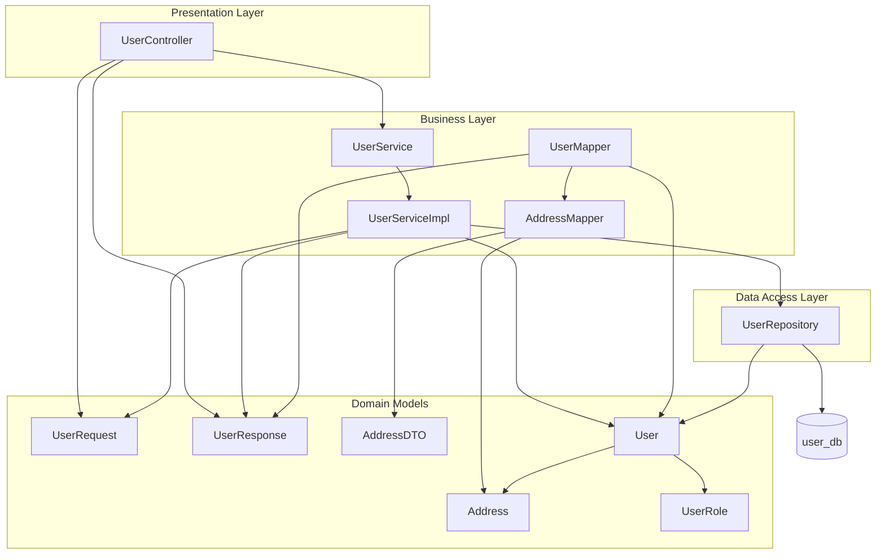
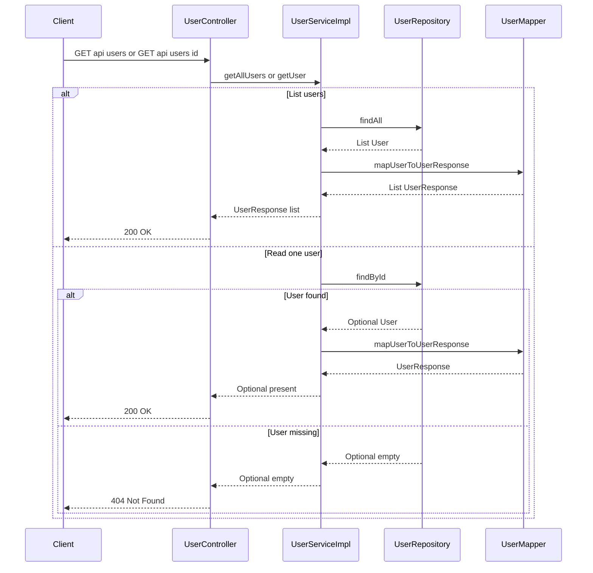
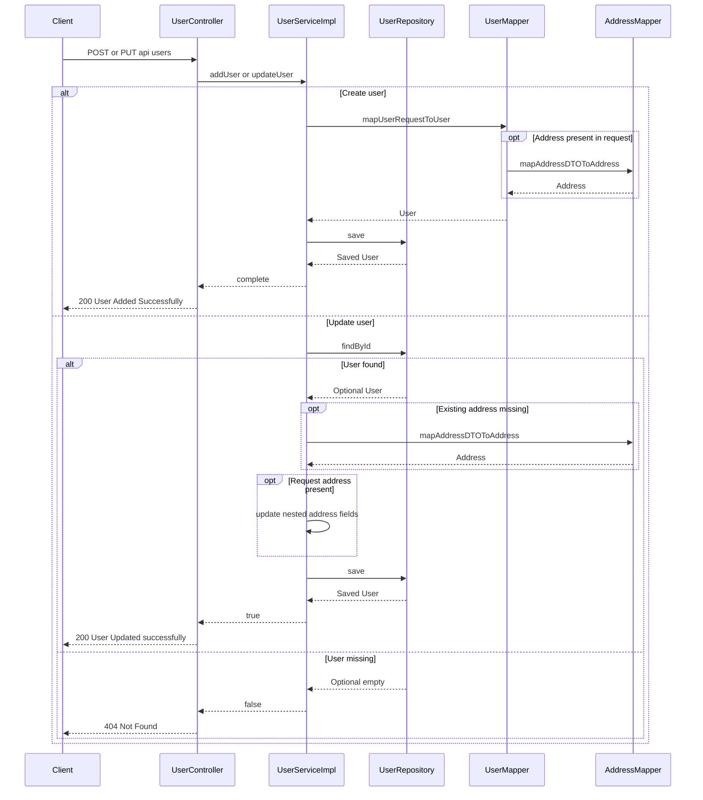

# User Management Domain

## Overview

The user-management domain exposes the backend profile API for creating, listing, reading, and updating customer accounts. It is centered on `UserController`, which turns HTTP requests into service calls, and `UserServiceImpl`, which performs the profile lifecycle work against JPA-backed persistence.

The same domain also manages nested address data as part of a user profile. Create and update requests can carry `AddressDTO`, and the service layer maps that nested payload into the `Address` entity so the `User` aggregate can be persisted in one operation.

## Architecture Overview



## Component Structure

### 1. Presentation Layer

#### UserController

*`user-service/src/main/java/com/example/ecom/controller/UserController.java`*

`UserController` is the HTTP entry point for user profile management. It exposes list, create, get-by-id, and update flows under `/api/users`, and it translates service-layer outcomes into `200 OK` or `404 Not Found` responses.

**Properties**

| Property | Type | Description |
| --- | --- | --- |
| `userService` | `UserService` | Service facade used to fetch, create, and update user profiles. |


**Constructor dependencies**

| Type | Description |
| --- | --- |
| `UserService` | Handles user profile lifecycle operations. |


**Public methods**

| Method | Description |
| --- | --- |
| `getAllUsers` | Returns all users as a `List<UserResponse>`. |
| `addUser` | Accepts a `UserRequest`, persists it, and returns a success message. |
| `getUser` | Returns a single `UserResponse` by id or `404 Not Found` when missing. |
| `updateUser` | Applies profile changes for an existing user or returns `404 Not Found` when missing. |


#### UserRequest

*`user-service/src/main/java/com/example/ecom/dto/UserRequest.java`*

`UserRequest` is the inbound profile payload used by create and update operations.

**Properties**

| Property | Type | Description |
| --- | --- | --- |
| `firstName` | `String` | User first name. |
| `lastName` | `String` | User last name. |
| `email` | `String` | User email address. |
| `phNo` | `String` | User phone number. |
| `address` | `AddressDTO` | Nested address payload used during create and profile updates. |


#### UserResponse

*`user-service/src/main/java/com/example/ecom/dto/UserResponse.java`*

`UserResponse` is the outbound profile representation returned by list and get-by-id operations.

**Properties**

| Property | Type | Description |
| --- | --- | --- |
| `id` | `String` | Stringified database id returned to API clients. |
| `firstName` | `String` | User first name. |
| `lastName` | `String` | User last name. |
| `email` | `String` | User email address. |
| `phNo` | `String` | User phone number. |
| `userRole` | `UserRole` | Role assigned to the user profile. |
| `address` | `AddressDTO` | Nested address returned to API clients when present. |


#### AddressDTO

*`user-service/src/main/java/com/example/ecom/dto/AddressDTO.java`*

`AddressDTO` is the nested address payload used by both request and response models.

**Properties**

| Property | Type | Description |
| --- | --- | --- |
| `street` | `String` | Street line for the address. |
| `city` | `String` | City name. |
| `state` | `String` | State or region. |
| `country` | `String` | Country name. |
| `zipCode` | `String` | Postal code. |


### 2. Business Layer

#### UserService

*`user-service/src/main/java/com/example/ecom/service/UserService.java`*

`UserService` defines the profile lifecycle contract consumed by `UserController`.

**Properties**

None.

**Public methods**

| Method | Description |
| --- | --- |
| `getAllUsers` | Returns all user profiles as `UserResponse` objects. |
| `addUser` | Persists a new user profile from `UserRequest`. |
| `getUser` | Resolves one user profile by id and returns an `Optional<UserResponse>`. |
| `updateUser` | Updates an existing user profile and returns a success flag. |


#### UserServiceImpl

*`user-service/src/main/java/com/example/ecom/service/impl/UserServiceImpl.java`*

`UserServiceImpl` implements the profile lifecycle against `UserRepository`. It performs entity-to-DTO mapping, transactional writes, and nested address updates.

**Properties**

| Property | Type | Description |
| --- | --- | --- |
| `userRepository` | `UserRepository` | JPA repository used for reading and writing `User` entities. |


**Constructor dependencies**

| Type | Description |
| --- | --- |
| `UserRepository` | Persistence boundary for `User` records. |


**Public methods**

| Method | Description |
| --- | --- |
| `getAllUsers` | Loads all `User` entities and maps them to `UserResponse`. |
| `addUser` | Maps a `UserRequest` to `User` and saves it in a transaction. |
| `getUser` | Loads one `User` by id and maps it to `UserResponse` when found. |
| `updateUser` | Loads an existing `User`, mutates profile fields, updates nested address data, and saves it in a transaction. |


#### UserMapper

updateUser contains two separate address branches. When the existing user has no address, the method creates a new Address instance but assigns a different Address built by AddressMapper.mapAddressDTOToAddress(...) to existingUser. The later field-by-field updates are applied to the local address variable, not to the instance attached to existingUser. If userRequest.getAddress() is also null in that branch, AddressMapper.mapAddressDTOToAddress(null) dereferences a null DTO before the controller can respond normally.

*`user-service/src/main/java/com/example/ecom/utility/UserMapper.java`*

`UserMapper` converts between `UserRequest`, `User`, and `UserResponse`.

**Properties**

None.

**Public methods**

| Method | Description |
| --- | --- |
| `mapUserToUserResponse` | Converts a `User` entity into `UserResponse`, including nested address data when present. |
| `mapUserRequestToUser` | Converts a `UserRequest` into a `User` entity and maps the nested address when present. |


#### AddressMapper

*`user-service/src/main/java/com/example/ecom/utility/AddressMapper.java`*

`AddressMapper` converts between `AddressDTO` and `Address`.

**Properties**

None.

**Public methods**

| Method | Description |
| --- | --- |
| `mapAddressToAddressDTO` | Converts an `Address` entity into `AddressDTO`. |
| `mapAddressDTOToAddress` | Converts an `AddressDTO` into an `Address` entity. |


### 3. Data Access Layer

#### UserRepository

*`user-service/src/main/java/com/example/ecom/repository/UserRepository.java`*

`UserRepository` is the persistence interface for `User` entities. It extends `JpaRepository<User, Long>` and is used by the service layer through inherited CRUD operations.

**Properties**

None.

**Public methods**

| Method | Description |
| --- | --- |
| `findAll` | Returns all `User` entities used by `getAllUsers`. |
| `findById` | Returns an optional `User` used by `getUser` and `updateUser`. |
| `save` | Persists new and updated `User` entities. |


### 4. Domain Models

#### User

*`user-service/src/main/java/com/example/ecom/model/User.java`*

`User` is the aggregate root for profile data. It owns the nested `Address` relationship and carries timestamp fields for lifecycle tracking.

**Properties**

| Property | Type | Description |
| --- | --- | --- |
| `id` | `Long` | Generated identifier. |
| `firstName` | `String` | User first name. |
| `lastName` | `String` | User last name. |
| `email` | `String` | User email address. |
| `phNo` | `String` | User phone number. |
| `userRole` | `UserRole` | Role assigned to the user, defaulting to `CUSTOMER`. |
| `address` | `Address` | One-to-one nested address entity with cascade and orphan removal. |
| `createdAt` | `LocalDateTime` | Creation timestamp managed by Hibernate. |
| `updatedAt` | `LocalDateTime` | Update timestamp managed by Hibernate. |


#### Address

*`user-service/src/main/java/com/example/ecom/model/Address.java`*

`Address` stores the nested address details referenced by `User`.

**Properties**

| Property | Type | Description |
| --- | --- | --- |
| `id` | `Long` | Generated identifier. |
| `street` | `String` | Street line. |
| `city` | `String` | City name. |
| `state` | `String` | State or region. |
| `country` | `String` | Country name. |
| `zipCode` | `String` | Postal code. |


#### UserRole

*`user-service/src/main/java/com/example/ecom/model/UserRole.java`*

`UserRole` values: `ADMIN`, `SELLER`, `CUSTOMER`.

**Properties**

None.

## Logging

`UserController` and `UserServiceImpl` both use `@Slf4j` for runtime logging around request processing and profile lifecycle decisions.

| Class | Log usage |
| --- | --- |
| `UserController` | Logs list, create, get-by-id, and update requests, plus user counts and missing-user warnings. |
| `UserServiceImpl` | Logs list, create, get, and update operations, plus debug details for counts, found users, address handling, and missing-user warnings. |


## API Integration

#### List Users

```api
{
    "title": "List Users",
    "description": "Fetches all user profiles and returns them as UserResponse objects",
    "method": "GET",
    "baseUrl": "<UserServiceBaseUrl>",
    "endpoint": "/api/users",
    "headers": [],
    "queryParams": [],
    "pathParams": [],
    "bodyType": "none",
    "requestBody": "",
    "formData": [],
    "rawBody": "",
    "responses": {
        "200": {
            "description": "Success",
            "body": "[\n    {\n        \"id\": \"1\",\n        \"firstName\": \"John\",\n        \"lastName\": \"Doe\",\n        \"email\": \"john.doe@example.com\",\n        \"phNo\": \"9876543210\",\n        \"userRole\": \"CUSTOMER\",\n        \"address\": {\n            \"street\": \"221B Baker Street\",\n            \"city\": \"London\",\n            \"state\": \"Greater London\",\n            \"country\": \"United Kingdom\",\n            \"zipCode\": \"NW1 6XE\"\n        }\n    }\n]"
        }
    }
}
```

#### Create User

```api
{
    "title": "Create User",
    "description": "Creates a new user profile from the submitted request body and returns a success message",
    "method": "POST",
    "baseUrl": "<UserServiceBaseUrl>",
    "endpoint": "/api/users",
    "headers": [
        {
            "key": "Content-Type",
            "value": "application/json",
            "required": true
        }
    ],
    "queryParams": [],
    "pathParams": [],
    "bodyType": "application/json",
    "requestBody": "{\n    \"firstName\": \"Jane\",\n    \"lastName\": \"Smith\",\n    \"email\": \"jane.smith@example.com\",\n    \"phNo\": \"5551234567\",\n    \"address\": {\n        \"street\": \"12 Market Street\",\n        \"city\": \"Pune\",\n        \"state\": \"Maharashtra\",\n        \"country\": \"India\",\n        \"zipCode\": \"411001\"\n    }\n}",
    "formData": [],
    "rawBody": "",
    "responses": {
        "200": {
            "description": "Success",
            "body": "User Added Successfully"
        }
    }
}
```

#### Get User by ID

```api
{
    "title": "Get User by ID",
    "description": "Fetches a single user profile by id and returns 404 when the user does not exist",
    "method": "GET",
    "baseUrl": "<UserServiceBaseUrl>",
    "endpoint": "/api/users/{id}",
    "headers": [],
    "queryParams": [],
    "pathParams": [
        {
            "key": "id",
            "type": "Long",
            "required": true
        }
    ],
    "bodyType": "none",
    "requestBody": "",
    "formData": [],
    "rawBody": "",
    "responses": {
        "200": {
            "description": "Success",
            "body": "{\n    \"id\": \"1\",\n    \"firstName\": \"John\",\n    \"lastName\": \"Doe\",\n    \"email\": \"john.doe@example.com\",\n    \"phNo\": \"9876543210\",\n    \"userRole\": \"CUSTOMER\",\n    \"address\": {\n        \"street\": \"221B Baker Street\",\n        \"city\": \"London\",\n        \"state\": \"Greater London\",\n        \"country\": \"United Kingdom\",\n        \"zipCode\": \"NW1 6XE\"\n    }\n}"
        },
        "404": {
            "description": "User not found",
            "body": ""
        }
    }
}
```

#### Update User

```api
{
    "title": "Update User",
    "description": "Updates an existing user profile and its nested address data when provided, returning 404 when the user does not exist",
    "method": "PUT",
    "baseUrl": "<UserServiceBaseUrl>",
    "endpoint": "/api/users/{id}",
    "headers": [
        {
            "key": "Content-Type",
            "value": "application/json",
            "required": true
        }
    ],
    "queryParams": [],
    "pathParams": [
        {
            "key": "id",
            "type": "Long",
            "required": true
        }
    ],
    "bodyType": "application/json",
    "requestBody": "{\n    \"firstName\": \"John\",\n    \"lastName\": \"Doe\",\n    \"email\": \"john.doe.updated@example.com\",\n    \"phNo\": \"9998887777\",\n    \"address\": {\n        \"street\": \"45 Updated Avenue\",\n        \"city\": \"Hyderabad\",\n        \"state\": \"Telangana\",\n        \"country\": \"India\",\n        \"zipCode\": \"500081\"\n    }\n}",
    "formData": [],
    "rawBody": "",
    "responses": {
        "200": {
            "description": "Success",
            "body": "User Updated successfully"
        },
        "404": {
            "description": "User not found",
            "body": ""
        }
    }
}
```

## Feature Flows

### Read Profile Flow



### Create and Update Profile Flow



## User Profile Lifecycle

| Lifecycle step | Service method | Persistence action | API result |
| --- | --- | --- | --- |
| Create | `addUser` | Maps `UserRequest` to `User` and saves it in a transaction. | `200 OK` with `User Added Successfully` |
| List | `getAllUsers` | Reads all `User` entities and maps them to `UserResponse`. | `200 OK` with a user list |
| Read one | `getUser` | Reads one `User` by id and maps it when present. | `200 OK` or `404 Not Found` |
| Update | `updateUser` | Loads the existing `User`, mutates fields, updates nested `Address`, and saves in a transaction. | `200 OK` with `User Updated successfully` or `404 Not Found` |


### Transactional Update Behavior

`addUser` and `updateUser` are annotated with `@Transactional`. The update path performs read-modify-write on the existing `User` entity within one transactional boundary, including nested address mutation before the final `save`.

### Nested Address Handling

- `UserMapper.mapUserRequestToUser` maps `address` only when the request payload contains one.
- `UserMapper.mapUserToUserResponse` maps `address` only when the entity has one.
- `updateUser` mutates address fields in place when an address already exists.
- When the existing user has no address, the service creates a new address path and attaches a mapped address to the `User`.

## Error Handling

| Condition | Service result | Controller response |
| --- | --- | --- |
| `findById` returns empty during read | `Optional.empty()` | `404 Not Found` |
| `findById` returns empty during update | `false` | `404 Not Found` |
| No users exist for list | Empty list | `200 OK` with `[]` |
| Existing user has no address and update payload omits `address` | Null dereference in `AddressMapper.mapAddressDTOToAddress` path | Request fails before a normal `404` or `200` response |
| Create or update payload includes `address` | Address is mapped into the entity | `200 OK` when persistence succeeds |


## Testing Considerations

`UserServiceImplTest` exercises the service behavior that drives the API:

- `getAllUsers` returns mapped responses from repository data.
- `addUser` persists a request with and without nested address data.
- `getUser` returns a populated `Optional` when the user exists.
- `getUser` returns an empty `Optional` when the user is missing.
- `updateUser` returns `true` for an existing user.
- `updateUser` returns `false` and skips `save` when the user is missing.

## Key Classes Reference

| Class | Responsibility |
| --- | --- |
| `UserController.java` | HTTP endpoints for listing, creating, reading, and updating user profiles. |
| `UserService.java` | Service contract for user profile lifecycle operations. |
| `UserServiceImpl.java` | Implements profile reads, creates, updates, and nested address handling. |
| `UserRepository.java` | JPA persistence boundary for `User` entities. |
| `UserRequest.java` | Inbound user profile payload. |
| `UserResponse.java` | Outbound user profile payload. |
| `AddressDTO.java` | Nested address transport model. |
| `User.java` | User aggregate root entity. |
| `Address.java` | Nested address entity. |
| `UserRole.java` | Role enumeration for user profiles. |
| `UserMapper.java` | Maps between request, entity, and response types. |
| `AddressMapper.java` | Maps between address DTOs and entities. |
