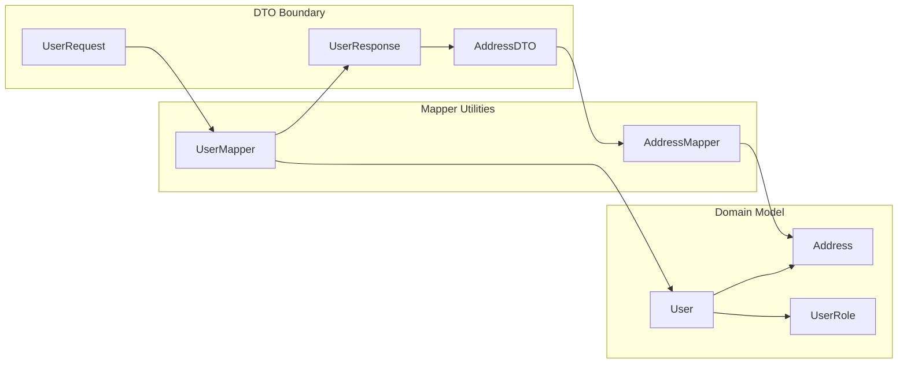
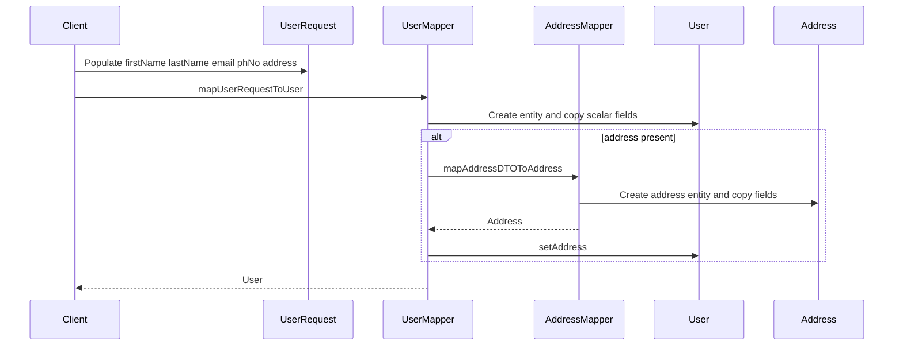
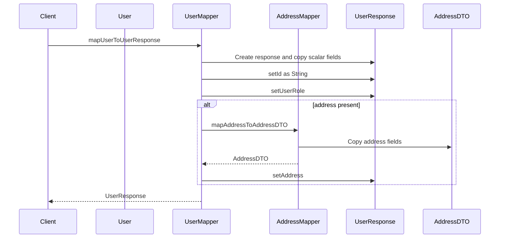

# User Management DOMAIN - User, address, role, and DTO-to-entity mapping model

## Overview

This domain defines how a user profile is represented inside `user-service` and how that profile is translated across the service boundary. The persistent aggregate is centered on `User`, which carries identity, contact details, role, timestamps, and an optional `Address` owned by the user row.

The DTO layer keeps inbound and outbound payloads separate from the JPA model. `UserRequest` is the write contract, `UserResponse` is the read contract, and `AddressDTO` is reused as a nested shape on both sides. `UserMapper` and `AddressMapper` form the boundary between those contracts and the persistence model, including the default role behavior and the one-to-one address ownership rules.

## Architecture Overview

## Component Structure

### 1. Domain Model

#### User

*`user-service/src/main/java/com/example/ecom/model/User.java`*

`User` is the aggregate root for user data. It is declared with `@Entity(name = "user_table")`, uses identity generation for the primary key, and owns the address association through a foreign key column named `address_id`.

| Property | Type | Description |
| --- | --- | --- |
| `id` | `Long` | Primary key generated with `GenerationType.IDENTITY`. |
| `firstName` | `String` | User first name. |
| `lastName` | `String` | User last name. |
| `email` | `String` | User email address. |
| `phNo` | `String` | User phone number. |
| `userRole` | `UserRole` | Stored as a string with `@Enumerated(EnumType.STRING)` and initialized to `UserRole.CUSTOMER`. |
| `address` | `Address` | One-to-one owned address reference. |
| `createdAt` | `LocalDateTime` | Populated automatically by `@CreationTimestamp`. |
| `updatedAt` | `LocalDateTime` | Updated automatically by `@UpdateTimestamp`. |

**Persistence and relationship behavior**

- `@OneToOne(cascade = CascadeType.ALL, orphanRemoval = true)` makes `User` the owning side of the association.
- `@JoinColumn(name = "address_id", referencedColumnName = "id")` stores the address foreign key on the user row.
- Cascading applies persistence lifecycle operations from `User` to `Address`.
- Orphan removal deletes the `Address` row when the association is removed from the owning `User` entity and the change is flushed.

**Constructor shape**

- Lombok provides a no-args constructor and an all-args constructor through `@NoArgsConstructor` and `@AllArgsConstructor`.

#### Address

*`user-service/src/main/java/com/example/ecom/model/Address.java`*

`Address` is the owned value-like entity used by `User` for location data.

| Property | Type | Description |
| --- | --- | --- |
| `id` | `Long` | Primary key generated with `GenerationType.IDENTITY`. |
| `street` | `String` | Street line. |
| `city` | `String` | City name. |
| `state` | `String` | State or region. |
| `country` | `String` | Country name. |
| `zipCode` | `String` | Postal code. |

**Notes**

- `Address` is a standalone JPA entity with a generated identifier.
- It is not annotated with any relationship fields of its own in this code path.

#### UserRole

*`user-service/src/main/java/com/example/ecom/model/UserRole.java`*

`UserRole` defines the supported user roles used by the domain model and exposed in `UserResponse`.

**Values**

- `ADMIN`
- `SELLER`
- `CUSTOMER`

**Persistence behavior**

- `User.userRole` is stored as a string because `User` uses `@Enumerated(EnumType.STRING)`.

---

### 2. DTO Boundary

#### UserRequest

*`user-service/src/main/java/com/example/ecom/dto/UserRequest.java`*

`UserRequest` is the inbound payload shape used for create and update operations.

| Property | Type | Description |
| --- | --- | --- |
| `firstName` | `String` | Incoming first name. |
| `lastName` | `String` | Incoming last name. |
| `email` | `String` | Incoming email address. |
| `phNo` | `String` | Incoming phone number. |
| `address` | `AddressDTO` | Optional nested address payload. |

**Contract boundary**

- No `id` field is present.
- No `userRole` field is present.
- No timestamp fields are present.
- The mapper treats this DTO as write-only data for the user profile shape.

#### UserResponse

*`user-service/src/main/java/com/example/ecom/dto/UserResponse.java`*

`UserResponse` is the outbound payload shape used to return user data to callers.

| Property | Type | Description |
| --- | --- | --- |
| `id` | `String` | User identifier converted from the entity `Long` id. |
| `firstName` | `String` | User first name. |
| `lastName` | `String` | User last name. |
| `email` | `String` | User email address. |
| `phNo` | `String` | User phone number. |
| `userRole` | `UserRole` | Role value copied from the entity. |
| `address` | `AddressDTO` | Optional nested address payload. |

**Contract boundary**

- `id` is exposed as a `String`, not a `Long`.
- `userRole` is read-only from the DTO boundary in this model path.
- Address is included only when the entity contains one.

#### AddressDTO

*`user-service/src/main/java/com/example/ecom/dto/AddressDTO.java`*

`AddressDTO` is the nested address shape shared by both request and response DTOs.

| Property | Type | Description |
| --- | --- | --- |
| `street` | `String` | Street line. |
| `city` | `String` | City name. |
| `state` | `String` | State or region. |
| `country` | `String` | Country name. |
| `zipCode` | `String` | Postal code. |

---

### 3. Mapper Layer

#### UserMapper

*`user-service/src/main/java/com/example/ecom/utility/UserMapper.java`*

`UserMapper` is a static utility class that translates between `User`, `UserRequest`, and `UserResponse`. It is not a Spring bean and has no injected dependencies.

| Method | Description |
| --- | --- |
| `mapUserToUserResponse` | Builds a `UserResponse` from a `User`, converts `id` to `String`, copies scalar fields, copies `userRole`, and maps `address` only when the entity address is non-null. |
| `mapUserRequestToUser` | Builds a new `User` from a `UserRequest`, copies scalar fields, and maps `address` only when the request address is non-null. |

**Mapping contract**

| Source | Target | Behavior |
| --- | --- | --- |
| `UserRequest` | `User` | Copies `firstName`, `lastName`, `email`, `phNo`; leaves `id`, `userRole`, `createdAt`, and `updatedAt` unset; maps nested address when present. |
| `User` | `UserResponse` | Copies `firstName`, `lastName`, `email`, `phNo`, `userRole`; converts `id` to `String`; maps nested address when present. |

**Mapper assumptions**

- `user.getId()` is always convertible with `String.valueOf`.
- `userRequest.getAddress()` may be null and is guarded before nested mapping.
- `user.getAddress()` may be null and is guarded before nested mapping.
- `UserRequest` intentionally does not carry a role field, so `User.userRole` defaults to `CUSTOMER` unless assigned elsewhere.

#### AddressMapper

*`user-service/src/main/java/com/example/ecom/utility/AddressMapper.java`*

`AddressMapper` is the companion static utility for address conversion.

| Method | Description |
| --- | --- |
| `mapAddressToAddressDTO` | Builds an `AddressDTO` from an `Address` by copying all address fields. |
| `mapAddressDTOToAddress` | Builds an `Address` from an `AddressDTO` by copying all address fields. |

**Mapping contract**

| Source | Target | Behavior |
| --- | --- | --- |
| `Address` | `AddressDTO` | Copies `street`, `city`, `state`, `country`, and `zipCode`. |
| `AddressDTO` | `Address` | Copies `street`, `city`, `state`, `country`, and `zipCode`. |

**Mapper assumptions**

- Both methods dereference the input object directly.
- The caller is responsible for ensuring the input is non-null before invoking either method.

## Feature Flows

### 1. Create User Payload Mapping

UserServiceImpl.updateUser creates a new Address when an existing user has none, but then immediately assigns AddressMapper.mapAddressDTOToAddress(userRequest.getAddress()). If userRequest.getAddress() is null in that branch, the call can fail before the later null check inside the method body is reached.

This flow describes how an inbound `UserRequest` becomes a persistent `User` aggregate. The user role is not part of the request contract, so the entity initializer controls the default role value.

### 2. Read User Response Mapping

This flow describes how a persisted `User` becomes a `UserResponse`. The mapper preserves the role and converts the identifier to a string for the outbound contract.

## State and Contract Behavior

| Condition | Source | Effect |
| --- | --- | --- |
| Default role | `User.userRole = UserRole.CUSTOMER` | Newly created `User` instances start as `CUSTOMER` unless modified elsewhere. |
| Role storage | `@Enumerated(EnumType.STRING)` | The role is persisted using the enum name. |
| Optional address in request | `UserMapper.mapUserRequestToUser` | The entity address remains null when the request omits it. |
| Optional address in response | `UserMapper.mapUserToUserResponse` | The response omits `address` when the entity address is null. |
| Audit timestamps | `@CreationTimestamp`, `@UpdateTimestamp` | `createdAt` and `updatedAt` are managed by Hibernate rather than DTO mapping. |
| Address ownership | `@OneToOne` on `User` | The `User` entity controls lifecycle and deletion semantics for `Address`. |

## Integration Points

- `UserRequest` is the inbound contract consumed by the user write path.
- `UserResponse` is the outbound contract returned by the user read path.
- `UserMapper` and `AddressMapper` are consumed by the service layer to convert between persistence entities and DTOs.
- `User` and `Address` are managed by JPA/Hibernate through the repository layer.

## Dependencies

| Type | Description |
| --- | --- |
| `jakarta.persistence` | Provides entity, relationship, and identifier annotations for `User` and `Address`. |
| `org.hibernate.annotations` | Provides `@CreationTimestamp` and `@UpdateTimestamp` for audit fields. |
| `lombok` | Generates boilerplate constructors, getters, setters, `equals`, `hashCode`, and `toString`. |

## Testing Considerations

- Verify that `User.userRole` initializes to `CUSTOMER` on a newly created entity.
- Verify that `UserMapper.mapUserRequestToUser` preserves scalar fields and leaves the role untouched.
- Verify that `UserMapper.mapUserToUserResponse` converts `id` to `String`.
- Verify that `AddressMapper` copies all five address fields in both directions.
- Verify that a null `address` on `UserRequest` or `User` stays null after mapping.
- Verify that the one-to-one relationship owns the foreign key on `User` through `address_id`.

## Key Classes Reference

| Class | Responsibility |
| --- | --- |
| `User.java` | Persistent user aggregate with default role, audit timestamps, and owned address association. |
| `Address.java` | Persistent address entity referenced by `User`. |
| `UserRole.java` | Enumerates the allowed user roles. |
| `UserRequest.java` | Write-side DTO for creating and updating user data. |
| `UserResponse.java` | Read-side DTO for returning user data with role and optional address. |
| `AddressDTO.java` | Nested DTO shape for address data. |
| `UserMapper.java` | Converts between `UserRequest`, `User`, and `UserResponse`. |
| `AddressMapper.java` | Converts between `Address` and `AddressDTO`. |
