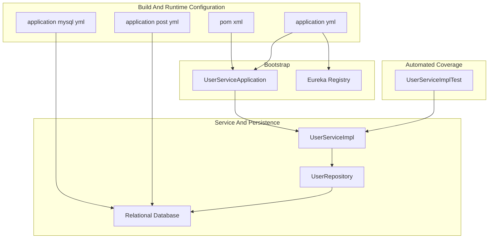
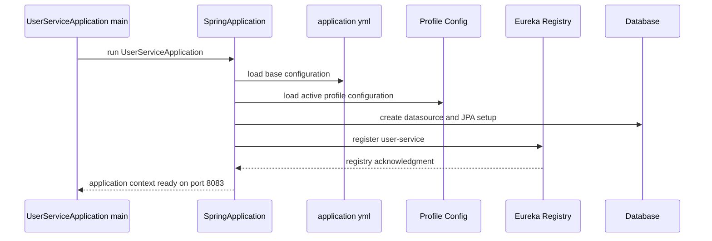
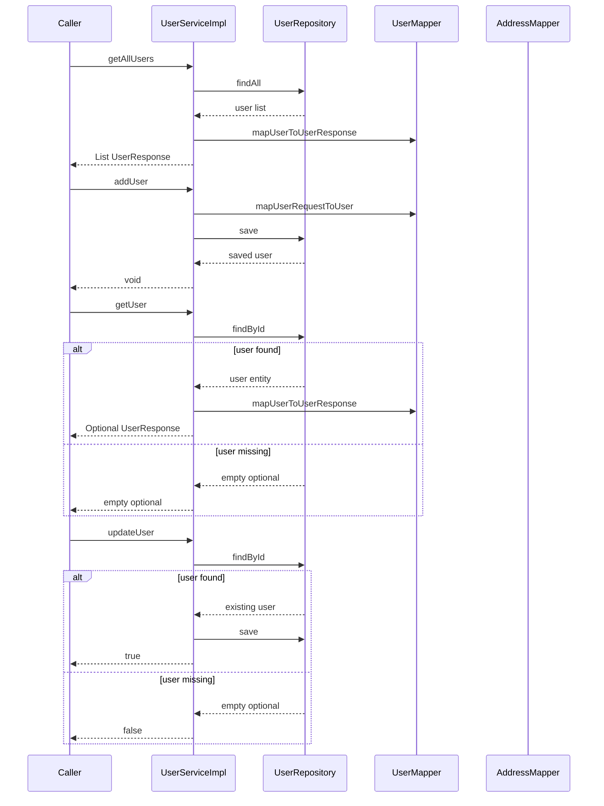

# User Management Domain User Service Configuration Startup and Automated Coverage

## Overview

The `user-service` module is the user management backend for the e-commerce system. It packages the service as a standalone JAR, boots it as a Spring Boot application, registers it with Eureka under the `user-service` identity, and exposes profile-driven datasource settings for MySQL and PostgreSQL.

The runtime configuration is split between a base `application.yml` and two profile files. The base file defines the service name, port, actuator exposure, logging baseline, and Eureka client behavior, while `application-mysql.yml` and `application-post.yml` provide database-specific connection and Hibernate settings. Automated coverage is implemented with a focused Mockito-based unit test class for `UserServiceImpl`.

## Architecture Overview

## Maven Build

### 

*user-service/pom.xml*

The module inherits the Spring Boot and shared management setup from the parent `ecom` project and packages the service as a JAR.

#### Project Coordinates

| Property | Value | Purpose |
| --- | --- | --- |
| `parent.groupId` | `com.example` | Inherits the root build and dependency management |
| `parent.artifactId` | `ecom` | Shared multi-module parent |
| `parent.version` | `0.0.1-SNAPSHOT` | Parent version |
| `relativePath` |  | Resolves the parent from the repository root |
| `artifactId` | `user-service` | Module identity |
| `name` | `user-service` | Build name |
| `packaging` | `jar` | Produces an executable JAR |

#### Dependencies

| Scope | Artifact | Purpose |
| --- | --- | --- |
| compile | `spring-boot-starter-web` | Spring Web MVC runtime for the service |
| compile | `spring-cloud-starter-netflix-eureka-client` | Eureka client registration and discovery |
| compile | `spring-boot-starter-data-jpa` | Spring Data JPA and repository support |
| compile | `spring-boot-starter-actuator` | Operational endpoints and health exposure |
| runtime | `postgresql` | PostgreSQL JDBC driver |
| runtime | `mysql-connector-j` | MySQL JDBC driver |
| runtime | `spring-boot-devtools` | Development-time restart support |
| compile | `lombok` | Annotation-driven boilerplate reduction |
| test | `spring-boot-starter-test` | JUnit and Mockito test stack |

#### Build Plugins

| Plugin | Purpose | Key Configuration |
| --- | --- | --- |
| `spring-boot-maven-plugin` | Builds the executable Spring Boot JAR | Version inherited from the parent |
| `maven-compiler-plugin` | Compiles against the configured Java version | Uses `${java.version}` for both `source` and `target` |

## Startup and Service Identity

### `UserServiceApplication.java`

*user-service/src/main/java/com/example/ecom/UserServiceApplication.java*

This is the Spring Boot entry point for the module. It starts the application by delegating to `SpringApplication.run(UserServiceApplication.class, args)`.

#### Class Properties

| Property | Type | Description |
| --- | --- | --- |
| None | - | The class declares no instance fields |

#### Methods

| Method | Description |
| --- | --- |
| `main` | Starts the Spring Boot application context |

### `application.yml`

*user-service/src/main/resources/application.yml*

This file defines the base runtime identity, server port, actuator exposure, logging baseline, and Eureka client settings.

| Property | Value | Purpose |
| --- | --- | --- |
| `spring.application.name` | `user-service` | Service identity used by Spring and Eureka |
| `spring.jpa.show-sql` | `true` | Enables SQL emission in the base configuration |
| `server.port` | `8083` | Binds the service to port 8083 |
| `management.endpoints.web.exposure.include` | `*` | Exposes all actuator endpoints over HTTP |
| `logging.level.root` | `INFO` | Sets the root log level |
| `eureka.client.serviceUrl.defaultZone` | `http://localhost:8761/eureka/` | Points the client at the local Eureka registry |
| `eureka.client.register-with-eureka` | `true` | Registers this service instance with Eureka |
| `eureka.client.fetch-registry` | `true` | Pulls registry data from Eureka |

#### Startup Flow

### Runtime Behavior

- The service starts under the `user-service` application name.
- The base configuration binds the HTTP server to port `8083`.
- Eureka client registration is enabled and pointed at `http://localhost:8761/eureka/`.
- Actuator endpoints are fully exposed through the web layer.
- Root logging starts at `INFO`, while profile files refine Hibernate logging.

## Profile-Specific Datasource Configuration

### `application-mysql.yml`

*user-service/src/main/resources/application-mysql.yml*

This profile targets MySQL and uses `ddl-auto: update` for schema evolution.

| Property | Value | Purpose |
| --- | --- | --- |
| `spring.datasource.url` | `jdbc:mysql://localhost:3306/user_db?createDatabaseIfNotExist=true` | Connects to the MySQL `user_db` database |
| `spring.datasource.username` | `root` | Database user |
| `spring.datasource.password` | `Vishwas@123` | Database password |
| `spring.datasource.driver-class-name` | `com.mysql.cj.jdbc.Driver` | JDBC driver for MySQL |
| `spring.jpa.hibernate.ddl-auto` | `update` | Updates the schema in place |
| `spring.jpa.properties.hibernate.dialect` | `org.hibernate.dialect.MySQLDialect` | Hibernate dialect for MySQL |
| `spring.jpa.properties.hibernate.format_sql` | `true` | Formats SQL across multiple lines |
| `spring.jpa.properties.hibernate.highlight_sql` | `true` | Enables ANSI SQL highlighting |
| `spring.jpa.properties.hibernate.use_sql_comments` | `true` | Adds SQL comments |
| `logging.level.org.hibernate.SQL` | `DEBUG` | Logs generated SQL statements |
| `logging.level.org.hibernate.orm.jdbc.bind` | `TRACE` | Logs JDBC bind parameter values |

### `application-post.yml`

*user-service/src/main/resources/application-post.yml*

This profile targets PostgreSQL and uses `ddl-auto: create-drop` for dev and test lifecycle behavior.

| Property | Value | Purpose |
| --- | --- | --- |
| `spring.datasource.url` | `jdbc:postgresql://localhost:5432/user_db` | Connects to the PostgreSQL `user_db` database |
| `spring.datasource.username` | `postgres` | Database user |
| `spring.datasource.password` | `vish@post` | Database password |
| `spring.datasource.driver-class-name` | `org.postgresql.Driver` | JDBC driver for PostgreSQL |
| `spring.jpa.hibernate.ddl-auto` | `create-drop` | Recreates the schema at startup and drops it on shutdown |
| `spring.jpa.properties.hibernate.dialect` | `org.hibernate.dialect.PostgreSQLDialect` | Hibernate dialect for PostgreSQL |
| `spring.jpa.properties.hibernate.format_sql` | `true` | Formats SQL across multiple lines |
| `spring.jpa.properties.hibernate.highlight_sql` | `true` | Enables ANSI SQL highlighting |
| `spring.jpa.properties.hibernate.use_sql_comments` | `true` | Adds SQL comments |
| `spring.jpa.show-sql` | `true` | Prints SQL through Hibernate |
| `logging.level.org.hibernate.SQL` | `DEBUG` | Logs generated SQL statements |
| `logging.level.org.hibernate.orm.jdbc.bind` | `TRACE` | Logs JDBC bind parameter values |

### SQL Logging Behavior

Both profile files enable the same visibility pattern:

- SQL statements are logged at `DEBUG` through `org.hibernate.SQL`.
- Parameter binding is logged at `TRACE` through `org.hibernate.orm.jdbc.bind`.
- SQL formatting, highlighting, and SQL comments are enabled in Hibernate.
- `show-sql` is enabled in the base configuration and reinforced in the PostgreSQL profile.

## Service Contract and Implementation

### `UserService.java`

*user-service/src/main/java/com/example/ecom/service/UserService.java*

This interface defines the user management service contract consumed by the controller and implemented by `UserServiceImpl`.

#### Class Properties

| Property | Type | Description |
| --- | --- | --- |
| None | - | The interface declares no fields |

#### Methods

| Method | Description |
| --- | --- |
| `getAllUsers` | Returns all users as `UserResponse` objects |
| `addUser` | Persists a new user from `UserRequest` |
| `getUser` | Fetches a single user by id and wraps it in `Optional` |
| `updateUser` | Updates an existing user and returns a success flag |

### `UserServiceImpl.java`

*user-service/src/main/java/com/example/ecom/service/impl/UserServiceImpl.java*

This is the transactional service implementation. It uses `UserRepository` for persistence and the static mapper helpers for request and response conversion.

#### Class Properties

| Property | Type | Description |
| --- | --- | --- |
| `userRepository` | `UserRepository` | Repository used for all user persistence operations |

#### Constructor Dependencies

| Type | Description |
| --- | --- |
| `UserRepository` | Injected through `@RequiredArgsConstructor` and used by every service method |

#### Methods

| Method | Description |
| --- | --- |
| `getAllUsers` | Loads all users, maps them to `UserResponse`, and returns the list |
| `addUser` | Maps `UserRequest` to `User`, saves it, and runs within a transaction |
| `getUser` | Looks up a user by id, maps it when present, and returns an `Optional` |
| `updateUser` | Loads a user by id, updates scalar fields and address data, saves it, and returns `true` or `false` |

#### Data Flow

- `getAllUsers` calls `userRepository.findAll()` and maps each entity through `UserMapper.mapUserToUserResponse`.
- `addUser` calls `UserMapper.mapUserRequestToUser` and persists the result with `userRepository.save`.
- `getUser` calls `userRepository.findById` and maps the entity only when the `Optional` is present.
- `updateUser` loads the existing entity, overwrites its scalar fields, conditionally updates address fields, and saves the entity back to the repository.

#### Service Flow

## Automated Coverage

### `UserServiceImplTest.java`

> **Note:** In `updateUser`, the branch for `existingUser.getAddress() == null` creates `new Address()` and then immediately assigns `existingUser.setAddress(AddressMapper.mapAddressDTOToAddress(userRequest.getAddress()))`. The local `address` instance is not attached to `existingUser`, so the subsequent field updates operate on an object that is not persisted with the user.

*user-service/src/test/java/com/example/ecom/service/impl/UserServiceImplTest.java*

This class uses `@ExtendWith(MockitoExtension.class)` with a mocked repository and injected service to exercise `UserServiceImpl` in isolation.

#### Class Properties

| Property | Type | Description |
| --- | --- | --- |
| `userRepository` | `UserRepository` | Mockito mock used to control repository behavior |
| `userService` | `UserServiceImpl` | Service under test, injected with the mock repository |
| `sampleUser` | `User` | Shared fixture initialized in `setUp` |

#### Fixture Initialization

`setUp` creates a single `sampleUser` with these values:

- `id = 1L`
- `firstName = John`
- `lastName = Doe`
- `email = john@example.com`
- `phNo = 1234567890`
- `address.street = Main`
- `address.city = City`

#### Methods

| Method | Description |
| --- | --- |
| `setUp` | Builds the shared `sampleUser` fixture before each test |
| `getAllUsers_shouldReturnList` | Verifies that list retrieval returns one mapped user |
| `addUser_shouldSave` | Verifies that a new user is saved once |
| `getUser_whenExists_shouldReturn` | Verifies that a matching user is returned when found |
| `updateUser_whenExists_shouldReturnTrue` | Verifies that update succeeds and saves once |
| `getUser_whenNotFound_shouldReturnEmpty` | Verifies that missing users return an empty `Optional` |
| `updateUser_whenNotFound_shouldReturnFalse` | Verifies that missing users return `false` and do not save |
| `addUser_withNullAddress_shouldSave` | Verifies that creation still saves when `address` is `null` |

#### Coverage Matrix

| Scenario | Test Method | Repository Setup | Assertion or Verification |
| --- | --- | --- | --- |
| List users | `getAllUsers_shouldReturnList` | `findAll` returns `List.of(sampleUser)` | Returns a non-null list with size `1` and first name `John` |
| Create user | `addUser_shouldSave` | `save` returns a new `User` | `save` is called exactly once |
| Fetch user success | `getUser_whenExists_shouldReturn` | `findById(1L)` returns `Optional.of(sampleUser)` | Returned `Optional` is present and first name is `John` |
| Update user success | `updateUser_whenExists_shouldReturnTrue` | `findById(1L)` returns `Optional.of(sampleUser)` and `save` returns `sampleUser` | Method returns `true` and `save` is called once |
| Fetch user not found | `getUser_whenNotFound_shouldReturnEmpty` | `findById(99L)` returns `Optional.empty()` | Returned `Optional` is empty |
| Update user not found | `updateUser_whenNotFound_shouldReturnFalse` | `findById(99L)` returns `Optional.empty()` | Method returns `false` and `save` is never called |
| Null address on create | `addUser_withNullAddress_shouldSave` | `save` returns a new `User` | `save` is called exactly once |

#### Test Harness Notes

- The test class does not start a Spring context.
- `UserRepository` is mocked with Mockito.
- `UserServiceImpl` is created through `@InjectMocks`.
- The tests verify both returned values and repository interaction counts.

## Key Classes Reference

| Class | Responsibility |
| --- | --- |
| `pom.xml` | Declares the module build, dependencies, and compiler settings |
| `UserServiceApplication.java` | Boots the `user-service` Spring Boot application |
| `application.yml` | Defines service identity, port, actuator exposure, logging baseline, and Eureka client settings |
| `application-mysql.yml` | Configures the MySQL profile datasource, Hibernate, and SQL logging |
| `application-post.yml` | Configures the PostgreSQL profile datasource, Hibernate, and SQL logging |
| `UserService.java` | Declares the user service contract |
| `UserServiceImpl.java` | Implements user retrieval, creation, and update logic against `UserRepository` |
| `UserServiceImplTest.java` | Verifies list, create, fetch, update, not-found, and null-address behaviors with Mockito |
